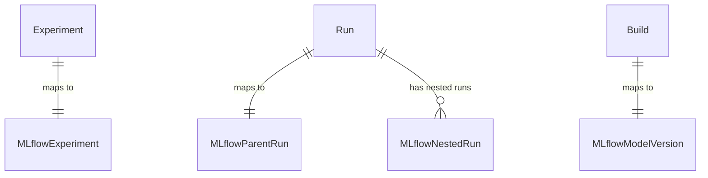
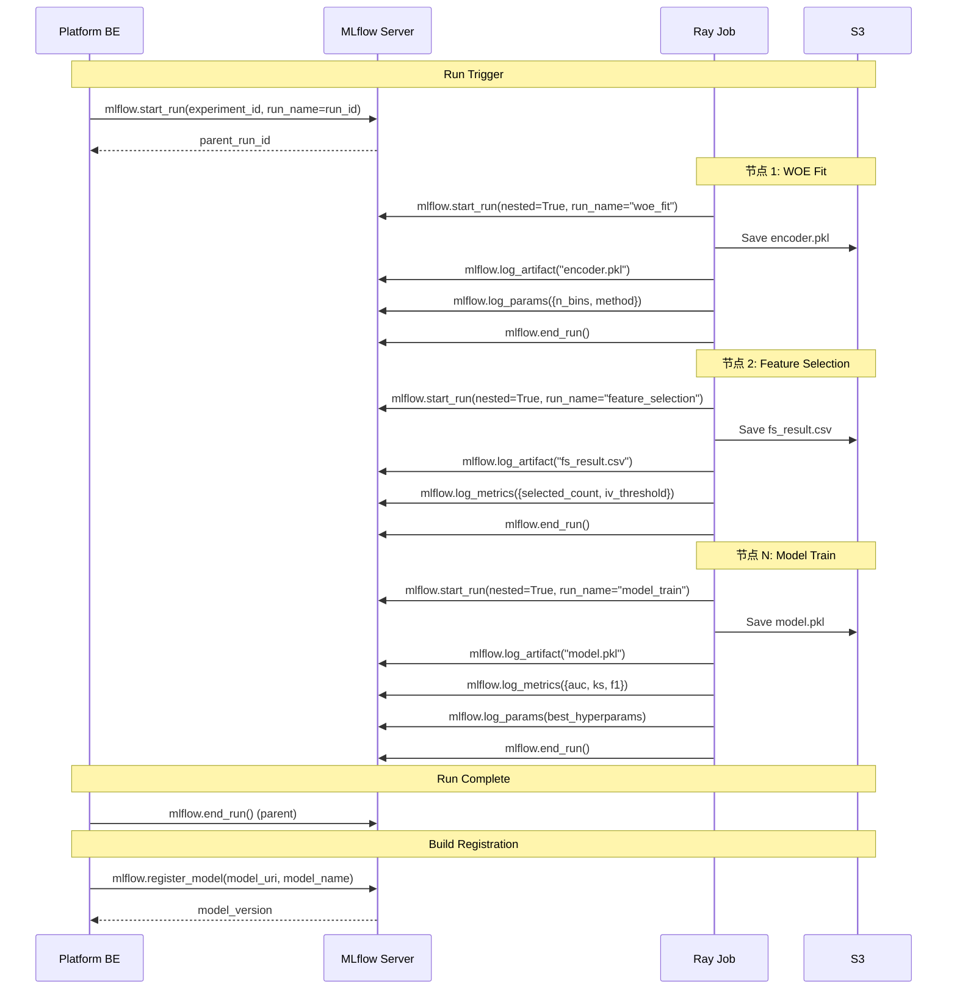

# MLflow 集成设计

## 1. 背景与决策

内部 Team 已确定将模型离线实验的中间产物（artifact）用 MLflow 管理。本文档定义 Platform 与 MLflow 的集成架构、映射关系和 artifact 登记策略。

## 2. 部署架构

```
┌─────────────────┐     ┌─────────────────┐     ┌─────────────────┐
│   Platform BE   │────▶│  MLflow Tracking │────▶│   S3 (Artifact  │
│  (Run Service)  │     │    Server        │     │    Store)       │
└────────┬────────┘     └────────┬────────┘     └─────────────────┘
         │                       │
         │                       ▼
         │              ┌─────────────────┐
         │              │  MLflow Backend  │
         │              │  Store (DB)     │
         │              └─────────────────┘
         │
         ▼
┌─────────────────┐
│   Platform      │
│   MetaDB        │
└─────────────────┘
```

- **MLflow Tracking Server**：内部 Managed Service（非 Platform 自建）
- **Artifact Store**：复用平台现有 S3 bucket，前缀隔离
- **Backend Store**：MLflow 自身的元数据 DB（PostgreSQL）

## 3. 实体映射

### 3.1 Platform → MLflow 映射

| Platform 概念 | MLflow 概念 | 映射关系 | 说明 |
|---------------|-------------|----------|------|
| **Experiment** | MLflow Experiment | 1:1 | Platform Experiment 创建时同步创建 MLflow Experiment；`mlflow_experiment_id` 存入 Platform Experiment 表 |
| **Run** | MLflow Parent Run | 1:1 | Platform Run 触发时创建 MLflow Parent Run；`mlflow_run_id` 存入 Platform Run 表 |
| **画布节点执行** | MLflow Nested Run | 1:1 | 每个画布节点执行为 MLflow Parent Run 下的 Nested Run |
| **ModelArtifact** | MLflow Artifact | 1:N | Run 产出的所有文件作为 MLflow Artifact 登记 |
| **Build** | MLflow Registered Model Version | 1:1 | Build 注册时同步创建 MLflow Model Registry 版本 |

### 3.2 ER 扩展



### 3.3 Platform 实体新增字段

**Experiment 表**：

| 字段 | 类型 | 说明 |
|------|------|------|
| mlflow_experiment_id | string (nullable) | MLflow Experiment ID |

**Run 表**：

| 字段 | 类型 | 说明 |
|------|------|------|
| mlflow_run_id | string (nullable) | MLflow Parent Run ID |

**Build 表**：

| 字段 | 类型 | 说明 |
|------|------|------|
| mlflow_model_version | string (nullable) | MLflow Model Registry 版本号 |
| mlflow_model_name | string (nullable) | MLflow Registered Model 名称 |

## 4. Artifact 登记策略

### 4.1 策略：Per-Node Nested Run + Artifact Logging

采用 **每节点 log_artifact** 方式（非 Run 级汇总），原因：
- 允许按节点粒度追溯和对比产物
- 支持 CheckPoint 时中间结果可查
- 与平台 SavePoint 概念天然对齐

### 4.2 登记时序



### 4.3 Artifact S3 路径规范

MLflow artifact store 与 Platform S3 路径保持一致：

```
s3://{bucket}/{base_prefix}/{exp_id}/{run_id}/
├── mlflow/                          # MLflow managed artifacts
│   ├── woe_fit/
│   │   └── encoder.pkl
│   ├── feature_selection/
│   │   └── fs_result.csv
│   ├── model_train/
│   │   ├── model.pkl
│   │   └── feature_importance.json
│   └── calibrate/
│       └── calibrator.pkl
├── nodes/{node_id}/logs/            # Platform managed logs
├── nodes/{node_id}/artifacts/       # Platform managed artifacts (mirror)
├── config_snapshot.json
└── manifest.json
```

`mlflow/` 子目录下的产物由 MLflow SDK 管理（log_artifact）；`nodes/` 下保留平台自管的镜像副本，确保即使 MLflow 不可用也能通过 Platform 路径访问。

### 4.4 各节点登记的 Params / Metrics / Artifacts

| 节点 | MLflow Params | MLflow Metrics | MLflow Artifacts |
|------|---------------|----------------|------------------|
| **WOE Fit** | n_bins, method, transform_method | — | encoder.pkl |
| **WOE Transform** | — | — | transformed_data (path reference) |
| **Feature Selection** | methods, iv_threshold, corr_threshold, psi_threshold | selected_feature_count, dropped_feature_count | fs_result.csv, feature_report.xlsx |
| **Model Tune** | search_method, n_trials, metric_for_tune | best_trial_score | tune_results.parquet |
| **Model Train** | framework, best_hyperparams (dict) | auc, ks, f1, precision, recall | model.pkl, feature_importance.json |
| **Model Predict** | — | val_auc, val_ks | predictions.parquet |
| **Model BM** | — | mega_auc, mega_ks | mega_model.pkl |
| **Calibrate Fit** | calibration_method | — | calibrator.pkl |
| **Calibrate Transform** | — | final_score_mean, final_score_std | final_scores.parquet |

## 5. Build 注册与 MLflow Model Registry

当用户 Register Build 时：

1. Platform 调用 `mlflow.register_model(model_uri, model_name)`
   - `model_uri`：指向 MLflow Parent Run 下 model_train nested run 的 artifact path
   - `model_name`：格式 `{model_name}_{region}`（与 Platform Model 对齐）
2. MLflow 返回 `model_version`，Platform 存入 Build 表的 `mlflow_model_version` 字段
3. Build 的 `artifact_s3_path` 同时指向 Platform S3 路径（兜底）

## 6. Platform UI 与 MLflow UI 的关系

| 场景 | 使用 Platform UI | 使用 MLflow UI |
|------|-----------------|----------------|
| Run 列表、状态监控 | **主入口** | — |
| 画布配置编辑 | **主入口** | — |
| 指标浏览 / 对比 | 基础对比（MVP） | 深度对比（跨 Run、跨 Experiment、平行坐标图） |
| Artifact 下载 | 基础下载 | 高级查看（MLflow Artifact Viewer） |
| Model Registry | Build 注册为主入口 | 模型版本 Stage 管理（Staging/Production/Archived） |

**关系**：Platform UI 为日常操作主入口；MLflow UI 为高级分析补充。Platform Run 详情页提供"在 MLflow 中查看"的跳转链接。

## 7. 容错与降级

| 场景 | 处理策略 |
|------|----------|
| MLflow Tracking Server 不可用 | Run 正常执行，产物落盘 S3；MLflow 登记延迟至恢复后补录（异步任务） |
| MLflow log_artifact 失败 | 重试 3 次（exponential backoff）；失败后标记该节点 MLflow 登记为 PARTIAL，不影响 Run 状态 |
| MLflow register_model 失败 | Build 在 Platform 侧正常注册；mlflow_model_version 为空，异步补录 |
| Platform 与 MLflow 数据不一致 | 定期对账任务：比对 Platform Run 与 MLflow Run 的映射完整性 |

---

*Last Updated: 2026-04-06*
