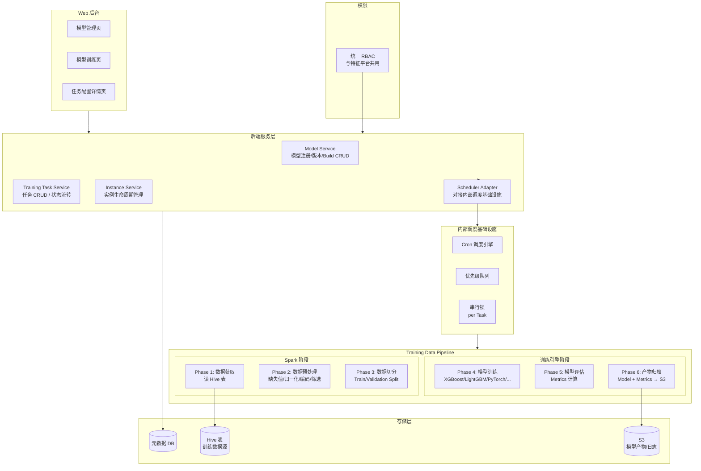
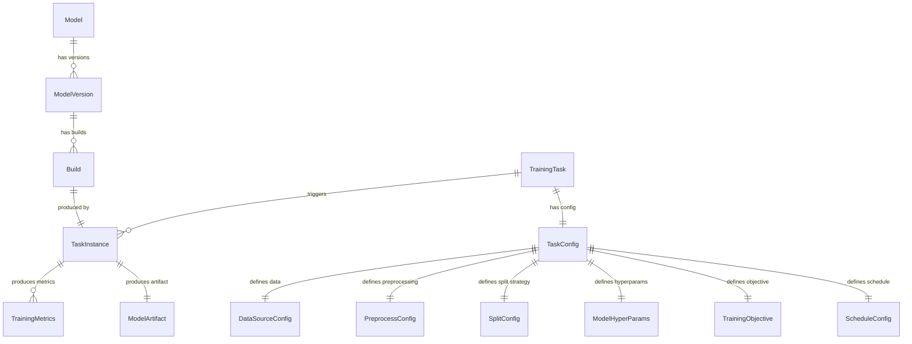
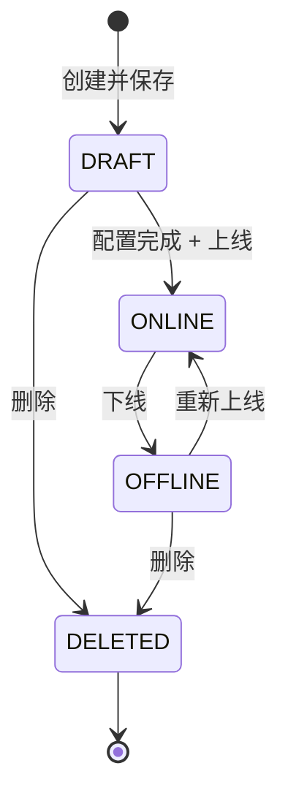
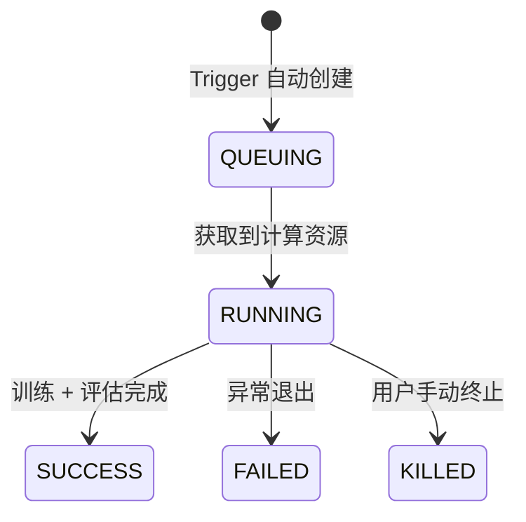
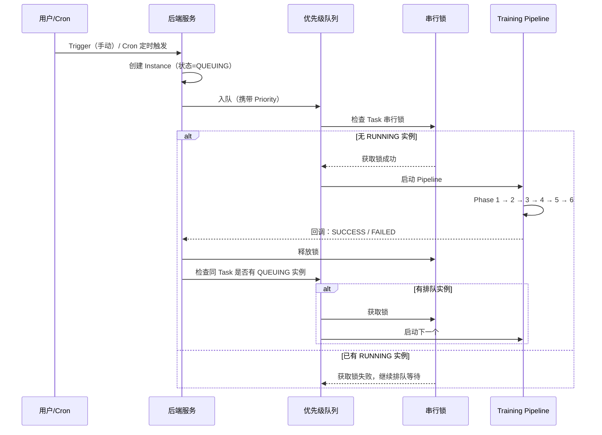
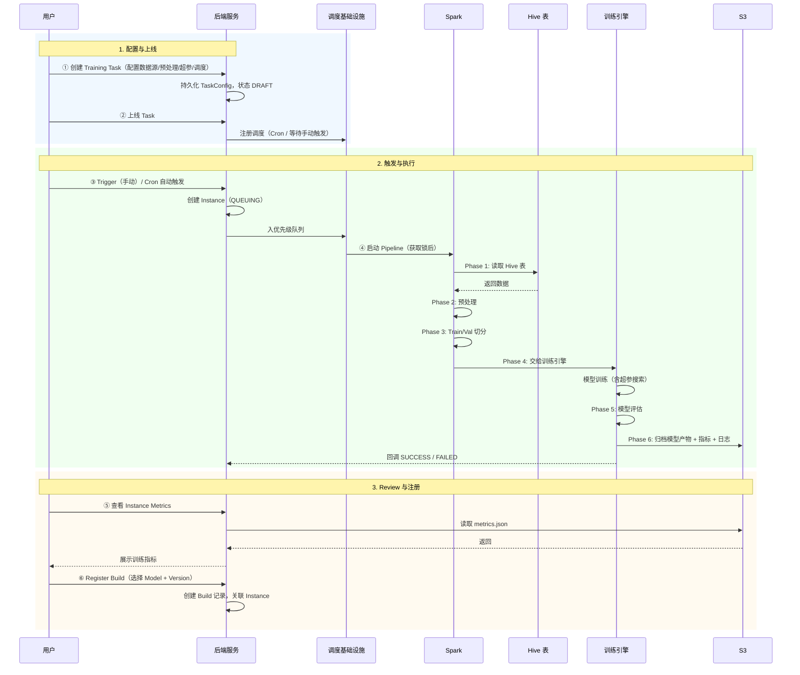
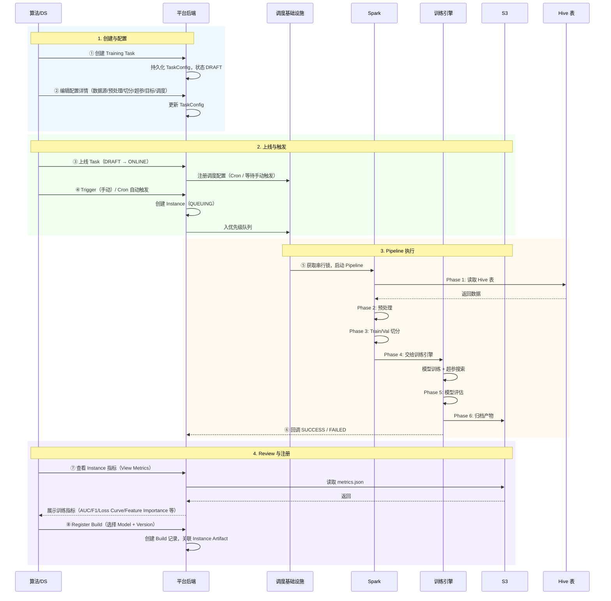

# 离线模型训练平台 — 系统架构说明

## 1. 文档目的与范围

- **目的**：定义离线模型训练平台的系统架构、领域模型、模块职责、状态机与上下游边界，并补充 Tech PM 视角的产品交付示意图（产品架构、核心概念、操作主流程、数据流转、功能边界、预研清单），为后端开发、前端交互设计、以及与上游特征平台/下游模型部署的对接提供统一理解。
- **范围**：平台包含 **模型管理（Model Management）** 与 **模型训练（Model Training）** 两大模块，核心是 Training Data Pipeline（Spark 数据处理 + 独立训练引擎）。模型部署与线上 Serving 仅做粗略设计，不在本期详细展开。§1–§8 为系统架构设计；§9–§15 为产品交付补充（PM 视角）。

**设计边界（重要）**

- **训练数据只读**：平台从 Hive 表读取训练数据，不对上游数据进行写入或修改。
- **松耦合于特征平台**：训练数据来源为用户有权限访问的任意 Hive 表（包含但不限于特征平台 WideTable 产出的离线宽表），不与特征平台做强耦合集成。
- **模型部署**：本期仅设计 Model → Version → Build 的注册出口，具体部署流程待后续迭代。
- **UI 风格**：与在线特征平台保持一致（Ant Design Pro / 主色 `#13c2c2`），本文档聚焦架构设计，交互原型待后续独立输出。

---

## 2. 总体架构图



---

## 3. 领域模型

### 3.1 核心实体关系



### 3.2 实体定义

#### Model（模型）

| 字段 | 类型 | 说明 |
|------|------|------|
| model_id | string (PK) | 模型唯一标识 |
| name | string | 模型名称 |
| description | text | 模型描述 |
| model_type | enum: classification / regression | 任务类型 |
| framework | enum: xgboost / lightgbm / catboost / sklearn / pytorch / tensorflow | 框架 |
| owner | string | 创建人 |
| biz_team | string | 所属业务团队 |
| status | enum: active / deprecated | 模型状态 |
| create_time | datetime | 创建时间 |
| update_time | datetime | 更新时间 |

#### ModelVersion（模型版本）

| 字段 | 类型 | 说明 |
|------|------|------|
| version_id | string (PK) | 版本唯一标识 |
| model_id | string (FK) | 所属模型 |
| version_tag | string | 版本标签（v1 / v2 / ...） |
| description | text | 版本描述 |
| status | enum: active / deprecated | 版本状态 |
| create_time | datetime | 创建时间 |

#### Build（构建产物）

| 字段 | 类型 | 说明 |
|------|------|------|
| build_id | string (PK) | Build 唯一标识 |
| version_id | string (FK) | 所属版本 |
| instance_id | string (FK) | 产出该 Build 的训练实例 |
| artifact_s3_path | string | 模型产物 S3 路径 |
| metrics_snapshot | JSON | 训练指标快照 |
| config_snapshot | JSON | 训练配置快照 |
| status | enum: registered / archived | Build 状态 |
| registered_by | string | 注册人 |
| register_time | datetime | 注册时间 |

#### TrainingTask（训练任务）

| 字段 | 类型 | 说明 |
|------|------|------|
| task_id | string (PK) | 任务唯一标识 |
| name | string | 任务名称 |
| description | text | 任务描述 |
| status | enum: DRAFT / ONLINE / OFFLINE / DELETED | 任务状态 |
| owner | string | 创建人 |
| biz_team | string | 所属业务团队 |
| priority | enum: normal / important / critical | 任务优先级 |
| resource_level | enum: low / medium / high | 计算资源档位 |
| create_time | datetime | 创建时间 |
| update_time | datetime | 更新时间 |

#### TaskInstance（任务实例）

| 字段 | 类型 | 说明 |
|------|------|------|
| instance_id | string (PK) | 实例唯一标识 |
| task_id | string (FK) | 所属任务 |
| status | enum: QUEUING / RUNNING / SUCCESS / FAILED / KILLED | 实例状态 |
| trigger_type | enum: manual / cron | 触发类型 |
| queued_at | datetime | 入队时间 |
| started_at | datetime | 开始执行时间 |
| finished_at | datetime | 结束时间 |
| artifact_s3_path | string | 模型产物 S3 路径 |
| metrics_s3_path | string | 训练指标 S3 路径 |
| log_s3_path | string | 训练日志 S3 路径 |
| config_snapshot_s3_path | string | 任务配置快照 S3 路径 |
| error_message | text | 失败时的错误信息 |

---

## 4. 模块设计

### 4.1 模型管理模块（Model Management）

| 项目 | 说明 |
|------|------|
| **职责** | 管理模型定义、版本、Build 产物；本期粗略设计，重点是为训练产出提供注册落地。 |
| **边界** | 仅负责模型注册与版本管理；不负责模型部署与线上 Serving（本期暂不详设）。 |

**页面结构**：

- **模型列表页**：展示已注册的 Model，支持按 framework / model_type / owner / biz_team 筛选。
- **模型详情页**：展示 Model 元信息 + ModelVersion 列表 + 每个 Version 下的 Build 列表。
- **Build 注册流程**：用户从训练实例的 SUCCESS 结果中，点击「注册为 Build」→ 选择目标 Model + Version（或新建）→ 完成注册。

**Model 状态**：Active / Deprecated（本期简化，不设复杂状态机）。

**概念层级关系**：

```
Model（逻辑模型实体，如「欺诈检测模型」）
├── ModelVersion v1（重大迭代，如架构变更）
│   ├── Build #1（来自 Task Instance #101）
│   └── Build #2（来自 Task Instance #205）
└── ModelVersion v2
    └── Build #1（来自 Task Instance #310）
```

### 4.2 模型训练模块（Model Training）

| 项目 | 说明 |
|------|------|
| **职责** | 训练任务全生命周期管理：任务配置、调度、实例执行追踪、指标展示。 |
| **边界** | 负责从任务配置到训练产出的全链路；训练数据由用户指定 Hive 表获取；模型产物存储到 S3 后，通过 Build 注册衔接到模型管理模块。 |

#### 4.2.1 训练任务状态机（Task State Machine）



| 状态 | Tag 颜色 | 含义 |
|------|----------|------|
| **DRAFT** | `tag-gray` | 已创建但未启用调度，不可触发实例 |
| **ONLINE** | `tag-green` | 调度生效中，可手动触发或按 Cron 自动触发实例 |
| **OFFLINE** | `tag-red` | 暂停调度，已有 RUNNING 实例继续执行但不再产生新实例 |
| **DELETED** | — | 软删除，界面不再显示 |

**Task Action 可见性矩阵**：

| 操作 | DRAFT | ONLINE | OFFLINE |
|------|-------|--------|---------|
| Edit | Yes | Yes | Yes |
| Trigger | 置灰（未上线不可触发） | Yes | 置灰（已下线不可触发） |
| Online | Yes（首次上线） | 置灰（已 ONLINE） | Yes（重新上线） |
| Offline | 置灰（未上线） | Yes | 置灰（已 OFFLINE） |
| Delete | Yes | 置灰（需先 Offline） | Yes |

**关键流转规则**：

1. **新建**：表单 Save → DRAFT。
2. **上线**：DRAFT / OFFLINE → ONLINE；上线后调度配置生效（Cron 开始计时或等待手动 Trigger）。
3. **下线**：ONLINE → OFFLINE；暂停调度，已有 RUNNING 实例不受影响继续执行，但不再产生新实例。
4. **删除**：仅 DRAFT 或 OFFLINE 可 Delete → 软删除。ONLINE 状态须先 Offline 才可 Delete。
5. **编辑**：所有非 DELETED 状态均可 Edit；ONLINE 状态下编辑保存后立即生效（下次 Trigger 使用新配置）。

#### 4.2.2 任务实例状态机（Instance State Machine）



| 状态 | Tag 颜色 | 含义 |
|------|----------|------|
| **QUEUING** | `tag-orange` | 已创建等待计算资源，排队中 |
| **RUNNING** | `tag-blue` | 正在执行 Training Data Pipeline |
| **SUCCESS** | `tag-green` | 训练 + 评估完成，产物已归档 S3 |
| **FAILED** | `tag-red` | 异常退出，错误信息已记录 |
| **KILLED** | `tag-red` | 用户手动终止 |

**Instance Action 可见性矩阵**：

| 操作 | QUEUING | RUNNING | SUCCESS | FAILED | KILLED |
|------|---------|---------|---------|--------|--------|
| View Metrics | 置灰 | 置灰 | Yes | 置灰 | 置灰 |
| View Log | 置灰 | 置灰 | Yes | Yes | Yes |
| Register Build | 置灰 | 置灰 | Yes | 置灰 | 置灰 |
| Kill | Yes（取消排队） | Yes（终止执行） | 置灰 | 置灰 | 置灰 |

**关键流转规则**：

1. **创建**：Trigger（手动或 Cron）→ 创建 Instance，初始状态 QUEUING。
2. **排队**：优先级队列按 Task Priority（normal / important / critical）排序；串行锁保证同一 Task 同时最多一个 RUNNING 实例。
3. **执行**：获取到计算资源 → RUNNING；执行 Training Data Pipeline 全部 6 个 Phase。
4. **完成**：Pipeline 全部成功 → SUCCESS；任意 Phase 异常 → FAILED。
5. **终止**：QUEUING 状态 Kill = 从队列移除；RUNNING 状态 Kill = 向计算引擎发送 cancel 信号。
6. **Register Build**：仅 SUCCESS 状态可操作；点击后跳转 Build 注册流程（选择 Model + Version）。

#### 4.2.3 页面层级

```
模型训练页
├── 训练任务一级 List（Task 列表）
│   ├── 筛选：Name / Status / Owner / Biz Team / Priority
│   ├── Action: Edit / Trigger / Manage(Online / Offline / Delete)
│   └── 点击展开 → 嵌套表格
│       └── 任务实例执行记录（Instance 列表）
│           ├── 列: Instance ID / Status / Trigger Type / Queued At / Started At
│           │       / Finished At / Action
│           └── Action: View Metrics / View Log / Register Build / Kill
└── 训练任务配置详情页（点击 Task Name 或 Edit 进入）
    ├── 基本信息（Name / Description / Owner / Biz Team / Priority / Resource Level）
    ├── 数据源配置（Hive Table / Schema / Partition Filter）
    ├── 预处理配置（缺失值策略 / 归一化 / 编码 / 特征筛选）
    ├── 切分策略配置（切分方式 + 对应参数）
    ├── 模型与超参配置（Framework / Model Type / Hyperparameters / 超参搜索）
    ├── 训练目标配置（优化指标 / 停止条件 / Early Stopping）
    └── 调度配置（手动 / Cron 表达式 / 最大排队深度）
```

---

## 5. 训练任务配置详情页（数据模型）

训练任务配置详情页是本系统的核心交互入口，用户在此完成全部训练配置。以下为数据模型（后续交互设计将基于此）：

### 5.1 配置分区

| 配置区块 | 字段 | 类型 | 说明 |
|----------|------|------|------|
| **基本信息** | name | string | 任务名称 |
| | description | text | 任务描述 |
| | owner | string (readonly) | 当前用户，自动填充 |
| | biz_team | enum | 业务团队 |
| | priority | enum: normal / important / critical | 任务优先级，影响队列排序 |
| | resource_level | enum: low / medium / high | 计算资源档位 |
| **数据源** | hive_server | enum | 数据服务标识（如 reg_sg_hive / reg_us_hive） |
| | table_schema | string | Hive Schema |
| | table_name | string + Fetch 校验 | Hive 表名，点击 Fetch 校验权限并获取字段列表 |
| | partition_filter | string (optional) | 分区过滤条件（如 `dt >= '2025-01-01'`） |
| | custom_filter | text (optional) | 自定义 WHERE 条件 |
| | label_column | select (Fetch 后) | 标签列 |
| | feature_columns | multi-select (Fetch 后) | 特征列 |
| **预处理** | missing_value_strategy | enum per column | 缺失值策略 |
| | categorical_columns | multi-select | 类别列指定 |
| | encoding_strategy | enum | 编码方式 |
| | normalization_strategy | enum | 归一化方式 |
| | feature_selection_mode | enum | 特征筛选方式 |
| **切分策略** | split_method | enum (5 种) | 切分方式 |
| | split_params | dynamic form | 按方式动态展示参数 |
| **模型与超参** | framework | enum | 框架选择 |
| | model_type | enum: classification / regression | 任务类型 |
| | hyperparameters | JSON editor / dynamic form | 超参配置 |
| | hyperparam_search | enum: none / grid / random / bayesian | 超参搜索方式 |
| | search_space | JSON (optional) | 搜索空间定义 |
| **训练目标** | optimization_metric | enum (按 model_type 动态) | 优化指标 |
| | early_stopping | bool | 是否启用 |
| | patience | int (optional) | 容忍轮次 |
| | min_delta | float (optional) | 最小改善阈值 |
| **调度** | schedule_mode | enum: manual / cron | 调度模式 |
| | cron_expression | string (optional) | Cron 表达式 |
| | max_queue_depth | int (default: 3) | 最大排队深度 |

### 5.2 字段联动规则

| 触发条件 | 联动行为 |
|----------|----------|
| table_name 点击 Fetch | 校验 hive_server + table_schema + table_name 权限；成功后加载字段列表，激活 label_column / feature_columns 选择 |
| split_method 切换 | 动态展示对应的 split_params 表单（详见 Training-Data-Pipeline.md §3.3） |
| framework 切换 | 动态更新 hyperparameters 表单 schema（每种框架有不同的超参模板） |
| model_type 切换 | 动态更新 optimization_metric 可选项（classification → AUC/F1/Precision/Recall；regression → RMSE/MAE/R²） |
| hyperparam_search = none | search_space 字段隐藏 |
| early_stopping = false | patience / min_delta 字段隐藏 |
| schedule_mode = manual | cron_expression 字段隐藏 |

---

## 6. 任务调度与串行控制

### 6.1 调度流程



### 6.2 Cron 与串行的交互

- Cron 触发时创建 Instance 入队；若前一个实例仍在 RUNNING，新实例在 QUEUING 等待。
- 若 QUEUING 中已有同 Task 的实例，Cron 再次触发时**仍创建新实例入队**（保留完整的调度记录），但受 `max_queue_depth` 约束（默认 3）；超出则跳过本次触发并记录 skip 日志。

### 6.3 优先级队列规则

| 优先级 | 排序权重 | 说明 |
|--------|----------|------|
| critical | 最高 | 优先获取计算资源 |
| important | 中 | 常规业务任务 |
| normal | 最低 | 实验性任务 |

- 同优先级内按 `queued_at` FIFO 排序。
- 优先级调度跨 Task 生效（不同 Task 的 Instance 共享同一优先级队列）。
- 串行锁仅限制同一 Task 内的并发（不同 Task 可同时 RUNNING）。

---

## 7. 与上下游的边界

| 环节 | 归属 | 说明 |
|------|------|------|
| Hive 表数据准备（含 WideTable 产出） | 上游（特征平台 / 其他数据管道） | 本平台仅读取，不写入 |
| 训练任务配置与调度 | **本平台** | 核心职责 |
| Training Data Pipeline（Spark + Engine） | **本平台** | 核心职责；详见 [Training-Data-Pipeline.md](../design/Training-Data-Pipeline.md) |
| 训练指标计算与展示 | **本平台** | 核心职责 |
| 模型产物存储（S3） | **本平台** | 写入 S3 |
| 模型注册（Model / Version / Build） | **本平台** | 核心职责 |
| 模型部署与线上 Serving | 下游（本期不详设） | 仅粗略设计 Build 注册出口，具体部署流程待后续设计 |
| 用户权限 | 共用 | 统一 RBAC，与特征平台一致 |
| 任务调度引擎 | 共用 | 复用现有内部调度基础设施 |

---

## 8. 数据流简图



---

## 9. 产品架构图（PM 视角）

Tech PM 视角：从产品能力与用户视角划分模块与边界，便于产品/业务对齐与开发交付。

```
┌──────────────────────────────────────────────────────────────────────────────────────────┐
│                          离线模型训练平台（产品边界）                                         │
├──────────────────────────────────────────────────────────────────────────────────────────┤
│                                                                                          │
│   ┌──────────────────────────────────────────────────────────────────────────────────┐   │
│   │ 面向：算法 / DS / 策略                                                            │   │
│   ├──────────────────────────────────────────────────────────────────────────────────┤   │
│   │                                                                                  │   │
│   │  ┌───────────────────────┐        ┌───────────────────────────────────────────┐  │   │
│   │  │ Model Management      │        │ Model Training                            │  │   │
│   │  │ 模型管理              │        │ 模型训练                                   │  │   │
│   │  │                       │        │                                           │  │   │
│   │  │ · Model 注册/列表     │  ◄──── │ · Training Task 配置与管理                │  │   │
│   │  │ · ModelVersion 管理   │ Build  │ · Task Instance 执行记录                  │  │   │
│   │  │ · Build 注册/归档     │ 注册   │ · 训练任务配置详情页                       │  │   │
│   │  │ · 状态：Active /      │        │   （数据源 / 预处理 / 切分 / 超参 / 调度） │  │   │
│   │  │   Deprecated          │        │ · 指标展示（Metrics / Log）               │  │   │
│   │  └───────────────────────┘        └──────────────────┬────────────────────────┘  │   │
│   │                                                      │ Trigger                    │   │
│   └──────────────────────────────────────────────────────┼────────────────────────────┘   │
│                                                          │                                │
│   ┌──────────────────────────────────────────────────────▼────────────────────────────┐   │
│   │ 平台执行层（对用户透明）                                                           │   │
│   │                                                                                    │   │
│   │  ┌─────────────────┐  ┌─────────────────┐  ┌─────────────────────────────────┐   │   │
│   │  │ 调度与队列       │  │ Spark 阶段      │  │ 训练引擎阶段                     │   │   │
│   │  │ · 优先级队列     │→ │ · Phase 1 取数  │→ │ · Phase 4 模型训练              │   │   │
│   │  │ · 串行锁         │  │ · Phase 2 预处理│  │ · Phase 5 模型评估              │   │   │
│   │  │ · Cron 调度      │  │ · Phase 3 切分  │  │ · Phase 6 产物归档 → S3         │   │   │
│   │  └─────────────────┘  └─────────────────┘  └─────────────────────────────────┘   │   │
│   │                                                                                    │   │
│   └────────────────────────────────────────────────────────────────────────────────────┘   │
│                                                                                          │
└──────────────────────────────────────────────────────────────────────────────────────────┘
                                       │
                  ┌────────────────────┼────────────────────┐
                  ▼                    ▼                    ▼
           ┌────────────┐      ┌────────────┐      ┌────────────┐
           │ 上游数据    │      │ 调度基础设施│      │ 下游消费    │
           │ 非本产品    │      │ 共用        │      │ 本期不详设  │
           │ (Hive 表    │      │ (内部调度   │      │ (Model     │
           │  已就绪,    │      │  引擎,      │      │  Serving / │
           │  含 WideTable│     │  RBAC)      │      │  Deploy)   │
           │  产出)      │      │             │      │            │
           └────────────┘      └────────────┘      └────────────┘
```

**产品架构要点（Tech PM 可强调）**

| 维度 | 说明 |
|------|------|
| 用户群体 | 算法 / DS / 策略：创建训练任务 → 配置 → 触发 → Review 指标 → 注册 Build。 |
| 能力边界 | 平台不负责上游数据准备（Hive 表由特征平台 / 其他管道产出）；不负责模型部署与线上 Serving（本期暂不详设）。 |
| 核心职责 | 「训练任务配置 → 调度执行 → 数据管道 → 模型评估 → 产物归档 → Build 注册」。 |
| 松耦合 | 训练数据来源为任意有权限的 Hive 表，包含但不限于特征平台 WideTable 产出；不与特征平台做强耦合集成。 |
| 两大模块 | **Model Training**（本期重点）：训练任务全生命周期；**Model Management**（本期粗略设计）：模型注册与版本管理。 |
| Build 注册 | 训练实例 SUCCESS 后，用户 Review 指标 → 手动注册为 Model Version 下的 Build；平台不自动注册。 |

---

## 10. 核心概念与术语表

以下为本平台核心概念，供产品/开发/业务统一理解。

| 概念 | 英文 | 定义 | 与其他概念的关系 |
|------|------|------|------------------|
| **模型** | Model | 逻辑模型实体，代表一个业务场景下的模型（如「欺诈检测模型」「信用评分模型」），包含元信息（名称、框架、类型、Owner）。 | 一个 Model 下可有多个 ModelVersion。 |
| **模型版本** | ModelVersion | Model 的一次重大迭代（如架构变更、特征集重构），以 v1 / v2 等标签区分。 | 一个 ModelVersion 下可有多个 Build。 |
| **构建产物** | Build | 一次训练实例产出的、经用户 Review 后注册的模型产物，包含模型文件 + 指标快照 + 配置快照。 | 由一个 TaskInstance 产出；注册到一个 ModelVersion 下。 |
| **训练任务** | TrainingTask | 可复用的训练配置实体，定义了完整的训练计划：数据源、预处理、切分策略、模型超参、训练目标、调度方式。 | 一个 Task 可触发多个 TaskInstance。 |
| **任务实例** | TaskInstance | Training Task 的一次实际执行记录，对应 Training Data Pipeline 的一次完整运行。 | 由 Task Trigger 自动创建；产出 ModelArtifact + TrainingMetrics。 |
| **训练数据管道** | Training Data Pipeline | 从 Hive 数据读取到模型产物归档的 6 Phase 全流程，由 Spark + 独立训练引擎协作完成。 | 每个 TaskInstance 执行一次完整 Pipeline。 |
| **模型产物** | ModelArtifact | Pipeline Phase 6 归档至 S3 的全部文件：模型文件 + 预处理元数据 + 训练指标 + 日志 + 配置快照。 | 与 TaskInstance 一一对应；Build 注册时引用 Artifact 路径。 |
| **优先级队列** | Priority Queue | 跨 Task 的全局实例排队机制，按 critical > important > normal 排序，同优先级 FIFO。 | 与串行锁配合：不同 Task 可并行，同 Task 严格串行。 |
| **串行锁** | Serial Lock | per-Task 粒度的并发控制，保证同一 Task 同一时刻最多一个 RUNNING 实例。 | 当前 RUNNING 结束释放锁后，队列中同 Task 的下一个 QUEUING 实例获取锁执行。 |

**概念层级关系小结**

```
Model（逻辑模型实体）
├── ModelVersion v1
│   ├── Build #1 ← TaskInstance #101 (SUCCESS)
│   └── Build #2 ← TaskInstance #205 (SUCCESS)
└── ModelVersion v2
    └── Build #1 ← TaskInstance #310 (SUCCESS)

TrainingTask（可复用配置）
├── TaskInstance #101 (SUCCESS) → ModelArtifact @ S3 → 注册为 Build
├── TaskInstance #102 (FAILED)  → 仅有日志 @ S3
├── TaskInstance #205 (SUCCESS) → ModelArtifact @ S3 → 注册为 Build
└── TaskInstance #206 (KILLED)  → 仅有日志 @ S3
```

---

## 11. 操作主流程示意图

### 11.1 算法/DS：从配置到模型注册（端到端）



### 11.2 例行化自动迭代流程

当 Task 配置了 Cron 调度后，平台自动实现模型的例行化迭代：

```
算法/DS                          平台                                      S3
    │                              │                                        │
    │ 一次性配置：                  │                                        │
    │ Task + Cron 表达式 + 上线    │                                        │
    ├─────────────────────────────►│                                        │
    │                              │ Cron 自动触发（如每周一 00:00）         │
    │                              │ → 创建 Instance（QUEUING）             │
    │                              │ → 获取锁 → 执行 Pipeline               │
    │                              │ → Phase 1→2→3→4→5→6                   │
    │                              ├───────────────────────────────────────►│
    │                              │                  模型产物 + 指标归档    │
    │                              │                                        │
    │ 定期 Review 最新实例指标      │                                        │
    │ → 选优注册 Build             │                                        │
    ├─────────────────────────────►│                                        │
    │                              │                                        │
```

**操作主流程小结**

| 角色 | 主流程 | 关键结果 |
|------|--------|----------|
| 算法/DS | 创建 Task → 配置 → 上线 → 触发（或 Cron 自动） → Review → 注册 Build | 模型产物注册为 Build，可供后续部署 |
| 平台（自动） | Cron 触发 → 入队 → 获取锁 → Pipeline 6 Phase → 归档 → 释放锁 | Instance SUCCESS/FAILED，产物归档至 S3 |

---

## 12. 数据流转示意图

### 12.1 元数据与配置流（谁写、谁读）

```
  ┌─────────────────────┐
  │ 算法/DS（用户）       │
  └──────────┬──────────┘
             │ 创建/编辑
             ▼
  ┌─────────────────────┐    持久化      ┌─────────────────────┐
  │ Training Task 配置   │──────────────►│ 平台元数据存储       │
  │ (TaskConfig 全 7 区块)│              │ (Task / Instance /   │
  └─────────────────────┘               │  Model / Version /   │
             │                          │  Build 配置)         │
             │ 上线 Task                └──────────┬──────────┘
             ▼                                     │
  ┌─────────────────────┐                         │ Instance 回调写入
  │ 调度基础设施         │                         │ (状态 / S3 路径 / Metrics)
  │ (Cron + 优先级队列)  │                         │
  └──────────┬──────────┘                         │
             │ Trigger                              │
             ▼                                     ▼
  ┌─────────────────────┐               ┌─────────────────────┐
  │ Training Pipeline   │               │ Web 后台展示         │
  │ (读取 TaskConfig     │               │ (读取元数据展示      │
  │  执行 6 Phase)       │               │  Task/Instance/     │
  └─────────────────────┘               │  Metrics/Build)     │
                                        └─────────────────────┘
```

### 12.2 训练数据流（一次 Pipeline 内的数据走向）

```
  调度基础设施         Training Data Pipeline                   外部存储
      │                         │                              │
      │ 启动 Pipeline           │                              │
      ├────────────────────────►│                              │
      │                         │ 1. Phase 1: 读取 Hive 表      │
      │                         ├─────────────────────────────►│ Hive
      │                         │◄─────────────────────────────┤ 返回 DataFrame
      │                         │ 2. Phase 2: 预处理（Spark）    │
      │                         │    缺失值 → 编码 → 归一化 → 筛选
      │                         │ 3. Phase 3: 切分 Train/Val    │
      │                         │ 4. Phase 4: 交给训练引擎       │
      │                         │    （传数据方式取决于框架）     │
      │                         │ 5. Phase 5: 模型评估           │
      │                         │ 6. Phase 6: 归档产物           │
      │                         ├─────────────────────────────►│ S3
      │                         │    model.* / metrics.json /   │
      │                         │    preprocessor.json / log    │
      │◄────────────────────────┤ 回调：SUCCESS + S3 路径       │
```

### 12.3 数据流汇总（一图看清两类流）

```
  ┌──────────────┐                    ┌──────────────────────────────────────┐
  │ 配置/元数据   │                    │ 训练数据（运行时）                     │
  │ 流           │                    │ 流                                    │
  ├──────────────┤                    ├──────────────────────────────────────┤
  │ 人 → Task    │                    │ Hive 表 → Spark 预处理 → 切分         │
  │ → 元数据存储 │                    │ → 训练引擎（XGBoost/PyTorch/...）     │
  │ → 调度配置   │                    │ → 模型产物 → S3 归档                   │
  │ → Web 展示   │                    │ → Metrics 回写元数据                   │
  │              │                    │                                        │
  │ Build 注册:  │                    │ 关键交接点:                             │
  │ 人 → Model   │                    │ Spark DataFrame → 训练引擎             │
  │  → Version   │                    │ （直传 / Parquet 落盘 / S3 staging）   │
  │  → Build     │                    │                                        │
  └──────────────┘                    └──────────────────────────────────────┘
```

---

## 13. 平台功能边界与模块职责（开发视角）

供开发做**背景理解**与**方案/预研**用：系统边界、模块职责、接口与契约、预研点。

### 13.1 系统边界与模块职责

```
┌──────────────────────────────────────────────────────────────────────────────────────┐
│ 本系统（离线模型训练平台）边界                                                          │
├──────────────────────────────────────────────────────────────────────────────────────┤
│                                                                                      │
│  ┌──────────────────┐  ┌──────────────────┐  ┌──────────────────────────────────┐   │
│  │ Model 管理服务    │  │ Training Task    │  │ Instance 管理服务               │   │
│  │                  │  │ 管理服务          │  │                                  │   │
│  │ · Model CRUD    │  │ · Task CRUD      │  │ · Instance 生命周期管理          │   │
│  │ · Version 管理   │  │ · 状态流转        │  │   (QUEUING→RUNNING→SUCCESS/     │   │
│  │ · Build 注册     │  │   (DRAFT/ONLINE/ │  │    FAILED/KILLED)               │   │
│  │ · 状态 Active/   │  │    OFFLINE)      │  │ · Kill 处理                     │   │
│  │   Deprecated    │  │ · 配置详情页      │  │ · Metrics / Log 读取 (从 S3)    │   │
│  │                  │  │   (7 区块表单)    │  │ · Register Build 流程           │   │
│  └──────┬───────────┘  └──────┬───────────┘  └──────────┬───────────────────────┘   │
│         │ Build 注册          │ Trigger                  │ Pipeline 回调              │
│         └─────────────────────┼──────────────────────────┘                           │
│                               │                                                      │
│                               ▼                                                      │
│  ┌───────────────────────────────────────────────────────────────────────────────┐   │
│  │ Scheduler Adapter（对接内部调度基础设施）                                        │   │
│  │ · Cron 注册/取消    · 优先级队列入队    · 串行锁管理                              │   │
│  └───────────────────────────────────────────────────────────────────────────────┘   │
│                               │                                                      │
│                               ▼                                                      │
│  ┌───────────────────────────────────────────────────────────────────────────────┐   │
│  │ Training Data Pipeline（执行层，预研重点）                                       │   │
│  │ · Phase 1: 数据获取 — SparkSQL 读 Hive，partition/custom filter pushdown       │   │
│  │ · Phase 2: 预处理 — 缺失值/编码/归一化/筛选，产出 preprocessor_metadata         │   │
│  │ · Phase 3: 切分 — 5 种策略，产出 train_df + val_df                             │   │
│  │ · Phase 4: 训练 — 引擎适配（XGBoost/LightGBM/PyTorch/TF），超参搜索            │   │
│  │ · Phase 5: 评估 — Metrics 计算（按 model_type 动态），产出 metrics.json          │   │
│  │ · Phase 6: 归档 — 全部产物上传 S3，回调更新 MetaDB                               │   │
│  └───────────────────────────────────────────────────────────────────────────────┘   │
│                               │                                                      │
└───────────────────────────────┼──────────────────────────────────────────────────────┘
                                │
           ┌────────────────────┼────────────────────┬───────────────┐
           ▼                    ▼                    ▼               ▼
    ┌────────────┐       ┌────────────┐       ┌──────────┐   ┌──────────┐
    │ Hive       │       │ S3         │       │ 内部调度  │   │ RBAC     │
    │ (训练数据   │       │ (模型产物   │       │ 基础设施  │   │ (统一权限 │
    │  只读)      │       │  日志/指标) │       │ (Cron/   │   │  与特征平 │
    │            │       │            │       │  Queue)  │   │  台共用)  │
    └────────────┘       └────────────┘       └──────────┘   └──────────┘
```

### 13.2 关键接口/契约（开发需实现或遵守）

```
┌──────────────────────────────────────────────────────────────────────────────────────┐
│ 接口/契约摘要                                                                        │
├──────────────────────────────────────────────────────────────────────────────────────┤
│                                                                                      │
│ 1. Training Task Service → Web UI                                                    │
│    输入：Task CRUD 请求（创建/编辑/状态流转）、TaskConfig 全 7 区块                   │
│    输出：Task 列表（含状态/Action 可见性矩阵）、Task 详情                             │
│    要点：Edit 在 ONLINE 状态下立即生效（下次 Trigger 使用新配置）                     │
│                                                                                      │
│ 2. Instance Service → Web UI                                                         │
│    输入：Trigger 请求、Kill 请求、View Metrics/Log 请求、Register Build 请求         │
│    输出：Instance 列表（嵌套在 Task 下）、Metrics JSON（从 S3 读取）、Log 文本        │
│    要点：Trigger 时自动创建 Instance（QUEUING）；仅 SUCCESS 可 Register Build         │
│                                                                                      │
│ 3. Scheduler Adapter → 内部调度基础设施                                               │
│    输入：Task 上线 → 注册 Cron；Trigger → 入优先级队列                                │
│    输出：串行锁状态、QUEUING 实例出队通知                                              │
│    预研：与内部调度引擎的对接方式（API/SDK）、优先级队列实现（Redis/DB/MQ）            │
│                                                                                      │
│ 4. Training Data Pipeline → 各外部依赖                                                │
│    Phase 1 → Hive：SparkSQL 查询，需 RBAC 权限校验                                   │
│    Phase 4 → 训练引擎：数据交接（DataFrame 直传 / Parquet / S3 staging）             │
│    Phase 6 → S3：产物上传（模型文件 + 指标 + 日志 + 配置快照 + 预处理元数据）         │
│    Phase 6 → MetaDB：Instance 状态更新 + S3 路径回写                                 │
│    预研：Spark 与各训练框架的集成方式、S3 SDK、失败回调与清理机制                      │
│                                                                                      │
│ 5. Model Service → Web UI                                                            │
│    输入：Model/Version/Build CRUD 请求                                                │
│    输出：Model 列表 + 详情（嵌套 Version → Build）、Build 元信息（指标快照 + 配置快照）│
│    要点：Build 由 Instance Register Build 流程创建，关联 Instance 的 Artifact S3 路径 │
│                                                                                      │
│ 6. Hive Fetch（配置详情页联动）                                                       │
│    输入：hive_server + table_schema + table_name                                     │
│    输出：权限校验结果 + 字段列表（列名 + 数据类型）                                   │
│    预研：Hive MetaStore API 对接、权限校验与 RBAC 集成                                │
│                                                                                      │
└──────────────────────────────────────────────────────────────────────────────────────┘
```

### 13.3 预研与风险点清单（Tech PM 交付开发）

| 序号 | 预研/风险点 | 说明 | 建议方向 |
|------|-------------|------|----------|
| P1 | Spark 与多框架训练引擎集成 | XGBoost/LightGBM 可走 SynapseML 分布式；CatBoost/sklearn 需 Parquet 落盘 + pandas 转换；PyTorch/TF 需 S3 staging + K8s GPU 调度 | 先做 XGBoost/LightGBM（Spark 原生集成），再扩展 PyTorch/TF |
| P2 | 超参搜索引擎集成 | Grid/Random 可自实现；Bayesian 需引入 Optuna 或类似库；搜索空间 JSON Schema 的校验与 UI 联动 | 评估 Optuna 在 Spark 环境下的集成方式（Optuna + SparkTrials） |
| P3 | 训练数据预处理管道 | 缺失值/编码/归一化/筛选 4 步在 Spark 上的实现；preprocessor_metadata 的序列化与 Serving 复用 | 基于 Spark ML Pipeline（Imputer/StringIndexer/VectorAssembler）构建，元数据导出为 JSON |
| P4 | 优先级队列与串行锁 | 跨 Task 全局优先级排序 + per-Task 串行锁；锁的获取/释放/超时；与内部调度引擎的集成 | 评估 Redis 分布式锁 + Sorted Set 队列 vs 数据库乐观锁方案 |
| P5 | S3 产物归档与读取 | 模型文件大小差异大（sklearn 几 MB vs PyTorch 几 GB）；归档原子性（部分上传失败的回滚）；Metrics 读取性能 | S3 multipart upload；归档失败标记为 FAILED 而非部分 SUCCESS |
| P6 | Hive MetaStore 对接 | 配置详情页 Fetch 需调用 Hive MetaStore 获取字段列表；权限校验需与 RBAC 集成 | 评估 HiveMetaStoreClient API 或 SparkSQL DESCRIBE TABLE |
| P7 | 训练日志归档 | 离线训练不做 UI 实时查看，但需要将 stdout/stderr 完整归档至 S3；日志文件可能较大 | 训练过程 redirect 到本地文件 → Pipeline 完成后上传 S3 |
| P8 | Kill 处理 | QUEUING 状态 Kill = 队列移除；RUNNING 状态 Kill = 向 Spark/训练引擎发 cancel；需保证临时数据清理 | 为每个 Instance 维护 PID/Job Group ID，Kill 时精确终止 |
| P9 | 配置详情页表单联动 | 7 个区块的动态联动规则（framework 切换 → 超参模板变化；split_method 切换 → 参数表单变化等） | 前端 JSON Schema 驱动的动态表单，后端提供各 framework 的超参模板 |

---

## 14. 与上下游的边界（产品侧完整版）

| 环节 | 是否属于本平台 | 说明 |
|------|----------------|------|
| Hive 表数据准备（特征平台 WideTable / 其他管道） | 否 | 上游数据准备，由特征平台或其他数据管道负责；本平台仅只读消费 |
| Hive MetaStore 字段查询（配置详情页 Fetch） | 平台 BE 调用 | 在配置详情页 Fetch 时调用 Hive MetaStore 获取字段列表；权限校验由 RBAC |
| Training Task 配置与管理 | **是** | 核心职责 |
| 训练任务调度（Cron / 手动 Trigger） | **是**（对接共用调度引擎） | Scheduler Adapter 对接内部调度基础设施 |
| 优先级队列与串行锁 | **是** | 本平台管理队列与锁逻辑 |
| Training Data Pipeline（Phase 1–6） | **是** | 核心职责；详见 [Training-Data-Pipeline.md](../design/Training-Data-Pipeline.md) |
| 训练指标计算与展示 | **是** | Phase 5 产出 Metrics；Web UI 从 S3 读取展示 |
| 模型产物存储（S3） | **是** | Phase 6 写入 S3 |
| 模型注册（Model / Version / Build） | **是** | 核心职责；用户手动注册，平台不自动注册 |
| 模型部署与线上 Serving | 否（本期不详设） | 仅设计 Build 注册出口；具体部署由下游负责 |
| 用户权限（RBAC） | 共用 | 统一 RBAC，与特征平台一致 |
| 调度引擎 | 共用 | 复用现有内部调度基础设施 |
| 计算资源（Spark/GPU/K8s） | 共用 | 资源由基础设施团队管理；平台通过 resource_level 映射 |

---

## 15. 术语与边界对齐

**与架构设计文档对齐的术语说明**：

- **Training Task** = 训练任务（可复用配置实体），对应架构 §4.2；状态机 DRAFT → ONLINE → OFFLINE → DELETED。
- **Task Instance** = 任务实例（单次执行），对应架构 §4.2.2；状态机 QUEUING → RUNNING → SUCCESS / FAILED / KILLED。
- **Build** = 构建产物（注册后的模型），对应架构 §3.2 Build 实体；由 SUCCESS 的 Instance 手动注册产出。
- **Training Data Pipeline** = 6 Phase 数据管道，对应 [Training-Data-Pipeline.md](../design/Training-Data-Pipeline.md)；Spark 阶段（Phase 1–3）+ 训练引擎阶段（Phase 4–6）。
- **Resource Level** = 计算资源档位（low / medium / high），对用户屏蔽具体的 Spark Executor / GPU 参数；映射关系由运维配置，详见 Pipeline 文档 §4。
- **Priority** = 任务优先级（normal / important / critical），影响 Instance 在全局优先级队列中的排序；与 resource_level 正交。

建议：先读本文档（系统架构说明）建立完整概念，再读 [Training-Data-Pipeline.md](../design/Training-Data-Pipeline.md) 了解执行层细节。

---

## 16. 延期特性（Backlog）

| 特性 | 优先级 | 说明 |
|------|--------|------|
| 数据采样 | P2 | 大表取 N% 快速实验 |
| 跨实例/跨模型实验对比 | P2 | 多 Instance Metrics 并排对比、不同 Model 横向比较 |
| 模型部署与 Serving | P1（后续） | 本期仅粗略设计 Model Manage 出口，具体部署流程待后续设计 |

---

## 17. 文档索引

| 文档 | 用途 |
|------|------|
| 本文档（系统架构说明.md） | 系统架构 + 领域模型 + 模块职责 + 状态机 + 产品交付示意图 + 上下游边界 + 预研清单 |
| [Training-Data-Pipeline.md](../design/Training-Data-Pipeline.md) | Training Data Pipeline 全 6 Phase 详细设计（输入/输出/异常处理/资源映射） |
| 产品原型图.md（待输出） | 模型管理页、模型训练页、任务配置详情页的交互规格 |

---

*文档版本：MVP；§9–§15 为产品交付补充（PM 视角）。模型部署与 Serving 为后续迭代 Scope，仅列出不展开。*
