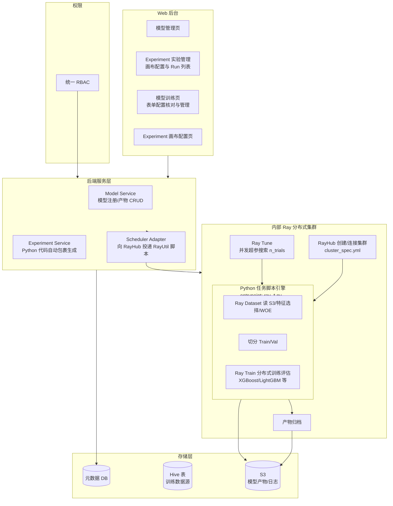
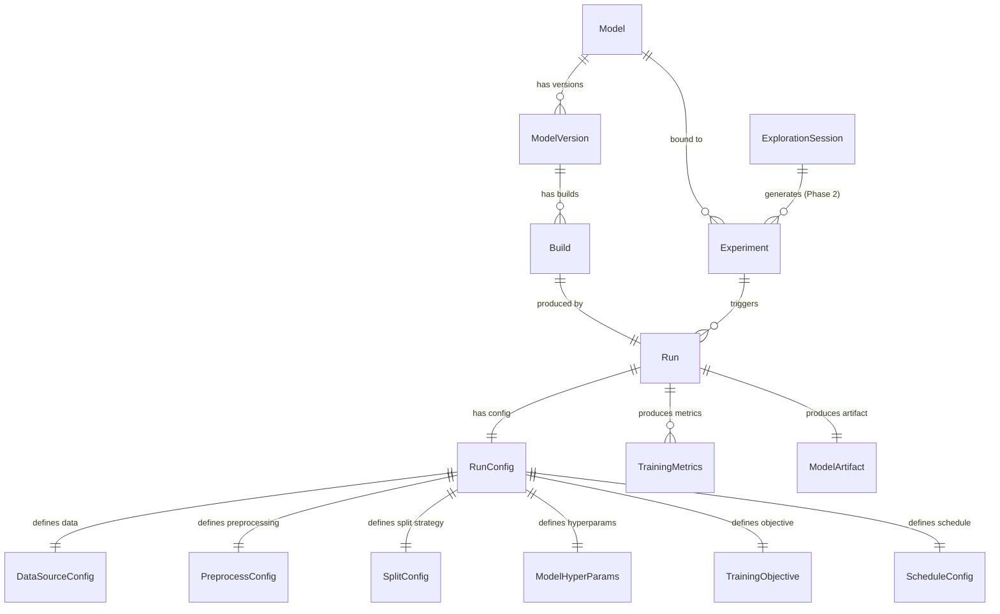
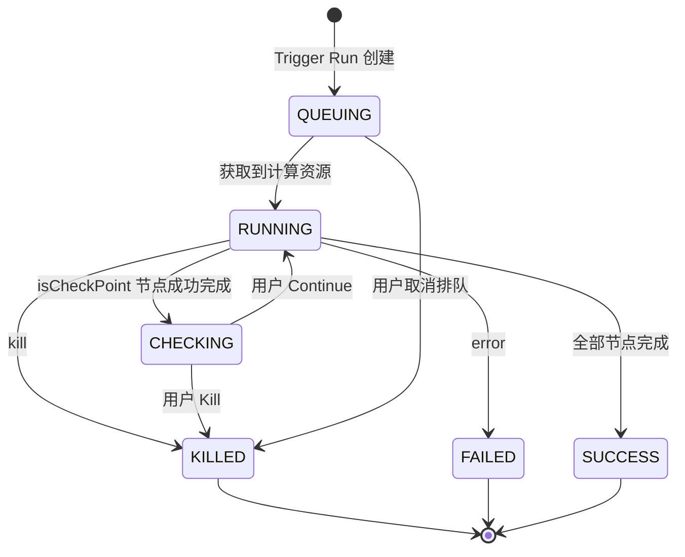
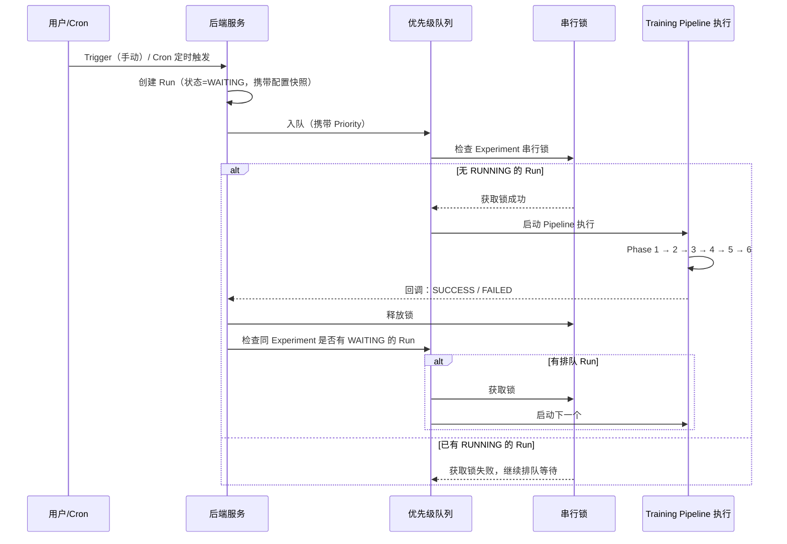
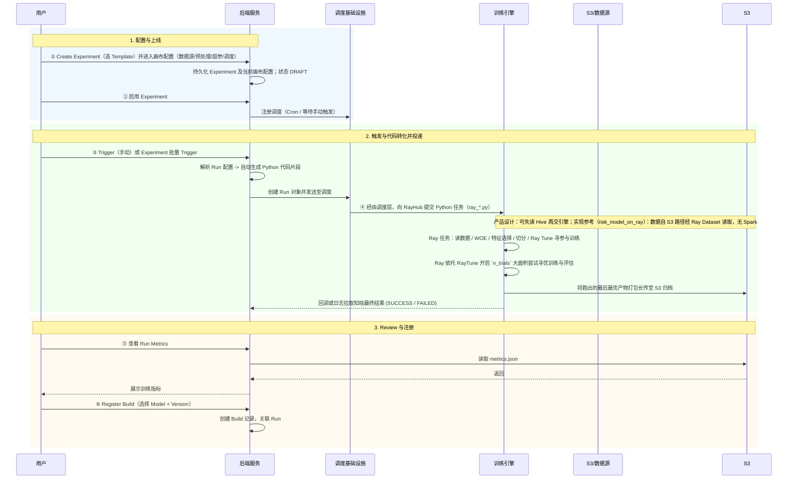
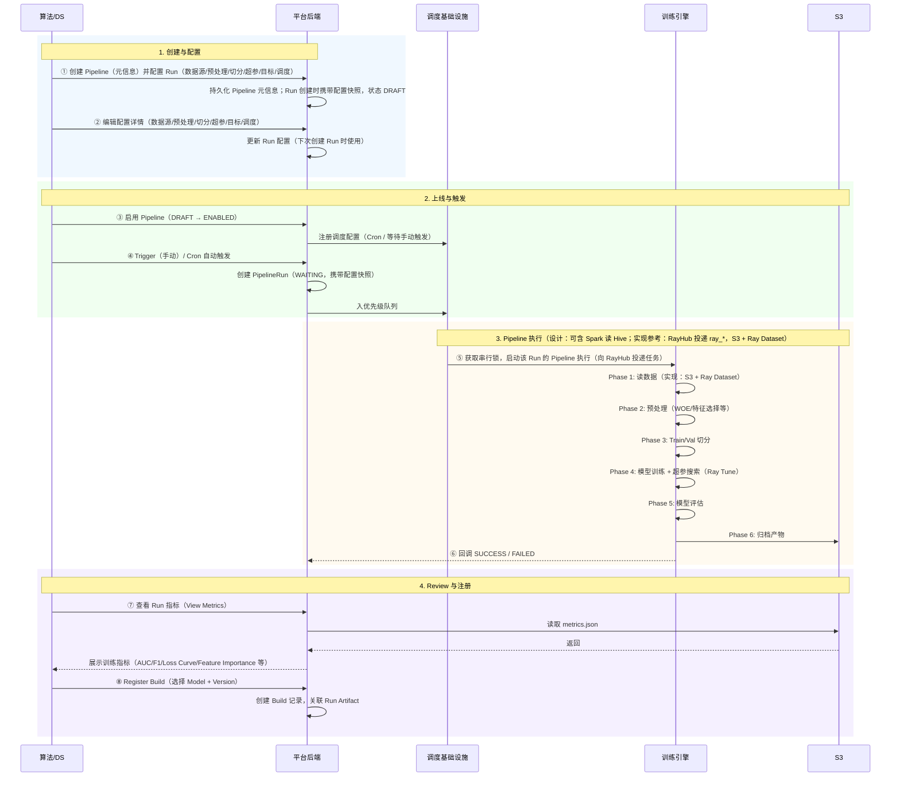

# 离线模型训练平台 — 系统架构说明

## 1. 文档目的与范围

- **目的**：定义离线模型训练平台的系统架构、领域模型、模块职责与上下游边界，并补充 Tech PM 视角的产品交付示意图（产品架构、数据流转）。
- **范围**：平台包含 **模型管理（Model Management）** 与 **模型训练（Model Training）** 两大模块。本期核心迭代是将底层执行方式替换为基于用户表单直接生成 Python 脚本，并在内部 **Ray 分布式集群**（依托 Ray Tune）上调度执行。训练编排以 **Experiment（EXP）** 为单元，一次执行对应 **Run**（以 Run id 标识）；中间产物与画布配置均绑定在 Run id。Experiment 须绑定已注册的 **Model**，默认继承 Model 的 name 与 region。模型部署仅做粗略设计。

**设计边界（重要）**

- **训练数据只读**：平台从 Hive 表读取训练数据，不对上游数据进行写入或修改。
- **数据清洗归属上游**：缺失值、编码、归一化等数据清洗由上游完成，提供的 Hive 表视为已干净；本平台 Experiment 画布不承担数据清洗，仅做特征自动选择、可选 WOE 变换、切分、模型超参空间与训练停止条件配置。
- **松耦合于特征平台**：训练数据来源为用户有权限访问的任意 Hive 表（包含但不限于特征平台 WideTable 产出的离线宽表），不与特征平台做强耦合集成。
- **模型部署**：本期仅设计 Model → Version → Build 的注册出口，具体部署流程待后续迭代。
- **UI 风格**：与在线特征平台保持一致（Ant Design Pro / 主色 `#13c2c2`），本文档聚焦架构设计，交互原型待后续独立输出。
- **自动 Feature Selection**：Phase 2 特征筛选（variance_threshold / correlation_filter）为本期 **P0 需求**。

---

## 2. 总体架构图



**说明**：当前实现参考为 **risk_model_on_ray**；集群通过 RayHub 创建/连接（cluster_spec.yml），后端生成调用 RayUtil 的 Python 脚本，Scheduler Adapter 向 RayHub 投递任务（entrypoint 为各 `ray_*.py`），集群内使用 Ray Dataset / Ray Train / Ray Tune，数据从 S3 路径读取，无本地 Spark。

---

## 3. 领域模型

### 3.1 核心实体关系



*Experiment（EXP）绑定已注册 Model，继承 Model 的 name 与 region；Experiment 与 Run 不覆盖 Model 元信息。Experiment 保留当前/最新画布配置；每次 Run 携带配置快照（RunConfig），中间产物与画布配置均绑定 Run id。*

**Experiment 与 ExplorationSession 的关系**：

Experiment 是**单一训练编排单元**（画布容器），语义纯净。Phase 2 引入的 **ExplorationSession**（探索会话）是通过 AI Prompt 批量生成多个 Experiment 的对比容器，关系为 `1 ExplorationSession → N Experiment → N Run`。两个概念的入口、数据流、UI 分离描述：

| 概念 | 用户流程 | 入口 | 数据流 |
|------|----------|------|--------|
| **Experiment** (MVP) | 画布配置 → Trigger Run → Review → Register Build | Experiment 列表 → 画布 | 1 Experiment → N Run |
| **ExplorationSession** (Phase 2) | 选数据集 → AI Prompt → 批量生成 Experiment → 对比大盘 → 选优 | 独立入口（AI Prompt 向导） | 1 Session → N Experiment → N Run |

**Template 与 Component（概念补充）**：**Experiment** 由 **Experiment Template（实验模板）** 创建（1 Experiment Template → N Experiment）。画布上的每个节点对应 **Experiment Component（实验物料）**，基于 **Component Template（物料模板）**（1 Experiment → N Component，1 Component Template → N Component）。若当前实现未持久化 Template 实体，Experiment 的 config 快照中包含 DAG 及节点配置，节点类型对应 Component Template。

### 3.2 实体定义

#### Model（模型）

| 字段 | 类型 | 说明 |
|------|------|------|
| model_id | string (PK) | 模型唯一标识 |
| name | string | 模型名称 |
| description | text | 模型描述 |
| model_type | enum: classification / regression | 任务类型 |
| framework | enum: xgboost / lightgbm / catboost / sklearn / pytorch / tensorflow | 框架 |
| owner | string | 创建人 |
| biz_team | string | 所属业务团队 |
| region | string | 区域（与 name 一起供 Experiment 继承；运行无关元信息） |
| status | enum: active / deprecated | 模型状态 |
| create_time | datetime | 创建时间 |
| update_time | datetime | 更新时间 |

#### ModelVersion（模型版本）

| 字段 | 类型 | 说明 |
|------|------|------|
| version_id | string (PK) | 版本唯一标识 |
| model_id | string (FK) | 所属模型 |
| version_tag | string | 版本标签（v1 / v2 / ...） |
| description | text | 版本描述 |
| status | enum: active / deprecated | 版本状态 |
| create_time | datetime | 创建时间 |

#### Build（构建产物）

| 字段 | 类型 | 说明 |
|------|------|------|
| build_id | string (PK) | Build 唯一标识 |
| version_id | string (FK) | 所属版本 |
| run_id | string (FK) | 产出该 Build 的 Run |
| artifact_s3_path | string | 模型产物 S3 路径 |
| metrics_snapshot | JSON | 训练指标快照 |
| config_snapshot | JSON | 训练配置快照 |
| status | enum: registered / archived | Build 状态 |
| registered_by | string | 注册人 |
| register_time | datetime | 注册时间 |

#### Model（模型）— region 与继承约定

Model 表除既有字段外，与运行相关的继承仅限 **model name** 与 **model region**（如 `region` 字段）：Experiment 绑定 Model 后默认继承二者，其余与 Model 的耦合为松耦合。**Experiment 与 Run 层不允许覆盖 Model 相关元信息**。

#### Experiment（模型实验 / EXP）

| 字段 | 类型 | 说明 |
|------|------|------|
| exp_id | string (PK) | Experiment 唯一标识 |
| model_id | string (FK) | 绑定的已注册 Model |
| name | string | 实验名称（可继承自 Model name，可编辑） |
| description | text | 实验描述 |
| region | string | 区域（默认继承 Model region，不覆盖 Model） |
| framework | enum: LightGBM / XGBoost / Benchmark | 训练框架（决定画布模板与执行范围） |
| status | enum: DRAFT / ENABLED / DISABLED | 任务级状态（见 §4.2.1） |
| owner | string | 创建人 |
| priority | enum: normal / important / critical | 优先级 |
| resource_level | enum: low / medium / high | 计算资源档位 |
| config_snapshot_s3_path | string (nullable) | 当前/最新画布配置快照 S3 路径，用于新 Run 的初始配置与历史溯源 |
| create_time | datetime | 创建时间 |
| update_time | datetime | 更新时间 |

*本实体即 **Model Experiment（模型实验）**：定义完整的真实实验计划。基于 **Experiment Template** 的表单提交后，后端生成等价的 Python RayUtil 脚本即该 Experiment。1 Model → N Experiment（以产品为准）。Experiment 具有任务级状态（DRAFT / ENABLED / DISABLED，见 §4.2.1），承载当前/最新画布配置；须绑定已注册 Model；画布配置入口在 Experiment 层级，新建 Run 在画布内点击「Run」执行调度。*

#### Run（运行）

| 字段 | 类型 | 说明 |
|------|------|------|
| run_id | string (PK) | Run 唯一标识 |
| exp_id | string (FK) | 所属 Experiment |
| status | enum: QUEUING / RUNNING / CHECKING / SUCCESS / FAILED / KILLED | Run 状态（QUEUING 与 WAITING 同位兼容，见 GLOSSARY） |
| savepoint_snapshots | JSON array | 各节点产出路径记录（含 SavePoint 节点）；每项：`{ "node_id": string, "s3_path": string, "completed_at": datetime }`，按执行顺序追加；用于按 Run id 溯源中间产物 |
| trigger_type | enum: manual / cron | 触发类型 |
| queued_at | datetime | 入队时间 |
| started_at | datetime | 开始执行时间 |
| finished_at | datetime | 结束时间 |
| artifact_s3_path | string | 模型产物 S3 路径（Run 级汇总入口） |
| metrics_s3_path | string | 训练指标 S3 路径 |
| log_s3_path | string | 训练日志 S3 路径（Run 级汇总入口） |
| config_snapshot_s3_path | string | 本次 Run 的配置快照 S3 路径（画布/节点配置绑定 Run id） |
| manifest_s3_path | string (nullable) | 可选；manifest.json 的 S3 路径，列出各 node_id 的 logs/artifacts 路径 |
| error_message | text | 失败时的错误信息 |

*Run = Experiment 某配置 Version 的一次执行。Run 记录该次执行中**涉及哪些 Component、执行顺序（Step）、各节点配置及产物**。**改配置并从某节点执行 = 新 Run**。系统仅记录该 Run 的 Config Snapshot，不区分、不存储 Version 维度。中间产物与画布配置均绑定 Run id；S3 路径规范见 §4.2.3，前缀为 `{exp_id}/{run_id}/`。*

---

## 4. 模块设计

### 4.1 模型管理模块（Model Management）

| 项目 | 说明 |
|------|------|
| **职责** | 管理模型定义、版本、Build 产物；本期粗略设计，重点是为训练产出提供注册落地。 |
| **边界** | 仅负责模型注册与版本管理；不负责模型部署与线上 Serving（本期暂不详设）。 |

**页面结构**：

- **模型列表页**：展示已注册的 Model，支持按 framework / model_type / owner / biz_team 筛选。
- **模型详情页**：展示 Model 元信息 + ModelVersion 列表 + 每个 Version 下的 Build 列表。
- **Build 注册流程**：用户从 Run 的 SUCCESS 结果中，点击「注册为 Build」→ 选择目标 Model + Version（或新建）→ 完成注册。

**Model 状态**：Active / Deprecated（本期简化，不设复杂状态机）。

**概念层级关系**：

```
Model（逻辑模型实体，如「欺诈检测模型」）
├── ModelVersion v1（重大迭代，如架构变更）
│   ├── Build #1（来自 Run #101）
│   └── Build #2（来自 Run #205）
└── ModelVersion v2
    └── Build #1（来自 Run #310）
```

### 4.2 模型训练模块（Model Training）

| 项目 | 说明 |
|------|------|
| **职责** | 流水线全生命周期管理：流水线元信息、调度、Run 执行追踪、指标展示。 |
| **边界** | 负责从流水线/Run 配置到训练产出的全链路；训练数据由用户指定 Hive 表获取；模型产物存储到 S3 后，通过 Build 注册衔接到模型管理模块。 |

#### 4.2.1 Experiment 状态

> 术语唯一定义见 [GLOSSARY.md](../../docs/GLOSSARY.md)。

Experiment 承载画布配置，具有任务级状态 `DRAFT → ENABLED → DISABLED`：

| 状态 | 含义 | 允许操作 |
|------|------|----------|
| **DRAFT** | 创建后初始状态，画布可编辑，不可调度 | Edit / Enable / Delete |
| **ENABLED** | 已启用，可被手动 Trigger 或 Cron 调度 | Edit / Disable / Trigger Run |
| **DISABLED** | 暂停调度，保留配置 | Edit / Enable / Delete |

用户从 Experiment 列表进入画布编辑配置，在画布内点击「Run」即新建 Run 并执行调度，Run 携带当前画布配置快照。

**与设计稿的对应**：Figma 设计稿（Model Experiment）中的 **TrainingTask** 对应本系统 **Experiment**，**TaskInstance** 对应 **Run**（详见 [GLOSSARY.md](../../docs/GLOSSARY.md) Deprecated Aliases）。界面排队态以 **QUEUING** 为主展示，数据模型可含 **WAITING** 与 **QUEUING** 同位兼容。

#### 4.2.2 Run 状态机（Run State Machine）

> 唯一权威定义见 [GLOSSARY.md](../../docs/GLOSSARY.md)，此处与之保持同步。



| 状态 | Tag 颜色 | 含义 | 允许操作（操作后状态） |
|------|----------|------|------------------------|
| **QUEUING** | `tag-orange` | 排队等待资源（界面主展示；数据模型可含 WAITING 同位兼容） | Kill → 取消排队 |
| **RUNNING** | `tag-blue` | Run 正在执行画布 | Kill → KILLED |
| **CHECKING** | `tag-yellow` | isCheckPoint 节点完成，等待人工 Review | Continue → RUNNING；Kill → KILLED |
| **SUCCESS** | `tag-green` | Run 执行成功，产物已归档 S3 | Register Build |
| **FAILED** | `tag-red` | Run 执行失败 | — |
| **KILLED** | `tag-red` | Run 被用户终止 | — |

**Run Action 可见性矩阵**：

| 操作 | QUEUING | RUNNING | CHECKING | SUCCESS | FAILED | KILLED |
|------|---------|---------|----------|---------|--------|--------|
| View（配置快照+DAG+节点执行） | Yes | Yes | Yes | Yes | Yes | Yes |
| View Metrics / Artifacts | 置灰 | 置灰 | 置灰 | Yes | 置灰 | 置灰 |
| View Log | 置灰 | 置灰 | Yes | Yes | Yes | Yes |
| Register Build | 置灰 | 置灰 | 置灰 | Yes | 置灰 | 置灰 |
| Continue | 置灰 | 置灰 | Yes | 置灰 | 置灰 | 置灰 |
| Kill | Yes（取消排队） | Yes（→ KILLED） | Yes（→ KILLED） | 置灰 | 置灰 | 置灰 |

**State Transition Contract**：

| 转换 | 触发条件 | 前置校验 | 副作用 |
|------|----------|----------|--------|
| QUEUING → RUNNING | 获取到计算资源 + 串行锁 | 同 Experiment 无其他 RUNNING Run | 分配 Ray 资源、启动脚本 |
| RUNNING → CHECKING | isCheckPoint=true 的节点成功完成 | 节点执行日志已落盘 | 暂停后续节点、通知用户 Review |
| CHECKING → RUNNING | 用户点击 Continue | 用户有 Experiment 操作权限 | 恢复后续节点执行 |
| RUNNING → SUCCESS | 全部节点完成 | 产物已归档 S3 | 释放锁、产物路径回写 MetaDB |
| RUNNING → FAILED | 任意节点错误 | — | 释放锁、错误日志落盘 S3、error_message 回写 |
| RUNNING → KILLED | 用户 Kill | — | 释放锁、终止 Ray Job、清理临时数据 |
| CHECKING → KILLED | 用户 Kill | — | 释放锁、清理临时数据 |
| QUEUING → KILLED | 用户取消排队 | — | 从队列移除 |

**关键流转规则**：

1. **创建**：在 Experiment 画布内点击 **Run**（始终从头执行）→ 新建 Run，初始状态 **WAITING**；Run 携带当前画布配置快照（RunConfig）。执行时分析配置是否变更，无变更部分可走缓存；提示是否使用缓存，支持 **Force Restart**。
2. **排队**：优先级队列按 Experiment Priority 排序；串行锁保证同一 Experiment 同时最多一个 RUNNING 的 Run。
3. **执行**：获取计算资源 → **RUNNING**；执行该 Run 对应画布的 `RayUtil` 封装脚本；**complete** → SUCCESS，**error** → FAILED，用户 **kill** → KILLED。
4. **改配置后执行**：用户在画布配置页调整配置后执行 → 等价于 Kill 原 Run（若在跑）、生成**新 Run id**，按**最新 Experiment 配置**从头执行（执行时无变更部分可走缓存）。
5. **Register Build**：仅 SUCCESS 状态可操作。

#### 4.2.3 Run 级存储规范（实验复现）

为支持**各节点日志与产物规范落盘**及**实验复现**，约定如下 S3 路径与元数据。

**前缀**：`s3://{bucket}/{base_prefix}/{exp_id}/{run_id}/`

**按节点**：

- `nodes/{node_id}/logs/`：该节点 stdout/stderr 及引擎日志。
- `nodes/{node_id}/artifacts/`：该节点产出（如 encoder.pkl、report.xlsx、fs_result.csv、model.pkl 等）。

**Run 级汇总**：

- `config_snapshot.json`：本次 Run 的完整配置快照（含画布节点配置）。
- `manifest.json`（可选）：列出各 `node_id` 的 `artifacts`、`logs` 路径及关键产出 key，便于脚本化复现。Run 可记录 `manifest_s3_path` 指向该文件。

**复现**：根据 config_snapshot 与 manifest（或 nodes 下目录结构）可按节点回溯日志与产物，用于人工验证或重放后续节点。

**与 MLflow 的衔接（设计决策）**：**内部 Team 已确定将模型离线实验的中间产物（artifact）用 MLflow 管理**。即：各画布节点（如 WOE Encoder、Feature Selection 结果、WOE Merge 产出、Tune/Train 的模型与指标）在落盘 S3 的同时或统一通过 MLflow Tracking/Artifact 登记与版本化，便于按 Run/Step 查询、对比与复现。Run 的 `artifact_s3_path` / `manifest_s3_path` 可与 MLflow Run/Artifact 关联（如记录 mlflow run_id 或 artifact_uri），Build 注册时可引用 MLflow 中的模型 artifact。具体对接方式（如每节点 log_artifact 还是 Run 级汇总）在实现时与 MLflow 服务端约定。

#### 4.2.4 页面层级

```
模型训练页
├── Experiment 一级 List（Experiment 列表，无状态，仅承载 Run 配置）
│   ├── 筛选：Name / Owner / Biz Team / Priority
│   ├── Action: Edit 等
│   └── 点击展开 → 嵌套表格
│       └── Run 执行记录（Run 列表，每行提供 View 入口，点击可查看该 Run 的配置快照、DAG、节点执行情况）
│           ├── 列: Run ID / Status / Trigger Type / Queued At / Started At
│           │       / Finished At / Action
│           └── Action: View（配置快照+DAG+节点执行）/ View Metrics / View Log / Register Build / Kill
└── 画布配置页（入口在 Experiment 层级；点击 Experiment 进入画布；节点右侧配置栏为 Tag 分页：左=配置单，右=last run 信息+Run ID Tag；画布内仅 Run 按钮，即从头执行，提示使用缓存、支持 Force Restart）
    ├── 基本信息（Name / Description / Owner / Biz Team / Priority / Resource Level）
    ├── 数据源配置（Hive Table / Schema / Partition Filter）
    ├── 特征自动选择与 WOE 配置（特征选择方法 / 阈值 / 可选 WOE / 数据清洗兜底）
    ├── 切分策略配置（切分方式 + 对应参数）
    ├── 模型与超参配置（Framework / Model Type / Hyperparameters / 超参搜索）
    ├── 训练目标配置（优化指标 / 停止条件 / Early Stopping）
    └── 调度配置（手动 / Cron 表达式 / 最大排队深度）
```

---

## 5. 流水线配置详情页（数据模型）

流水线配置详情页是本系统的核心交互入口，用户在此完成流水线元信息及 Run 的配置（画布/节点）。配置在创建 Run 时作为快照归属 Run。以下为数据模型（后续交互设计将基于此）：

### 5.1 配置分区

| 配置区块 | 字段 | 类型 | 说明 |
|----------|------|------|------|
| **基本信息** | name | string | 流水线名称 |
| | description | text | 流水线描述 |
| | owner | string (readonly) | 当前用户，自动填充 |
| | biz_team | enum | 业务团队 |
| | priority | enum: normal / important / critical | 任务优先级，影响队列排序 |
| | resource_level | enum: low / medium / high | 计算资源档位 |
| **数据源** | hive_server | enum | 数据服务标识（如 reg_sg_hive / reg_us_hive） |
| | table_schema | string | Hive Schema |
| | table_name | string + Fetch 校验 | Hive 表名，点击 Fetch 校验权限并获取字段列表 |
| | partition_filter | string (optional) | 分区过滤条件（如 `dt >= '2025-01-01'`） |
| | custom_filter | text (optional) | 自定义 WHERE 条件 |
| | label_column | select (Fetch 后) | 标签列 |
| | feature_columns | multi-select (Fetch 后) | 特征列（候选） |
| | sample_use_col | string (optional) | 样本划分列，与 RAY 一致（如 train/test） |
| **特征自动选择** | feature_selection_methods | multi-select | by_iv / by_corr / by_gini / by_psi / by_stability |
| | fp_fs_iv_threshold | float | IV 阈值（默认 0.02） |
| | fp_fs_corr_threshold | float | 相关性阈值（默认 0.7） |
| | fp_fs_psi_threshold | float | PSI 阈值（默认 0.1） |
| | fp_fs_lambda_grid 等 | (by_stability 时显示) | 稳定性选择参数，见 Pipeline §3.2 |
| **WOE 配置（可选）** | woe_enabled | bool | 是否启用 WOE 变换 |
| | n_bins, method, transform_method, encoder_save_path, merge on/how 等 | (woe_enabled 时) | 与 RAY 手册 §1.1–1.3 对齐 |
| **数据清洗（可选兜底）** | missing_value_strategy 等 | 可选、默认关闭 | 上游已清洗时可跳过；仅在上游未清洗时启用 |
| **切分策略** | split_method | enum (5 种) | 切分方式 |
| | split_params | dynamic form | 按方式动态展示参数 |
| **模型与超参** | framework | enum | 框架选择 |
| | model_type | enum: classification / regression | 任务类型 |
| | hyperparameters | JSON editor / dynamic form | 超参配置 |
| | hyperparam_search | enum: none / grid / random / bayesian | 超参搜索方式 |
| | search_space | JSON (optional) | 搜索空间定义，与 RAY init_hypers 对齐（uniform/randint/choice、tune. 前缀） |
| | n_trials | int (optional) | 超参搜索次数，对应 RAY n_trails |
| **训练目标** | optimization_metric | enum (按 model_type 动态) | 优化指标 |
| | metric_for_train_tune | string (optional) | 调参阶段优化指标（如 auc），与 RAY 对齐 |
| | train_val_ks_diff_threshold | float (optional) | 训练/验证 KS 差异阈值（与 RAY model_tune 对齐） |
| | early_stopping | bool | 是否启用；对应 RAY early_stopping_round / TrialPlateauStopper |
| | patience | int (optional) | 容忍轮次 |
| | min_delta | float (optional) | 最小改善阈值 |
| **调度** | schedule_mode | enum: manual / cron | 调度模式 |
| | cron_expression | string (optional) | Cron 表达式 |
| | max_queue_depth | int (default: 3) | 最大排队深度 |

### 5.2 字段联动规则

| 触发条件 | 联动行为 |
|----------|----------|
| table_name 点击 Fetch | 校验 hive_server + table_schema + table_name 权限；成功后加载字段列表，激活 label_column / feature_columns 选择 |
| split_method 切换 | 动态展示对应的 split_params 表单（详见 Training-Data-Pipeline.md §3.3） |
| framework 切换 | 动态更新 hyperparameters 表单 schema（每种框架有不同的超参模板） |
| model_type 切换 | 动态更新 optimization_metric 可选项（classification → AUC/F1/Precision/Recall；regression → RMSE/MAE/R²） |
| hyperparam_search = none | search_space / n_trials 字段隐藏 |
| early_stopping = false | patience / min_delta 字段隐藏 |
| schedule_mode = manual | cron_expression 字段隐藏 |
| feature_selection_methods 含 by_stability | 显示 fp_fs_lambda_grid、fp_fs_stability_threshold、fp_fs_stability_n_resampling 等 |
| woe_enabled = true | 显示 WOE 子表单（n_bins、method、encoder 路径、merge 等） |

---

## 6. 调度与串行控制

### 6.1 调度流程



### 6.2 调度策略说明

- Cron 触发时创建 Run 入队；若前一个 Run 仍在 RUNNING，新 Run 在 WAITING 等待。
- 若 WAITING 中已有同 Experiment 的 Run，Cron 再次触发时**仍创建新 Run 入队**（保留完整的调度记录），但受 `max_queue_depth` 约束（默认 3）；超出则跳过本次触发并记录 skip 日志。

### 6.3 优先级队列规则

| 优先级 | 排序权重 | 说明 |
|--------|----------|------|
| critical | 最高 | 优先获取计算资源 |
| important | 中 | 常规业务任务 |
| normal | 最低 | 实验性任务 |

- 同优先级内按 `queued_at` FIFO 排序。
- 由于 Run 执行在 Ray 层面处理调度并解决高内聚，队列管控主要服务于本系统的流水线优先级，保障高优的自动转化 Python 脚本最先被投递至内部环境去执行。

---

## 7. 与上下游的边界

| 环节 | 归属 | 说明 |
|------|------|------|
| Hive 表数据准备（含 WideTable 产出） | 上游（特征平台 / 其他数据管道） | 本平台仅读取，不写入 |
| 流水线配置与调度 | **本平台** | 核心职责 |
| Training Data Pipeline（Ray 代码实现版） | **本平台** | 核心职责；Run 配置向 Python `RayUtil` 脚本到投递的全转化；详见相应 Pipeline 文档 |
| 训练指标计算与展示 | **本平台** | 核心职责 |
| 模型产物存储（S3） | **本平台** | 写入 S3 |
| 模型注册（Model / Version / Build） | **本平台** | 核心职责 |
| 模型部署与线上 Serving | 下游（本期不详设） | 仅粗略设计 Build 注册出口，具体部署流程待后续设计 |
| 用户权限 | 共用 | 统一 RBAC，与特征平台一致 |
| 任务调度引擎 | 共用 | 复用现有内部调度基础设施 |

---

## 8. 实现参考：risk_model_on_ray

项目内已归档的实现仓库路径为 **`risk_model_on_ray/`**（位于项目根目录下）。平台文档中与「执行层」「数据管道」「RAY 对接」相关的描述，以该实现为参考对齐。

| 项目 | 说明 |
|------|------|
| **核心组件** | **Config**（`config/config.py` + base_config、woe_config、tune_config 等）、**RayUtil**（`util/ray_helper/ray_util.py`）、**cluster_spec.yml**（集群规格）；SG/US 双 region 通过 `BaseConfig.cluster_idc` 切换。 |
| **执行模型** | Driver 仅调用 RayHub API（ClusterApi），不本地 `ray.init()`；每个 Job 在集群上运行对应 **ray_*.py** 脚本，配置通过环境变量 **RAY_JOB_CONFIG_JSON** 注入。 |
| **数据流** | 路径驱动（S3）；WOE v2.4（ray_woe_fit_v2_4、ray_woe_transform_v2_4）、woe_merge_v2（Ray 原生 join）、feature_selection / feature_selection_v2（含 by_stability）、Ray Train/Tune、model_bm_v2 分布式 LR、Calibrator v2.1。 |
| **手册** | 中英文手册位于 `risk_model_on_ray/com/seamoney/risk/spl_acard/`：[分布式训练使用手册_v1.3.md](../../risk_model_on_ray/com/seamoney/risk/spl_acard/分布式训练使用手册_v1.3.md)、`distributed_training_manual_en_v1.3.md`。 |

---

## 9. 数据流简图



---

## 10. 产品架构图（PM 视角）

Tech PM 视角：从产品能力与用户视角划分模块与边界，便于产品/业务对齐与开发交付。

```
┌──────────────────────────────────────────────────────────────────────────────────────────┐
│                          离线模型训练平台（产品边界）                                         │
├──────────────────────────────────────────────────────────────────────────────────────────┤
│                                                                                          │
│   ┌──────────────────────────────────────────────────────────────────────────────────┐   │
│   │ 面向：算法 / DS / 策略                                                            │   │
│   ├──────────────────────────────────────────────────────────────────────────────────┤   │
│   │                                                                                  │   │
│   │  ┌───────────────────────┐        ┌───────────────────────────────────────────┐  │   │
│   │  │ Model Management      │        │ Model Training                            │  │   │
│   │  │ 模型管理              │        │ 模型训练                                   │  │   │
│   │  │                       │        │                                           │  │   │
│   │  │ · Model 注册/列表     │  ◄──── │ · Experiment 画布配置与管理                │  │   │
│   │  │ · ModelVersion 管理   │ Build  │ · Run 执行记录                    │  │   │
│   │  │ · Build 注册/归档     │ 注册   │ · 流水线配置详情页                         │  │   │
│   │  │ · 状态：Active /      │        │   （数据源 / 预处理 / 切分 / 超参 / 调度） │  │   │
│   │  │   Deprecated          │        │ · 指标展示（Metrics / Log）               │  │   │
│   │  └───────────────────────┘        └──────────────────┬────────────────────────┘  │   │
│   │                                                      │ Trigger                    │   │
│   └──────────────────────────────────────────────────────┼────────────────────────────┘   │
│                                                          │                                │
│   ┌──────────────────────────────────────────────────────▼────────────────────────────┐   │
│   │ 平台执行层（对用户透明）                                                           │   │
│   │                                                                                    │   │
│   │  ┌─────────────────┐  ┌─────────────────┐  ┌─────────────────────────────────┐   │   │
│   │  │ 调度与队列       │  │ 数据与预处理阶段 │  │ 训练引擎阶段                     │   │   │
│   │  │ · 优先级队列     │→ │ · Phase 1 取数  │→ │ · Phase 4 模型训练              │   │   │
│   │  │ · 串行锁         │  │ · Phase 2 预处理│  │ · Phase 5 模型评估              │   │   │
│   │  │ · Cron 调度      │  │ · Phase 3 切分  │  │ · Phase 6 产物归档 → S3         │   │   │
│   │  └─────────────────┘  └─────────────────┘  └─────────────────────────────────┘   │   │
│   │                                                                                    │   │
│   └────────────────────────────────────────────────────────────────────────────────────┘   │
│                                                                                          │
└──────────────────────────────────────────────────────────────────────────────────────────┘
                                       │
                  ┌────────────────────┼────────────────────┐
                  ▼                    ▼                    ▼
           ┌────────────┐      ┌────────────┐      ┌────────────┐
           │ 上游数据    │      │ 调度基础设施│      │ 下游消费    │
           │ 非本产品    │      │ 共用        │      │ 本期不详设  │
           │ (Hive 表    │      │ (内部调度   │      │ (Model     │
           │  已就绪,    │      │  引擎,      │      │  Serving / │
           │  含 WideTable│     │  RBAC)      │      │  Deploy)   │
           │  产出)      │      │             │      │            │
           └────────────┘      └────────────┘      └────────────┘
```

**产品架构要点（Tech PM 可强调）**

| 维度 | 说明 |
|------|------|
| 用户群体 | 算法 / DS / 策略：创建流水线 → 配置 Run → 触发 → Review 指标 → 注册 Build。 |
| 能力边界 | 平台不负责上游数据准备（Hive 表由特征平台 / 其他管道产出）；不负责模型部署与线上 Serving（本期暂不详设）。 |
| 核心职责 | 「流水线/Run 配置 → 调度执行 → 数据管道 → 模型评估 → 产物归档 → Build 注册」。 |
| 松耦合 | 训练数据来源为任意有权限的 Hive 表，包含但不限于特征平台 WideTable 产出；不与特征平台做强耦合集成。 |
| 两大模块 | **Model Training**（本期重点）：流水线全生命周期与 Run 执行；**Model Management**（本期粗略设计）：模型注册与版本管理。 |
| Build 注册 | Run SUCCESS 后，用户 Review 指标 → 手动注册为 Model Version 下的 Build；平台不自动注册。 |

---

## 11. 核心概念与术语表

> **唯一术语定义来源**：[GLOSSARY.md](../../docs/GLOSSARY.md)。以下为本平台核心概念概览，供产品/开发/业务统一理解；如有冲突以 GLOSSARY 为准。

| 概念 | 英文 | 定义 | 与其他概念的关系 |
|------|------|------|------------------|
| **模型** | Model | 逻辑模型实体，代表一个业务场景下的模型（如「欺诈检测模型」「信用评分模型」），包含元信息（名称、框架、类型、Owner）。 | 一个 Model 下可有多个 ModelVersion。 |
| **模型版本** | ModelVersion | Model 的一次重大迭代（如架构变更、特征集重构），以 v1 / v2 等标签区分。 | 一个 ModelVersion 下可有多个 Build。 |
| **构建产物** | Build | 一次 Run 产出的、经用户 Review 后注册的模型产物，包含模型文件 + 指标快照 + 配置快照。 | 由一个 Run 产出；注册到一个 ModelVersion 下。 |
| **实验模板** | Experiment Template | 预设的实验流程模板，定义可复用的实验配置，包含若干 Component Template 的 DAG 组合（数据源、特征选择、切分策略、模型超参、训练目标等）。 | 1 Experiment Template → N Experiment；1 Experiment Template → N Component Template。 |
| **物料模板** | Component Template | Experiment 内最小构建块，描述该步骤的配置信息（出入参、是否必填、展示与交互形式）。 | 1 Component Template → N Component；1 Component Template → N Experiment Template。 |
| **模型实验** | Model Experiment (Experiment / EXP) | 完整的真实实验计划。基于 Experiment Template 的表单提交后，后端自动生成等价的 Python RayUtil 脚本，即为该 Model Experiment。绑定已注册 Model，保留当前/最新画布配置；画布入口在 Experiment 层级；一次执行为 Run（Run id 标识）。实验级调度在文档与 **Execute Config** 中以 **ONCE / Cron** 表述（Cron 表达式）；是否后端全量落地以迭代为准。 | 1 Model Version → N Experiment（以产品为准）；1 Experiment → N Run；继承 Model 的 name 与 region。 |
| **实验物料** | Experiment Component | 真实实验计划内的物料配置明细，基于某 Component Template。画布上的每个节点即一个 Experiment Component 实例。 | 1 Experiment → N Component；1 Component Template → N Component。 |
| **实验执行** | Run | Experiment 中涉及 Component 的一次有顺序的实际执行记录，以 Run id 标识。中间产物与画布配置均绑定 Run id。Run 记录该次执行中执行了哪几步、涉及哪些节点、Step 顺序、节点配置及产物。改配置并从某节点执行 = 新 Run。 | Run = Experiment 某配置 Version 的一次执行；由 Experiment 触发。 |
| **CheckPoint** | CheckPoint | 画布节点（Experiment Component）的布尔属性；默认关闭。开启 **isCheckPoint** 的节点在成功完成后可使 Run 进入 **`CHECKING`**，直至 **Continue** 或 **Kill**；界面排队态以 **`QUEUING`** 为主展示，数据模型可含 **`WAITING`** 与 **`QUEUING`** 同位兼容。 | 改配置后执行 = 新 Run，从头执行，无变更部分可走缓存。 |
| **SavePoint** | SavePoint | 节点产出作为恢复点持久化（如 WOE fit 后）；允许多个节点开启。新 Run 可复用 SavePoint 产出（无变更部分走缓存）。 | 用于按 Run id 溯源中间产物。 |
| **训练数据管道** | Training Data Pipeline | 平台内通过 Run 配置转化来生成包含读取、筛选到模型归档动作在内的独立 Python `RayUtil` 脚本生命周期。实现上由 risk_model_on_ray 的 RayUtil 方法及 ray_*.py 脚本链构成，配置经 Config 与 RAY_JOB_CONFIG_JSON 注入。 | 每个 Run 执行一段投递生成的 Python。 |
| **模型产物** | ModelArtifact | Ray 集群计算结果统一归档至 S3 的全部文件：最佳模型文件 + 预处理元数据 + 训练指标 + 日志。**中间产物（含各节点产出）由 MLflow 管理**，与 Run 关联，便于按 Run/节点追溯与复现。 | 与 Run 一一对应；Build 注册时引用 Artifact 路径（可来自 MLflow 或 S3）。 |
| **优先级队列** | Priority Queue | 跨 Experiment 的全局 Run 排队机制，按 critical > important > normal 排序，同优先级 FIFO。 | 与串行锁配合：不同 Experiment 可并行，同 Experiment 严格串行。 |
| **串行锁** | Serial Lock | per-Experiment 粒度的并发控制，保证同一 Experiment 同一时刻最多一个 RUNNING 的 Run。 | 当前 RUNNING 结束释放锁后，队列中同 Experiment 的下一个 WAITING 的 Run 获取锁执行。 |

**概念层级关系小结**

```
Model（逻辑模型实体）
├── ModelVersion v1
│   ├── Build #1 ← Run #101 (SUCCESS)
│   └── Build #2 ← Run #205 (SUCCESS)
└── ModelVersion v2
    └── Build #1 ← Run #310 (SUCCESS)

Experiment（Model Experiment，基于 Experiment Template 创建）
├── Experiment Component 1..N（画布节点，基于 Component Template）
└── Run 1..N（携带配置快照，记录涉及哪些 Component、Step 顺序、节点配置及产物）
        → ModelArtifact @ S3 / 注册为 Build
```

---

## 12. 操作主流程示意图

### 12.1 算法/DS：从配置到模型注册（端到端）



### 12.2 例行化自动迭代流程

当 Pipeline 配置了 Cron 调度后，平台自动实现模型的例行化迭代：

```
算法/DS                          平台                                      S3
    │                              │                                        │
    │ 一次性配置：                  │                                        │
    │ Pipeline + Cron 表达式 + 上线│                                        │
    ├─────────────────────────────►│                                        │
    │                              │ Cron 自动触发（如每周一 00:00）         │
    │                              │ → 创建 PipelineRun（WAITING）          │
    │                              │ → 获取锁 → 执行 Pipeline               │
    │                              │ → Phase 1→2→3→4→5→6                   │
    │                              ├───────────────────────────────────────►│
    │                              │                  模型产物 + 指标归档    │
    │                              │                                        │
    │ 定期 Review 最新实例指标      │                                        │
    │ → 选优注册 Build             │                                        │
    ├─────────────────────────────►│                                        │
    │                              │                                        │
```

**操作主流程小结**

| 角色 | 主流程 | 关键结果 |
|------|--------|----------|
| 算法/DS | 创建 Pipeline → 配置 Run → 上线 → 触发（或 Cron 自动） → Review → 注册 Build | 模型产物注册为 Build，可供后续部署 |
| 平台（自动） | Cron 触发 → 入队 → 获取锁 → Pipeline 6 Phase → 归档 → 释放锁 | PipelineRun SUCCESS/FAILED，产物归档至 S3 |

---

## 13. 数据流转示意图

### 13.1 元数据与配置流（谁写、谁读）

```
  ┌─────────────────────┐
  │ 算法/DS（用户）       │
  └──────────┬──────────┘
             │ 创建/编辑
             ▼
  ┌─────────────────────┐    持久化      ┌─────────────────────┐
  │ Pipeline / Run 配置  │──────────────►│ 平台元数据存储       │
  │ (RunConfig 全 7 区块) │              │ (Pipeline / Run /    │
  └─────────────────────┘               │  Model / Version /   │
             │                          │  Build 配置)         │
             │ 上线 Pipeline            └──────────┬──────────┘
             ▼                                     │
  ┌─────────────────────┐                         │ Run 回调写入
  │ 调度基础设施         │                         │ (状态 / S3 路径 / Metrics)
  │ (Cron + 优先级队列)  │                         │
  └──────────┬──────────┘                         │
             │ Trigger                              │
             ▼                                     ▼
  ┌─────────────────────┐               ┌─────────────────────┐
  │ Training Pipeline   │               │ Web 后台展示         │
  │ (读取 RunConfig      │               │ (读取元数据展示      │
  │  执行 6 Phase)       │               │  Pipeline/Run/      │
  └─────────────────────┘               │  Metrics/Build)     │
                                        └─────────────────────┘
```

### 13.2 训练数据流（一次 Pipeline 内的数据走向）

**产品/平台设计**（远期可选）：Phase 1 从 Hive 表读取 → Phase 2–6 预处理、切分、训练、评估、归档。

**当前实现参考（risk_model_on_ray）**：数据入口为 **S3 路径**（Ray Dataset 读 Parquet）；若数据源配置为 Hive，需由上游或单独流程导出至 S3。Pipeline 由 RayUtil 方法链对应（woe_fit → woe_transform → woe_merge → feature_selection → model_tune/model_train → 等），各步对应独立 ray_* 脚本，配置经 RAY_JOB_CONFIG_JSON 注入，任务经 RayHub 投递。

```
  调度基础设施         Training Data Pipeline                   外部存储
      │                         │                              │
      │ 启动 Pipeline           │                              │
      ├────────────────────────►│                              │
      │                         │ 1. Phase 1: 读取数据（设计：Hive；实现：S3 路径 + Ray Dataset） │
      │                         ├─────────────────────────────►│ Hive / S3
      │                         │◄─────────────────────────────┤ 返回数据
      │                         │ 2. Phase 2: 特征自动选择（P0）+ 可选 WOE  │
      │                         │    （数据清洗非本平台职责）                 │
      │                         │ 3. Phase 3: 切分 Train/Val    │
      │                         │ 4. Phase 4: 交给训练引擎       │
      │                         │    （传数据方式取决于框架）     │
      │                         │ 5. Phase 5: 模型评估           │
      │                         │ 6. Phase 6: 归档产物           │
      │                         ├─────────────────────────────►│ S3
      │                         │    model.* / metrics.json /   │
      │                         │    preprocessor.json / log    │
      │◄────────────────────────┤ 回调：SUCCESS + S3 路径       │
```

### 13.3 数据流汇总（一图看清两类流）

**设计线**：Hive 表 → 预处理 → 切分 → 训练引擎 → S3 归档（远期可为 Spark 阶段）。**实现线（risk_model_on_ray）**：S3 路径 → Ray Dataset → ray_* 脚本链 → 产物回 S3，无 Spark。

```
  ┌──────────────┐                    ┌──────────────────────────────────────┐
  │ 配置/元数据   │                    │ 训练数据（运行时）                     │
  │ 流           │                    │ 流                                    │
  ├──────────────┤                    ├──────────────────────────────────────┤
  │ 人 → Pipeline│                    │ 设计：Hive 表 → 预处理 → 切分         │
  │ → 元数据存储 │                    │ 实现：S3 路径 → Ray Dataset → ray_*   │
  │ → 调度配置   │                    │ → 训练引擎（XGBoost/LightGBM/...）    │
  │ → Web 展示   │                    │ → 模型产物 → S3 归档                   │
  │              │                    │ → Metrics 回写元数据                   │
  │ Build 注册:  │                    │ 关键交接点:                             │
  │ 人 → Model   │                    │ 设计：DataFrame → 训练引擎             │
  │  → Version   │                    │ 实现：Ray 任务内数据流                 │
  │  → Build     │                    │ （Parquet/S3 staging）                │
  └──────────────┘                    └──────────────────────────────────────┘
```

---

## 14. 平台功能边界与模块职责（开发视角）

供开发做**背景理解**与**方案/预研**用：系统边界、模块职责、接口与契约、预研点。

### 14.1 系统边界与模块职责

```
┌──────────────────────────────────────────────────────────────────────────────────────┐
│ 本系统（离线模型训练平台）边界                                                          │
├──────────────────────────────────────────────────────────────────────────────────────┤
│                                                                                      │
│  ┌──────────────────┐  ┌──────────────────┐  ┌──────────────────────────────────┐   │
│  │ Model 管理服务    │  │ Model Pipeline   │  │ Pipeline Run 管理服务            │   │
│  │                  │  │ 管理服务          │  │                                  │   │
│  │ · Model CRUD    │  │ · Pipeline CRUD  │  │ · Run 生命周期管理               │   │
│  │ · Version 管理   │  │ · 状态流转        │  │   (WAITING→RUNNING→    │   │
│  │ · Build 注册     │  │   (DRAFT/ENABLED/│  │    SUCCESS/FAILED/KILLED)       │   │
│  │ · 状态 Active/   │  │    DISABLED)     │  │ · Kill 处理                     │   │
│  │   Deprecated    │  │ · 配置详情页      │  │ · Metrics / Log 读取 (从 S3)    │   │
│  │                  │  │   (7 区块表单)    │  │ · Register Build 流程           │   │
│  └──────┬───────────┘  └──────┬───────────┘  └──────────┬───────────────────────┘   │
│         │ Build 注册          │ Trigger                  │ Pipeline 回调              │
│         └─────────────────────┼──────────────────────────┘                           │
│                               │                                                      │
│                               ▼                                                      │
│  ┌───────────────────────────────────────────────────────────────────────────────┐   │
│  │ Scheduler Adapter（对接内部调度基础设施）                                        │   │
│  │ · Cron 注册/取消    · 优先级队列入队    · 串行锁管理                              │   │
│  └───────────────────────────────────────────────────────────────────────────────┘   │
│                               │                                                      │
│                               ▼                                                      │
│  ┌───────────────────────────────────────────────────────────────────────────────┐   │
│  │ Training Data Pipeline（执行层，预研重点）                                       │   │
│  │ 平台设计：Phase 1 可为 Spark 读 Hive（或未来其他数据源）；Phase 2–6 预处理、切分、训练、评估、归档。        │   │
│  │ 当前实现参考（risk_model_on_ray）：无 Spark；数据从 S3 由 Ray Dataset 读取；Pipeline 由 RayUtil 方法链   │   │
│  │ （woe_fit → woe_transform → woe_merge → feature_selection → model_tune/model_train → 等）对应，各步对应  │   │
│  │ 独立 ray_* 脚本。                                                               │   │
│  └───────────────────────────────────────────────────────────────────────────────┘   │
│                               │                                                      │
└───────────────────────────────┼──────────────────────────────────────────────────────┘
                                │
           ┌────────────────────┼────────────────────┬───────────────┐
           ▼                    ▼                    ▼               ▼
    ┌────────────┐       ┌────────────┐       ┌──────────┐   ┌──────────┐
    │ Hive       │       │ S3         │       │ 内部调度  │   │ RBAC     │
    │ (训练数据   │       │ (模型产物   │       │ 基础设施  │   │ (统一权限 │
    │  只读)      │       │  日志/指标) │       │ (Cron/   │   │  与特征平 │
    │            │       │            │       │  Queue)  │   │  台共用)  │
    └────────────┘       └────────────┘       └──────────┘   └──────────┘
```

### 14.2 关键接口/契约（开发需实现或遵守）

> **OpenAPI 3.1 规范**：[docs/api/openapi.yaml](../api/openapi.yaml)，覆盖 Model / ModelVersion / Build / Experiment / Run CRUD、Hive Fetch、Metrics/Log/Artifact 读取及 Health Check。以下为概览。

```
┌──────────────────────────────────────────────────────────────────────────────────────┐
│ 接口/契约摘要                                                                        │
├──────────────────────────────────────────────────────────────────────────────────────┤
│                                                                                      │
│ 1. Model Pipeline Service → Web UI                                                   │
│    输入：Pipeline CRUD 请求（创建/编辑/状态流转）、Run 配置全 7 区块                  │
│    输出：Pipeline 列表（含状态/Action 可见性矩阵）、Pipeline 详情                     │
│    要点：Edit 在 ENABLED 状态下立即生效（下次 Trigger 创建新 Run 时使用新配置）        │
│                                                                                      │
│ 2. Pipeline Run Service → Web UI                                                      │
│    输入：Trigger 请求、Kill 请求、View Metrics/Log 请求、Register Build 请求         │
│    输出：Run 列表（嵌套在 Pipeline 下）、Metrics JSON（从 S3 读取）、Log 文本         │
│    要点：Trigger 时自动创建 PipelineRun（WAITING）；仅 SUCCESS 可 Register Build     │
│                                                                                      │
│ 3. Scheduler Adapter → 内部调度基础设施                                               │
│    输入：Pipeline 上线 → 注册 Cron；Trigger → 入优先级队列                             │
│    输出：串行锁状态、WAITING 实例出队通知                                              │
│    预研：与内部调度引擎的对接方式（API/SDK）、优先级队列实现（Redis/DB/MQ）            │
│                                                                                      │
│ 4. Training Data Pipeline → 各外部依赖                                                │
│    Phase 1 → 设计：Hive/SparkSQL；实现参考：S3 路径 + Ray Dataset                     │
│    Phase 2 → 特征自动选择（P0）+ 可选 WOE；数据清洗非本平台职责                       │
│    Phase 4 → 训练引擎：数据交接（DataFrame 直传 / Parquet / S3 staging）             │
│    Phase 6 → S3：产物上传（模型文件 + 指标 + 日志 + 配置快照 + 预处理元数据）         │
│    Phase 6 → MetaDB：PipelineRun 状态更新 + S3 路径回写                              │
│    预研：Spark 与各训练框架的集成方式、S3 SDK、失败回调与清理机制                      │
│                                                                                      │
│ 5. Model Service → Web UI                                                            │
│    输入：Model/Version/Build CRUD 请求                                                │
│    输出：Model 列表 + 详情（嵌套 Version → Build）、Build 元信息（指标快照 + 配置快照）│
│    要点：Build 由 PipelineRun Register Build 流程创建，关联 Run 的 Artifact S3 路径   │
│                                                                                      │
│ 6. Hive Fetch（配置详情页联动）                                                       │
│    输入：hive_server + table_schema + table_name                                     │
│    输出：权限校验结果 + 字段列表（列名 + 数据类型）                                   │
│    预研：Hive MetaStore API 对接、权限校验与 RBAC 集成                                │
│                                                                                      │
└──────────────────────────────────────────────────────────────────────────────────────┘
```

### 14.3 预研与风险点清单（Tech PM 交付开发）

**说明**：当前实现参考为全 Ray 链路（risk_model_on_ray），不含 Spark；Spark 与多框架集成为平台远期选项。

| 序号 | 预研/风险点 | 说明 | 建议方向 |
|------|-------------|------|----------|
| P0 | Phase 2 自动 Feature Selection | by_iv / by_corr / by_gini / by_psi / by_stability 为本期必须交付 | 见 [Training-Data-Pipeline.md](../design/Training-Data-Pipeline.md) §3.2；与 [分布式训练使用手册](../../risk_model_on_ray/com/seamoney/risk/spl_acard/分布式训练使用手册_v1.3.md) Step 2 对齐 |
| P1 | Spark 与多框架训练引擎集成 | XGBoost/LightGBM 可走 SynapseML 分布式；CatBoost/sklearn 需 Parquet 落盘 + pandas 转换；PyTorch/TF 需 S3 staging + K8s GPU 调度 | 先做 XGBoost/LightGBM（Spark 原生集成），再扩展 PyTorch/TF；当前实现参考为全 Ray（risk_model_on_ray） |
| P2 | 超参搜索引擎集成 | Grid/Random 可自实现；Bayesian 需引入 Optuna 或类似库；搜索空间 JSON Schema 的校验与 UI 联动 | 评估 Optuna 在 Spark 环境下的集成方式（Optuna + SparkTrials）；Ray 侧已用 Ray Tune + BayesOptSearch（见 risk_model_on_ray） |
| P3 | Phase 2 特征选择与 WOE | 特征自动选择（by_iv/corr/gini/psi/stability）为 P0；可选 WOE fit/transform/merge；缺失值/编码/归一化为上游责任，上游已清洗时可选或跳过；preprocessor_metadata 的序列化与 Serving 复用 | 与 [分布式训练使用手册](../../risk_model_on_ray/com/seamoney/risk/spl_acard/分布式训练使用手册_v1.3.md) RAY Feature 域对齐；兜底清洗可选 Spark ML Pipeline |
| P4 | 优先级队列与串行锁 | 跨 Pipeline 全局优先级排序 + per-Pipeline 串行锁；锁的获取/释放/超时；与内部调度引擎的集成 | 评估 Redis 分布式锁 + Sorted Set 队列 vs 数据库乐观锁方案 |
| P5 | S3 产物归档与读取 | 模型文件大小差异大（sklearn 几 MB vs PyTorch 几 GB）；归档原子性（部分上传失败的回滚）；Metrics 读取性能 | S3 multipart upload；归档失败标记为 FAILED 而非部分 SUCCESS |
| P6 | Hive MetaStore 对接 | 配置详情页 Fetch 需调用 Hive MetaStore 获取字段列表；权限校验需与 RBAC 集成 | 评估 HiveMetaStoreClient API 或 SparkSQL DESCRIBE TABLE |
| P7 | 训练日志归档 | 离线训练不做 UI 实时查看，但需要将 stdout/stderr 完整归档至 S3；日志文件可能较大 | 训练过程 redirect 到本地文件 → Pipeline 完成后上传 S3 |
| P8 | Kill 处理 | WAITING 状态 Kill = 队列移除；RUNNING 状态 Kill = 向 Spark/训练引擎发 cancel 或终止；需保证临时数据清理 | 为每个 PipelineRun 维护 PID/Job Group ID，Kill 时精确终止 |
| P9 | 配置详情页表单联动 | 7 个区块的动态联动规则（framework 切换 → 超参模板变化；split_method 切换 → 参数表单变化等） | 前端 JSON Schema 驱动的动态表单，后端提供各 framework 的超参模板 |

---

## 15. 与上下游的边界（产品侧完整版）

| 环节 | 是否属于本平台 | 说明 |
|------|----------------|------|
| Hive 表数据准备（特征平台 WideTable / 其他管道） | 否 | 上游数据准备，由特征平台或其他数据管道负责；本平台仅只读消费 |
| Hive MetaStore 字段查询（配置详情页 Fetch） | 平台 BE 调用 | 在配置详情页 Fetch 时调用 Hive MetaStore 获取字段列表；权限校验由 RBAC |
| Model Pipeline 配置与管理 | **是** | 核心职责 |
| 流水线调度（Cron / 手动 Trigger） | **是**（对接共用调度引擎） | Scheduler Adapter 对接内部调度基础设施 |
| 优先级队列与串行锁 | **是** | 本平台管理队列与锁逻辑 |
| Training Data Pipeline 脚本包裹 | **是** | 核心职责；详见 [Training-Data-Pipeline.md](../design/Training-Data-Pipeline.md) |
| 训练指标计算与展示 | **是** | Phase 5 产出 Metrics；Web UI 从 S3 读取展示 |
| 模型产物存储（S3） | **是** | Phase 6 写入 S3 |
| 模型注册（Model / Version / Build） | **是** | 核心职责；用户手动注册，平台不自动注册 |
| 模型部署与线上 Serving | 否（本期不详设） | 仅设计 Build 注册出口；具体部署由下游负责 |
| 用户权限（RBAC） | 共用 | 统一 RBAC，与特征平台一致 |
| 调度引擎 | 共用 | 复用现有内部调度基础设施 |
| 计算资源（Spark/GPU/K8s） | 共用 | 资源由基础设施团队管理；平台通过 resource_level 映射 |

---

## 16. 术语与边界对齐

> 术语唯一来源：[GLOSSARY.md](../../docs/GLOSSARY.md)

---

## 17. RBAC 权限模型与多租户隔离

### 17.1 角色定义

平台与特征平台共用统一 RBAC。以下为本平台资源粒度的角色定义：

| 角色 | 英文 | 说明 |
|------|------|------|
| **平台管理员** | Admin | 全局管理，可操作所有 biz_team 下的资源 |
| **团队 Owner** | TeamOwner | biz_team 级管理者，可管理本团队所有 Experiment/Model |
| **成员** | Member | biz_team 成员，可创建/编辑自己的 Experiment；可查看本团队资源 |
| **只读** | Viewer | 仅可查看被授权范围的资源，不可触发 Run 或注册 Build |

### 17.2 Permission Matrix

| Resource | Action | Admin | TeamOwner | Member (Creator) | Member (Non-Creator) | Viewer |
|----------|--------|-------|-----------|-------------------|----------------------|--------|
| **Model** | Create | Yes | Yes | Yes | No | No |
| **Model** | Edit | Yes | Yes | Creator Only | No | No |
| **Model** | Deprecate | Yes | Yes | No | No | No |
| **Model** | View | Yes | Yes (team) | Yes (team) | Yes (team) | Yes (authorized) |
| **ModelVersion** | Create | Yes | Yes | Creator of Model | No | No |
| **Build** | Register | Yes | Yes | Exp Owner | No | No |
| **Build** | Archive | Yes | Yes | Build Registerer | No | No |
| **Experiment** | Create | Yes | Yes | Yes | No | No |
| **Experiment** | Edit | Yes | Yes | Creator Only | No | No |
| **Experiment** | Enable/Disable | Yes | Yes | Creator Only | No | No |
| **Experiment** | Delete | Yes | Yes | Creator Only | No | No |
| **Run** | Trigger | Yes | Yes | Exp Creator | No | No |
| **Run** | Kill | Yes | Yes | Run Creator or Exp Creator | No | No |
| **Run** | Continue (CHECKING) | Yes | Yes | Run Creator or Exp Creator | No | No |
| **Run** | View | Yes | Yes (team) | Yes (team) | Yes (team) | Yes (authorized) |
| **Run** | View Metrics/Log | Yes | Yes (team) | Yes (team) | Yes (team) | Yes (authorized) |

### 17.3 多租户隔离策略

#### 数据隔离粒度

- **隔离单元**：`biz_team`（业务团队）
- Experiment 默认对 `biz_team` 内所有成员可见
- 跨 `biz_team` 的资源访问需 Admin 显式授权

#### 可见性规则

| 场景 | 规则 |
|------|------|
| Experiment 列表 | 仅显示当前用户 biz_team 下的 Experiment（Admin 可切换 team 视图） |
| Model 列表 | 按 biz_team 过滤；跨 team 的 Model 共享需 Admin 授权 |
| Run 详情 / Metrics | 继承 Experiment 的可见性 |
| Hive 表访问 | Fetch schema 时校验用户对目标 Hive 表的读权限（由统一 RBAC 控制） |

#### 资源配额策略

| 维度 | 粒度 | 默认值 | 说明 |
|------|------|--------|------|
| 并发 Run 数 | per-biz_team | 10 | 同一 team 下同时 RUNNING 的 Run 上限 |
| 队列深度 | per-Experiment | 3 (max_queue_depth) | 单个 Experiment 排队中的 Run 上限 |
| 全局队列 | platform | 100 | 全平台 QUEUING + RUNNING 的 Run 总上限 |
| S3 存储配额 | per-biz_team | 500 GB | 可由 Admin 调整 |

#### 计算资源隔离

- **MVP 阶段**：共享 Ray 集群 + namespace 隔离（每个 biz_team 一个 Ray namespace）
- **后续阶段**：可按需为高优 team 分配独立集群
- `resource_level`（low / medium / high）映射到 Ray 集群的资源分配（CPU/Memory/GPU）

### 17.4 与特征平台 RBAC 的集成点

| 集成点 | 说明 |
|--------|------|
| Auth Middleware | 共用统一认证中间件（JWT/Session），解析用户身份与角色 |
| Role/Scope 枚举 | 复用特征平台已有的 `role` 枚举；本平台新增 scope：`experiment:*`, `run:*`, `model:*`, `build:*` |
| biz_team 管理 | 由统一 RBAC 系统管理 team 成员关系；本平台读取、不写入 |

---

## 18. 可观测性（Observability）

### 18.1 Event Tracking Plan

定义平台核心业务事件，用于分析产品使用、运营质量和异常检测。

| Event | Trigger | Properties | Questions it answers |
|-------|---------|------------|---------------------|
| `experiment_created` | 创建 Experiment | exp_id, model_id, framework, owner, biz_team, region | 实验创建频率与分布 |
| `experiment_status_changed` | Experiment 状态变更 | exp_id, from_status, to_status, actor | 启用/禁用频率 |
| `run_triggered` | Trigger Run | run_id, exp_id, trigger_type (manual/cron), use_cache, idempotency_key | 每日 Run 量、缓存命中率、手动 vs 自动比例 |
| `run_status_changed` | Run 状态转换 | run_id, exp_id, from_status, to_status, duration_ms, node_id (CHECKING 时) | Run 成功率、平均耗时、CheckPoint 使用率 |
| `run_node_completed` | 单个画布节点完成 | run_id, node_id, node_type, duration_ms, cache_hit, output_size_bytes | 节点级耗时瓶颈、缓存效果 |
| `build_registered` | 注册 Build | build_id, run_id, model_id, version_id, registered_by | 产出转化率（Run SUCCESS → Build） |
| `build_archived` | Build 归档 | build_id, archived_by | Build 生命周期 |
| `hive_schema_fetched` | Fetch Hive schema | hive_server, table_schema, table_name, success, duration_ms | Hive 连通性、平均响应时间 |
| `run_killed` | Kill Run | run_id, exp_id, killed_by, status_when_killed | Kill 频率与原因分析 |
| `queue_depth_exceeded` | 队列满溢被拒 | exp_id, current_depth, max_queue_depth | 队列容量是否需要调整 |

### 18.2 结构化日志 Schema

所有平台后端日志统一使用 JSON 结构化格式：

```json
{
  "timestamp": "2026-04-06T12:34:56.789Z",
  "level": "INFO",
  "service": "model-training-platform",
  "trace_id": "abc123",
  "span_id": "def456",
  "event": "run_status_changed",
  "run_id": "run-001",
  "exp_id": "exp-001",
  "from_status": "RUNNING",
  "to_status": "SUCCESS",
  "duration_ms": 325000,
  "actor": "user@example.com",
  "biz_team": "risk_sg",
  "message": "Run completed successfully"
}
```

| 字段 | 类型 | 必填 | 说明 |
|------|------|------|------|
| timestamp | ISO 8601 | Yes | 事件时间 |
| level | enum: DEBUG/INFO/WARN/ERROR | Yes | 日志级别 |
| service | string | Yes | 服务名 |
| trace_id | string | Yes | 分布式追踪 ID |
| span_id | string | Yes | Span ID |
| event | string | No | 业务事件名（与 Event Tracking Plan 对齐） |
| run_id | string | No | 关联的 Run ID |
| exp_id | string | No | 关联的 Experiment ID |
| actor | string | No | 操作人 |
| biz_team | string | No | 业务团队 |
| message | string | Yes | 人类可读描述 |

**Ray 训练日志**：Ray Job 产出的 stdout/stderr 在 Run 完成后归档至 S3（路径：`{exp_id}/{run_id}/nodes/{node_id}/logs/`），平台不做实时流式传输（MVP）；后续可引入 WebSocket tail 或 Server-Sent Events。

### 18.3 SLI / SLO

| SLI | 定义 | SLO 目标 |
|-----|------|----------|
| **Run 创建延迟** | Trigger Run API 到 Run 状态变为 QUEUING 的 P95 延迟 | < 2s |
| **Run 排队延迟** | QUEUING 到 RUNNING 的 P95 延迟 | < 60s |
| **Run 成功率** | SUCCESS / (SUCCESS + FAILED) 占比（排除 KILLED） | > 95% |
| **API 可用性** | 非 5xx 响应占比 | > 99.9% |
| **API 响应时间** | 非 Run-trigger 类 API 的 P99 响应时间 | < 500ms |
| **Hive Fetch 延迟** | fetch-schema API 的 P95 延迟 | < 5s |
| **Build 注册成功率** | Register Build API 的成功率 | > 99.5% |

### 18.4 Metrics & Alerting

#### 业务指标仪表盘

| 指标 | 维度 | 刷新周期 |
|------|------|----------|
| 每日 Run 创建数 | biz_team, framework, trigger_type | 实时 |
| Run 成功率趋势 | biz_team, framework | 小时 |
| 平均 Run 耗时 | framework, resource_level | 小时 |
| 队列深度 | biz_team | 实时 |
| Build 注册转化率 | biz_team | 日 |
| 缓存命中率 | biz_team, node_type | 日 |

#### 告警规则

| 告警 | 条件 | 严重级别 | 通知渠道 |
|------|------|----------|----------|
| Run 成功率下降 | 1h 滑动窗口 < 85% | P1 | IM + 邮件 |
| API 错误率 | 5xx > 1% (5min 窗口) | P0 | IM + 电话 |
| 队列堆积 | 全局 QUEUING > 80 | P2 | IM |
| Run 卡死 | RUNNING 超过 24h 无心跳 | P1 | IM |
| S3 归档失败 | Phase 6 连续 3 次失败 | P1 | IM |

### 18.5 Health Check

`GET /api/v1/health`（见 OpenAPI spec）返回平台健康状态，包含：
- 后端服务存活
- MetaDB 连通性
- Ray 集群可达性
- S3 存储可达性

---

## 19. 非功能性需求（NFR）

### 19.1 性能与容量规划

#### API 性能目标

| 接口类型 | P50 | P99 | 目标 |
|----------|-----|-----|------|
| 列表查询（Experiment / Run / Model） | < 100ms | < 500ms | 分页 + 索引 |
| 详情查询（单实体） | < 50ms | < 200ms | — |
| Trigger Run | < 500ms | < 2s | 包含队列入队 |
| Hive Fetch Schema | < 2s | < 5s | Hive MetaStore 网络延迟 |
| Metrics / Log 读取 | < 1s | < 3s | S3 读取延迟 |

#### 并发与容量

| 维度 | MVP 目标 | 说明 |
|------|----------|------|
| 并发 RUNNING Run | 20 | 全平台同时执行的 Run |
| 全局队列深度 | 100 | QUEUING + RUNNING 总数 |
| 单 Experiment 队列 | 3 | max_queue_depth 默认值 |
| 单 Run 最大数据量 | 10GB (Parquet) | Ray Dataset 单分区内存限制 |
| 单 Run 最大耗时 | 24h | 超时自动标记 FAILED |
| API QPS | 100 | 峰值并发请求 |
| 存储增长预估 | ~50GB/day | 基于 20 Run/day × 2.5GB/Run 产物 |

#### 数据库容量

| 实体 | 预期 1 年增长 | 索引策略 |
|------|--------------|----------|
| Model | ~500 | model_id PK |
| Experiment | ~5,000 | (model_id, status), (owner, biz_team) |
| Run | ~50,000 | (exp_id, status), (queued_at DESC), (status, queued_at) |
| Build | ~2,000 | (version_id), (run_id) |

### 19.2 安全设计

#### 认证与授权

| 层 | 机制 | 说明 |
|----|------|------|
| API 认证 | JWT Bearer Token | 统一认证中间件，与特征平台一致 |
| 角色授权 | RBAC Permission Matrix（§17.2） | 资源 + 操作粒度 |
| Hive 访问 | 委托凭证（Delegation Token） | 用户无法直接获取 Hive 密码 |
| S3 访问 | IAM Role（服务账号） | 应用级凭证，非用户级 |

#### 凭证管理

| 凭证 | 轮换策略 | 存储位置 |
|------|----------|----------|
| S3 Access Key | 90 天自动轮换 | Secret Manager / Vault |
| Hive Kerberos Keytab | 由 Infra 管理，平台定期刷新 | 运行时注入，不落盘 |
| JWT Signing Key | 180 天轮换 | Secret Manager |
| Ray Cluster Token | per-namespace | Kubernetes Secret |

#### 数据加密

| 层 | 机制 |
|----|------|
| At Rest (S3) | SSE-S3 或 SSE-KMS |
| At Rest (MetaDB) | TDE（Transparent Data Encryption） |
| In Transit | TLS 1.2+ for all API / S3 / Hive / Ray 通信 |

#### 审计日志

所有写操作记录审计日志：

| 操作 | 记录内容 |
|------|----------|
| Create / Edit / Delete Experiment | who, when, what changed |
| Trigger / Kill / Continue Run | who, when, run_id, exp_id |
| Register / Archive Build | who, when, build_id, run_id |
| Enable / Disable Experiment | who, when, from_status, to_status |

审计日志独立存储，保留期 >= 1 年，不可篡改（append-only）。

#### 输入校验

- 所有 API 入参通过 JSON Schema 校验
- SQL 注入防护：Hive 表名 / schema 名 / 过滤条件使用参数化查询或白名单校验
- S3 路径校验：只允许平台管理的 bucket prefix
- 文件上传限制：不接受用户直接上传任意文件到 S3

### 19.3 测试策略

#### 测试金字塔

| 层级 | 覆盖范围 | 工具 | 目标覆盖率 |
|------|----------|------|-----------|
| **单元测试** | Service 层业务逻辑（状态机转换、配置校验、cache hash 计算） | pytest / Jest | > 80% |
| **集成测试** | API 端到端（CRUD + 状态流转 + 权限校验） | pytest + httpx / Supertest | > 70% |
| **Pipeline 测试** | 小数据集端到端 Run（data load → train → artifact） | pytest + Ray local mode | 关键路径 100% |
| **性能测试** | API 延迟 + 并发 + 队列压测 | k6 / Locust | 达到 §19.1 目标 |
| **安全测试** | RBAC 越权、SQL 注入、凭证泄露扫描 | OWASP ZAP / Trivy | 0 Critical / High |

#### QA Impact（每次发版检查）

| 检查项 | 说明 |
|--------|------|
| Run 状态机回归 | 6 个状态 × 所有转换路径 |
| RBAC 权限矩阵回归 | 4 角色 × 核心操作 |
| Cache Policy 回归 | cache hit / miss 场景各 1 case |
| Hive Fetch 回归 | 正常 / 表不存在 / 无权限 |
| Build 注册回归 | SUCCESS Run → Build → ModelVersion |
| Kill 回归 | QUEUING Kill / RUNNING Kill / CHECKING Kill |

#### 测试环境

| 环境 | 用途 | 数据 |
|------|------|------|
| Local | 开发自测 | Mock Hive + Local S3 (MinIO) + Ray local mode |
| Staging | 集成测试 / QA | Staging Hive + Staging S3 + 独立 Ray 集群 |
| Production | 生产 | 生产 Hive + 生产 S3 + 生产 Ray 集群 |

### 19.4 可靠性设计

#### 并发控制与幂等性

| 机制 | 设计 |
|------|------|
| **串行锁超时** | Run 在 RUNNING 状态超过 24h 无心跳 → 自动释放锁 → 标记 FAILED |
| **心跳机制** | Ray Job 每 60s 向 Platform BE 发送心跳；3 次无心跳 → 触发 FAILED |
| **Trigger Run 幂等** | RunTrigger 请求携带 `idempotency_key`（UUID），相同 key 5min 内重复请求返回已有 Run |
| **队列满溢** | 超出 max_queue_depth → API 返回 429 + 明确提示 "Queue full for Experiment {exp_id}" |

#### Experiment 删除级联规则

| 场景 | 处理 |
|------|------|
| 删除 Experiment 时存在 RUNNING/QUEUING Run | **拒绝删除**，返回 409 Conflict |
| 删除 Experiment 时 Run 全部为终态 | **软删除** Experiment（标记 deleted_at）；Run 记录保留（可查询，不可操作） |
| 删除 Experiment 时已有 Build | Build 保持独立于 Experiment 生命周期（Build 引用 Run + ModelVersion，不受 Experiment 删除影响） |
| S3 产物清理 | Experiment 软删除后，S3 产物保留 90 天 → 定期清理任务归档或删除 |

#### Build 状态机与级联规则

| 状态转换 | 条件 |
|----------|------|
| registered → archived | 手动归档 或 ModelVersion deprecated 时级联 |
| registered → registered | 不可回退 |
| archived → registered | **不可恢复**（需重新从 Run 注册新 Build） |

ModelVersion deprecated 时：该 Version 下所有 `registered` Build 级联为 `archived`。

---
