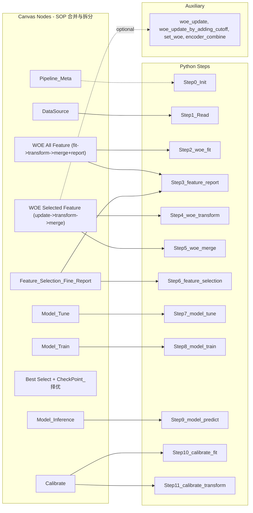

# Experiment 画布配置 — Python Step 与画布节点对照

本文档基于 [MODEL_PIPELINE.md](../MODEL_PIPELINE.md)、[分布式训练使用手册_v1.3.md](../risk_model_on_ray/com/seamoney/risk/spl_acard/分布式训练使用手册_v1.3.md) 与 [Pipeline-Steps-and-Canvas-Nodes.md](./Pipeline-Steps-and-Canvas-Nodes.md)，以 **LightGBM（LGBM）** 为例，说明：① 原始 Python Sample 的完整 Step 与主要 Function；② 当前 **Experiment 画布**的节点划分、配置要点及与 Python Step 的映射关系。单域、不涉及多域。画布配置入口在 **Experiment 层级**；Experiment 保留当前/最新画布配置，每次 Run 携带配置快照，中间产物与配置均绑定 **Run id**。见 [Naming-And-Responsibilities.md](./Naming-And-Responsibilities.md)。

---

## 一、原始 Python Sample（以 LGBM 为例）：完整 Step 与主要 Function

以下对应「完整子模型训练 + 可选校准」链路。数据来源为平台/用户指定的 Hive 或 S3，在 Python 中体现为 `data_path` / `sample_path` 等；初始化 RayUtil 与 Config 视为 Step 0，不列入画布执行节点。

### 1.1 Step 总览

| 序号 | Step 名称 | 主要作用 | 对应 RayUtil 方法 / 脚本入口 |
|------|-----------|----------|-----------------------------|
| 0 | 初始化 | 配置 BaseConfig（fp_base、label、sample_use_col、凭证等），构造 RayUtil，连接或创建 Ray 集群 | `Config.base_config.*`、`RayUtil(cluster_name=..., cluster_spec_yaml=...)` |
| 1 | 读取数据源 | 从 Hive 或 S3 获取原始特征数据；路径由用户或平台指定 | 无独立 `ray_util.*`，数据路径作为后续各 Step 的 `data_path` / `sample_path` 输入 |
| 2 | WOE Fit | 对单域原始数据做 WOE 分箱训练，产出 Encoder (.pkl)，供后续 Transform 使用 | `ray_util.woe_fit()` → **`ray_woe_fit_v2_4.py`** |
| 3 | Feature Report | （可选）基于 Encoder 生成特征报告（performance / trend / stability / mono） | `ray_util.feature_report()` → `ray_feature_report_v2_4.py` |
| 4 | WOE Transform | 使用已训练 Encoder 将原始数据转为 WOE 编码 Parquet | `ray_util.woe_transform()` → **`ray_woe_transform_v2_4.py`** |
| 5 | WOE Merge | 将多域 WOE 结果按 key（如 userid）JOIN 合并；单域时可退化为单路输出 | `ray_util.woe_merge()` / `ray_util.woe_merge_v2()` → **`ray_woe_merge.py`** / **`ray_woe_merge_v2.py`** |
| 6 | Feature Selection | 对合并后数据做 IV/Corr/PSI/Gini/Stability 等筛选，产出特征选择报告 | `ray_util.feature_selection()` / `ray_util.feature_selection_v2()` → **`ray_fs.py`** / **`ray_fs_v2.py`** |
| 7 | Model Tune | 使用 Ray Tune 对 LightGBM 做超参搜索，产出 best_hypers、best_model 等 | `ray_util.model_tune()` → **`ray_tune.py`** |
| 8 | Model Train | 用最佳超参训练 LightGBM，产出最终模型 (.pkl) 及可选预测结果 | `ray_util.model_train()` → **`ray_train.py`** |
| 9 | Model Predict | 用训练好的模型对指定样本做批量预测，产出带 pred 列的 Parquet | `ray_util.model_predict()` → **`ray_predict.py`** |
| 10 | Calibrate Fit | （可选，默认关）拟合校准模型，将概率映射为分数 | `ray_util.calibrate_fit()` / `ray_util.multi_stage_calibrate_fit()` → `ray_calibrate_*` / `ray_multi_stage_calibrate_*` |
| 11 | Calibrate Transform | （可选，默认关）用校准模型将概率转为最终分数（如 MegaScore） | `ray_util.calibrate_transform()` / `ray_util.multi_stage_calibrate_transform()` |

Mega Model（model_bm / model_bm_v2）用于将多个子模型预测结果用 LR 组合，属于 Benchmark 或多子模型融合场景；纯 LGBM 单子模型训练链路不必须包含。

### 1.2 各 Step 在做什么、用到的主要 Function

- **Step 0 初始化**  
  - 设置 `BaseConfig`（如 `fp_base`、`label`、`sample_use_col`、S3 端点、RayHub 地址、凭证）。  
  - 构造 `RayUtil`，按 `cluster_name` / `cluster_spec_yaml` 连接或创建集群。  
  - 无单独「数据读取」API；数据路径在后续 Step 中以参数形式传入。

- **Step 1 读取数据源**  
  - 逻辑上对应「从 Hive 表或 S3 路径拉取原始数据」。  
  - 在 Python 中体现为：后续 `woe_fit` / `woe_transform` 的 `data_path`、`model_tune` / `model_train` 的 `sample_path` 等，均由用户或平台根据数据源配置填充。  
  - 无独立 `ray_util.*` 调用；画布上由 **DataSource** 节点配置（Hive / S3 Type 及表名、分区、label 等）。

- **Step 2 WOE Fit**  
  - **在做什么**：对单域原始特征做 WOE 分箱训练，得到分箱边界与 WOE 值，序列化为 Encoder (.pkl)。  
  - **主要 Function**：`ray_util.woe_fit()`，底层脚本 `ray_woe_fit_v2_4.py`，内部使用 WOE v2.4 实现（如 `woe_helper/woe_v2_4_ray.py`）。  
  - **产出**：`encoder_save_path` 指定的 .pkl（WOE Encoder）。  
  - **辅助工具**（非主流程，用于 Encoder 维护）：`woe_update`（重设分箱边界）、`woe_update_by_adding_cutoff`（追加切点）、`set_woe`（手动设某分箱 WOE 值）、`encoder_combine`（合并多个 encoder）。这些不参与「标准训练 Pipeline」主流程，仅在运维/修补时使用。

- **Step 3 Feature Report**  
  - **在做什么**：基于已有 Encoder 和指定数据，生成特征性能、趋势、稳定性、单调性等报告（.xlsx 等）。  
  - **主要 Function**：`ray_util.feature_report()` → `ray_feature_report_v2_4.py`。  
  - **产出**：`report_filepath` / `feature_report_save_path` 指定的报告文件。

- **Step 4 WOE Transform**  
  - **在做什么**：用 Step 2 产出的 Encoder 将原始数据编码为 WOE 值，写出为 Parquet。  
  - **主要 Function**：`ray_util.woe_transform()` → `ray_woe_transform_v2_4.py`。  
  - **产出**：`data_save_path` 指定的 WOE 转换后数据。

- **Step 5 WOE Merge**  
  - **在做什么**：将多个特征域（或单域）的 WOE 转换结果按 key（如 userid）JOIN，得到合并后的宽表。单域时可为「单路输出」或占位。  
  - **主要 Function**：`ray_util.woe_merge()`（Modin）或 `ray_util.woe_merge_v2()`（Ray 原生 join，推荐）。  
  - **产出**：`data_save_path` 指定的合并后 Parquet。

- **Step 6 Feature Selection**  
  - **在做什么**：对合并后数据按 IV、相关性、PSI、Gini 或 Stability 等方法筛选特征，输出选择报告。  
  - **主要 Function**：`ray_util.feature_selection()` 或 `ray_util.feature_selection_v2()`（支持 by_stability）。  
  - **产出**：`output_filepath` / `fp_fs_output_path` 指定的报告（如 .csv）。  
  - **裁切语义**：Feature Selection **不产出裁切后的数据集**，只产出选择报告（如 `selection_report_*.csv`、各方法 `feature_list_*.csv`）。真正的「裁切」（只保留选中特征列）发生在 **Model Tune / Model Train** 读表时：`ray_tune.py` / `ray_train.py` 的 `read_data()` 根据 `feature_selection_path` 与 `use_feature_selection` 过滤列，只加载选中特征。

- **Step 7 Model Tune**  
  - **在做什么**：使用 Ray Tune 对 LightGBM 做超参搜索（如 BayesOptSearch），得到最佳超参与对应模型。  
  - **主要 Function**：`ray_util.model_tune()` → `ray_tune.py`，内部使用 `LightGBMTrainer`、`TuneConfig` 等。  
  - **产出**：best_hypers_path、best_model_path、feature_importance_path、bo_history_path、predict_result_path 等。

- **Step 8 Model Train**  
  - **在做什么**：用 Step 7 得到的最佳超参（或显式传入的 hypers）训练最终 LightGBM 模型。  
  - **主要 Function**：`ray_util.model_train()` → `ray_train.py`。  
  - **产出**：best_model_path（.pkl）、可选 predict_result_path。

- **Step 9 Model Predict**  
  - **在做什么**：加载训练好的模型，对指定样本做批量预测。  
  - **主要 Function**：`ray_util.model_predict()` → `ray_predict.py`。  
  - **产出**：predict_result_path（含 pred 列等的 Parquet）。

- **Step 10 / 11 Calibrate Fit & Transform**  
  - **在做什么**：拟合校准模型（概率→分数映射），再对预测概率做转换得到最终分数；默认不执行。  
  - **主要 Function**：`ray_util.calibrate_fit()` / `multi_stage_calibrate_fit()`，`ray_util.calibrate_transform()` / `multi_stage_calibrate_transform()`。  
  - **产出**：校准模型 .pkl、校准后分数 Parquet。

---

## 二、画布节点设计与 Python Step 映射（LGBM，SOP 对齐）

画布采用 **合并节点** 设计（对齐建模实验 SOP）：节点 3 为 **WOE All Feature**（对全部特征 woe_fit → woe_transform → woe_merge，再可选 All Feature Report），节点 4 合并 Step 6+3（Feature Selection + Fine Feature Report），节点 5 为 **WOE Selected Feature**（对选中特征可选 woe_update → woe_transform → woe_merge）。**Model Tune**、**Model Train** 拆分为独立节点，支持多子路径做训练参数组合；**CheckPoint（择优）** 含 **Best Select（Model Summary）**，多子路径训练完成后汇总分支结果、用户择优选定，再由 **Model Inference** 使用选定结果执行 model_predict。**CheckPoint** 为**节点属性、默认关闭**；Run 状态仅为 WAITING / RUNNING / SUCCESS / FAILED / KILLED（无 CHECKING）。平台支持 **SavePoint** 与 **CheckPoint**。画布内仅提供 **Run**（始终从头执行），不提供「从当前节点执行」或「Run From Current Step」；执行时分析配置是否变更、无变更部分走缓存，提示是否使用缓存并支持 **Force Restart**。改配置后执行 = 新 Run（Kill 原 Run、按最新 Experiment 配置从头执行）。**不修改** [docs/prototype/MODEL_TRAINING.html](../prototype/MODEL_TRAINING.html)。画布内节点**右侧配置栏为 Tag 分页**：左分页 = 配置单，右分页 = last run 信息 + Run ID Tag。

### 建模实验 SOP 对照表

与产品/调研 SOP 表一一对应（Model Step | Component Type | Config Details | Note）：

| Model Step | Component Type | Config Details | Note |
|-------------|----------------|----------------|------|
| Ray init | Task Config | 元信息、资源分配、任务优先级 | 画布首位，对应 Experiment Meta；修改不落版 |
| read_data | Data Source | Type = Hive：hive_server、table_schema、table_name、custom_filter、label、sample_use_col、categorical_col。Type = S3：s3_path、label、sample_use_col、categorical_col | 数据源表干净、无偏，类别变量未经 WOE 的需标识 |
| woe_fit对全部ft做fit | WOE All Feature | 全局默认 WOE 参数；对全部特征做 fit → transform → merge；再（可选）全部特征探查报告 | **Time Travel 实验 checkpoint（WOE 部分）**；可配置 SavePoint |
| woe transform + merge、all feature_report(optional) | （同上） | （同上） | 节点 3 内完成全部特征的 transform + merge |
| feature selection | Feature Selection | 特征选择；对选择留下的 Feature 做探查报告 | **CheckPoint**：后续 Model Tune & Train 实验的暂停点 |
| fine feature_report | （同上） | （同上） | 先 feature_selection，再 feature_report(选中特征) |
| woe_update(optional)、woe transform、woe_merge | WOE Selected Feature | woe_update(可选) → woe_transform → woe_merge，针对**选中特征** | 后续 Model Tune & Train 实验的存档点；可配置 SavePoint |
| Model Param Space Strategy / Model Tune / Model Train | Model Tune & Train | 搜索策略 + 搜索参数空间 dict；各分支产出 best_hyper_path、best_model | 支持分支 DAG 并行 |
| Best Select | Model Summary | 无独立配置区；可选记录选中的子路径 ID 或 artifact 路径 | 汇总多路 TUNE+Train 分支结果并识别最优，用户择优后 Continue 至 Model Inference |
| Model Predict(optional) | Model Inference | 用最终模型做批量预测 | 需支持此节点独立组成完整画布，用于策略回扫等场景 |
| Model Calibrate | Model Calibrate | calibrate_fit + calibrate_transform | 先不做 / 本期不实现；画布保留节点，默认关闭 |

### SOP 节点类型与配置要点

| Node Type | Config Details | Note |
|-----------|----------------|------|
| **Experiment Meta**（Task Config） | 元信息、资源分配、任务优先级 | 画布首位；修改不落版，直接更新 Experiment 实体 |
| **数据源 (DataSource)** | Type = Hive：hive_server、table_schema、table_name、custom_filter、label、sample_use_col、categorical_col。Type = S3：s3_path、label、sample_use_col、categorical_col | 需保证数据源表干净、无偏，且标识不经 WOE 的类别变量 |
| **WOE All Feature** | 对全部特征做 **fit → transform → merge**；全局默认 WOE 参数（n_bins、min_bin_rate、min_bin_size、min_missing_bad_cnt、method 等）；再（可选）全部特征探查报告；可配置 SavePoint | WOE 部分 **Time Travel 实验 checkpoint**；节点支持独立运行并存记录 |
| **Feature Selection** | 特征选择；对选择留下的 Feature 做探查报告；**CheckPoint 属性**（默认关闭，可开启） | 先 feature_selection，再 feature_report(选中特征)；为后续 Model Tune & Train 的 **CheckPoint**；开启时本节点完成后中间产物已写出（Run 无 CHECKING 状态） |
| **WOE Selected Feature** | woe_update(可选) → woe_transform → woe_merge，针对**选中特征**；可配置 SavePoint | 后续 Model Tune & Train 实验的存档点 |
| **Model Tune** | 支持不同分支定义搜索策略 + 搜索参数空间 dict；各分支产出 best_hyper_path / best_model | 支持分支 DAG 并行 |
| **Model Train** | 选择最优一路分支的 best_hyper_path，再跑一次 model_train()，得到最终要发布的模型 | 合并多路 TUNE 分支 |
| **CheckPoint（择优）**（Best Select / Model Summary） | 无独立配置区；可选记录选中的子路径 ID 或 artifact 路径 | 汇总多路 TUNE+Train 分支模型结果并识别最优，用户择优选定再 Continue 至 Model Inference |
| **Model Inference** | 用最终模型做批量预测 | 需支持此节点独立组成完整画布，用于策略回扫等场景 |
| **Model Calibrate** | calibrate_fit + calibrate_transform | 本期不实现 / Pending；画布保留节点，默认关闭 |

### 2.1 画布节点与 Python Step 对应总览

| 序号 | 画布节点名称 | 对应 Python Step | 主要作用 | 实现脚本 | SavePoint / CheckPoint |
|------|--------------|------------------|----------|----------|------------------------|
| 1 | **Experiment Meta** | Step 0（实验级） | 实验元信息 + 执行与调度；修改不落版 | — | — |
| 2 | **数据源 (DataSource)** | Step 1 | 配置数据来源（Hive/S3）、label、sample_use_col、**categorical_col** | — | — |
| 3 | **WOE All Feature**（WOE Fit + All Feature Report） | Step 2 + 4 + 5 + Step 3 | 对全部特征 woe_fit → woe_transform → woe_merge，再（可选）All Feature Report；产出 Encoder + WOE 数据 + 全量报告 | ray_woe_fit_v2_4.py、ray_woe_transform_v2_4.py、ray_woe_merge_v2.py、ray_feature_report_v2_4.py | SavePoint 可配；**Time Travel checkpoint（WOE）** |
| 4 | **Feature Selection + Fine Feature Report** | Step 6 + Step 3 | feature_selection → feature_report(选中特征)；产出 FS 报告 + 精选报告 | ray_fs.py / ray_fs_v2.py、ray_feature_report_v2_4.py | **CheckPoint**（节点属性，默认关） |
| 5 | **WOE Selected Feature**（WOE Update + WOE Merge） | 可选 woe_update + Step 4 + Step 5 | 对选中特征：可选 woe_update → woe_transform → woe_merge | ray_woe_update.py（可选）、ray_woe_transform_v2_4.py、ray_woe_merge_v2.py | SavePoint 可配（后续 Tune & Train 存档点） |
| 6 | **Model Tune** | Step 7 | model_tune；search_space + 搜索策略；可多子路径 | ray_tune.py | — |
| 7 | **Model Train** | Step 8 | model_train；可与节点 6 组成多子路径 | ray_train.py | — |
| 8 | **CheckPoint（择优）**（Best Select / Model Summary） | — | 汇总多分支 TUNE+Train 结果，用户择优选定后 Continue 至 Model Inference | — | **CheckPoint 可选**（节点属性，默认关） |
| 9 | **Model Inference** | Step 9 | model_predict；使用择优选定的训练结果 | ray_predict.py | — |
| 10 | **Calibrate** | Step 10 + 11 | calibrate_fit、calibrate_transform（默认关） | ray_calibrate_* | 本期不实现 / Pending |

### 2.2.0 特征选择裁切语义与 WOE 节点配置合并

- **Feature Selection 裁切**：节点 4（Feature Selection）只产出选择报告，不产出「仅含选中特征」的物理表。裁切在 **Model Tune / Model Train** 读 parquet 时按 `feature_selection_path` + `use_feature_selection` 过滤列完成。
- **WOE Selected Feature 等价语义**：「WOE Selected Feature」（节点 5）在语义上等价于对**裁切后的特征集合**（由选择报告定义）做：fit（在节点 3 已完成）+ 可选 woe_update + transform + merge。即对裁切后的 Features 做 woe fit_transform_merge（all = 当前选中集合）；下游 Tune/Train 按同一报告只读这些列。
- **未配置 woe_update 时的等价与可选简化**：当**不配置 woe_update** 时，节点 5 的 transform + merge 与节点 3 使用同一 Encoder，产出与节点 3 的 merge 表中对应列一致。因此从训练结果上，**等价于**：Tune/Train 的 `sample_path` 直接指向**节点 3 的 merge 表**，仅靠 `feature_selection_path` + `use_feature_selection` 在读表时过滤列（即「只用选中特征」训练）。若产品/实现选择「未配 woe_update 时跳过节点 5 的 transform+merge」，可约定 Tune/Train 使用节点 3 的产出路径并依报告过滤列，结果一致。当前设计仍保留节点 5 的 transform+merge，主要出于：**SavePoint 语义**（Tune/Train 的明确存档点）、**sample_path 统一**（始终指向节点 5 产出）、以及多域场景下可选只写出选中域以减小 IO。
- **节点 3 与节点 5 配置合并**：两节点可**共用同一 WOE 配置块**（n_bins、method、min_bin_rate、transform_method、exclude、categorical_features 等只保留一份）。区分方式：节点 3 使用 scope = **all**，不填 `feature_selection_path`；节点 5 使用 scope = **selected**，必填或推荐 `feature_selection_path`（及可选 `use_feature_selection`），以便与 Fine Feature Report 及 Tune/Train 一致。画布/后端若支持「共享配置块」，可将两节点指向同一 WOE 配置实体，仅通过 scope 与 `feature_selection_path` 区分。

### 2.2 各节点配置项（以 Python Step 参数为准）

以下配置项均对应 MODEL_PIPELINE.md 中各 Step 的输入/输出参数；命名统一用 path 形式（如 encoder_save_path、data_path）。

**节点 1：Experiment Meta**（对应 Step 0，实验级）  
- **在做什么**：展示并编辑 Meta Info（Experiment Name 只读、Region 仅 View、Owner 可编辑多选、Description 可编辑）与 Execute Info（Resource Tier、Queue Priority）；修改直接写 Experiment 实体，不写入 Run 配置快照。  
- **主要配置项**：Experiment Name、Region、Owner、Description、Resource Tier、Queue Priority。

**节点 2：数据源 DataSource**（对应 Step 1）  
- **在做什么**：配置数据来源与标签列，平台将解析结果注入后续各 Step 的 data_path / sample_path、label、sample_use_col；**categorical_col** 注入 WOE 的 categorical_features。  
- **主要配置项**：  
  - Type = Hive：hive_server、table_schema、table_name、partition_filter、custom_filter、**label**、**sample_use_col**、**categorical_col**。  
  - Type = S3：**s3_path**（或 sample_path）、**label**、**sample_use_col**、**categorical_col**。  
- **Note**：需保证数据源表干净、无偏，且标识不经 WOE 的类别变量。

**节点 3：WOE All Feature**（WOE Fit + All Feature Report，对应 Step 2 + 4 + 5 + Step 3）  
- **在做什么**：对**全部特征**先 woe_fit 产出 Encoder，再 woe_transform、woe_merge，最后（可选）对全部特征做 All Feature Report 产出全量报告；可配置 SavePoint，为 **WOE 部分 Time Travel 实验 checkpoint**，节点支持独立运行并存记录。与节点 5 可共用同一 WOE 配置块，本节点对应 scope = all（见 §2.2.0）。  
- **配置区 1 - WOE Fit**（MODEL_PIPELINE §1）：feature_name、data_path、encoder_save_filepath、label、n_bins、min_bin_rate、min_bin_size、min_missing_bad_cnt、method、transform_method、exclude、categorical_features（可由数据源 categorical_col 注入）、missing_values、missing_logic、dict_*、model_level、sample_use_col、ls_high_risk_na_features、ls_neutral_risk_na_features。  
- **配置区 2 - WOE Transform + Merge**（节点 3 内）：对全部特征做 woe_transform、woe_merge（参数见 MODEL_PIPELINE §3、§4）。  
- **配置区 3 - All Feature Report**（MODEL_PIPELINE §2，可选）：feature_name、data_path、encoder_load_filepath、report_filepath、label、sample_type、pkey、dim、n_bins、sample_use_col、reports。

**节点 4：Feature Selection + Fine Feature Report**（对应 Step 6 + Step 3）  
- **在做什么**：先 feature_selection 产出 FS 报告，再 feature_report(选中特征) 产出精选报告；**CheckPoint** 为节点属性、默认关闭，开启时本节点完成后中间产物已写出（Run 无 CHECKING 状态）。  
- **配置区 1 - Feature Selection**（MODEL_PIPELINE §5）：data_path、output_filepath、label、model_name、sample_use_col、fs_methods、exclude_cols、iv_threshold、corr_threshold、psi_threshold；v2：stability_* 等。  
- **配置区 2 - Fine Feature Report**（MODEL_PIPELINE §2）：encoder_load_path、feature_selection_path、report_filepath、sample_type、pkey、dim、reports。

**节点 5：WOE Selected Feature**（WOE Update + WOE Merge，对应可选 woe_update + Step 4 + Step 5）  
- **在做什么**：针对**选中特征**，可选 woe_update 精调后，woe_transform、woe_merge；可配置 SavePoint（后续 Model Tune & Train 实验的存档点）。未配置 woe_update 时，仍可执行对选中特征的 transform + merge（与节点 3 Encoder 一致，结果与节点 3 表中对应列相同）；**等价地**，也可由下游直接使用节点 3 的 merge 表并按 `feature_selection_path` 过滤列训练，详见 §2.2.0。与节点 3 可共用同一 WOE 配置块，通过 scope = selected 与 `feature_selection_path` 区分（见 §2.2.0）。  
- **配置区 1 - WOE Update**（可选）：特征列表 + 每特征调参（ws_list / cutoff / missing_logic 等，对应 ray_woe_update.py / ray_woe_update_by_adding_cutoff.py）；本期可预留，具体字段下期实现。  
- **配置区 2 - WOE Transform**（MODEL_PIPELINE §3）：feature_name、data_path、encoder_load_filepath、data_save_path、sample_type、model_level、transform_method、n_bins、method、ooot_date。  
- **配置区 3 - WOE Merge**（MODEL_PIPELINE §4）：data_path_dict、data_save_path、on、how；v2：num_partitions。

**节点 6：Model Tune**（对应 Step 7）  
- **在做什么**：超参搜索，支持不同分支定义搜索策略 + 搜索参数空间，各分支产出 best_hyper_path / best_model；支持分支 DAG 并行。  
- **配置区**（MODEL_PIPELINE §6）：sample_path、label、best_model_filepath、best_hypers_path、feature_importance_path、bo_history_path、predict_result_path、checkpoint_path、sample_use_col、exclude_cols、feature_selection_path、use_feature_selection、sample_weight_col、auxilary_cols、**init_hypers、n_trials、search_space、搜索策略**、metric_for_tune、num_workers 等。

**节点 7：Model Train**（对应 Step 8）  
- **在做什么**：选择最优一路分支的 best_hyper_path，再跑一次 model_train()，得到最终要发布的模型；合并多路 TUNE 分支。  
- **配置区**（MODEL_PIPELINE §7）：sample_path、label、best_model_filepath、checkpoint_path、best_hyper_filepath、hypers、predict_result_path 等。

**节点 8：CheckPoint（择优）**（Best Select / Model Summary）  
- **在做什么**：**Best Select（Model Summary）**：汇总多路 TUNE+Train 分支模型结果并识别最优；多子路径完成后可选暂停，用户择优选定，再 **Continue**（不生成新 Run id）进入 Model Inference。**CheckPoint** 为节点属性、默认关闭。  
- **配置**：无独立配置区；可选记录选中的子路径 ID 或 artifact 路径。

**节点 9：Model Inference**（对应 Step 9）  
- **在做什么**：使用择优选定的训练结果（或指定某次 Run/Build 产物）执行 model_predict，产出带 pred 列的 Parquet。需支持此节点独立组成完整画布（如数据源 + Model Inference），用于策略回扫等场景。  
- **配置区**（MODEL_PIPELINE §8）：sample_path、**model_filepath**（选用择优结果或某 Instance/Build 产物）、predict_result_path、feature_cols、auxilary_cols 等。

**节点 10：Calibrate**（对应 Step 10 + 11）  
- **在做什么**：calibrate_fit + calibrate_transform。本期不实现 / Pending；画布保留节点，默认关闭，不做开发排期。  
- **配置区 1 - Calibrate Fit**（MODEL_PIPELINE §10）：sample_path、label、feature_list、model_filepath、n_bins、n_degree、score_type；多阶段：n_stages、breakpoints、label_term。  
- **配置区 2 - Calibrate Transform**（MODEL_PIPELINE §11）：sample_path、model_filepath、result_path、feature_list、auxilary_cols、fp_base。

### 2.3 节点与 Python Step 映射图（SOP 合并节点）

（画布顺序：N5 → N6 → N7 → N8 → N9 → N10；N8 为 Best Select + CheckPoint 择优，Continue 后进入 N9 Model Inference。）

- **画布 10 节点**：Pipeline Meta → DataSource → **WOE All Feature**（fit→transform→merge 全部特征 + 可选 report，SavePoint 可配）→ Feature Selection + Fine Feature Report（CheckPoint 可配）→ **WOE Selected Feature**（选中特征 update→transform→merge，SavePoint 可配）→ **Model Tune** → **Model Train** → **CheckPoint（择优）**（Best Select / Model Summary，可选）→ **Model Inference** → Calibrate。支持多子路径（节点 6+7）做训练参数组合，择优后再执行 Model Inference。
- **Revert**：从最近 SavePoint（节点 3 或节点 4 的产出）恢复；详见 [Pipeline-Steps-and-Canvas-Nodes.md](./Pipeline-Steps-and-Canvas-Nodes.md)。
- **节点 5 辅助**：woe_update、woe_update_by_adding_cutoff、set_woe、encoder_combine（可选精调后 merge）。

### 2.4 DAG 实例 Demo（用户调研与产品手册）

以下为端到端画布 DAG 示例：主链为线性，Model Tune 支持多分支并行（如 GridSearch / BayesOpt），汇入 Model Train 前经 CheckPoint（择优）选定最优分支；SavePoint 位于节点 3、5，CheckPoint 位于节点 4、8。Model Inference 可独立与数据源组成最小画布用于策略回扫。

```mermaid
flowchart LR
  subgraph main [数据预处理]
    PipelineMeta[Pipeline Meta]
    DataSource[DataSource]
    WOEFit["WOE All Feature (fit->transform->merge+report)"]
    FeatureSelection[Feature Selection + Fine Feature Report]
    WOEMerge["WOE Selected Feature (update->transform->merge)"]
  end

  subgraph tuneBranches [Model Tune & Train 分支]
    ModelTune1[Model Tune - GridSearch]
    ModelTrain1[Model Train]
    ModelTune2[Model Tune - BayesOpt]
    ModelTrain2[Model Train]
  end

  subgraph mergeInference [合并与推理]
    ModelInference[择优Model Inference]
    Calibrate[Calibrate]
  end

  PipelineMeta --> DataSource
  DataSource --> WOEFit
  WOEFit -->|SavePoint| FeatureSelection
  FeatureSelection -->|CheckPoint| WOEMerge
  WOEMerge -->|SavePoint| ModelTune1
  WOEMerge --> |SavePoint| ModelTune2
  ModelTune1 --> ModelTrain1
  ModelTune2 --> ModelTrain2
  ModelTrain1 -->ModelInference
  ModelTrain2 -->ModelInference
  ModelInference --> Calibrate
```

- **SavePoint**：节点 3（WOE All Feature）、节点 5（WOE Selected Feature）；Revert 从最近 SavePoint 恢复。
- **CheckPoint**：节点 4（Feature Selection）、节点 8（Best Select + 择优）；节点 8 处汇总多分支结果、用户选定最优训练结果后 Continue 至 Model Inference。
- **独立画布**：数据源 + Model Inference 可组成最小可执行画布，用于策略回扫、批量预测等场景。

---

## 三、参考文档

- [MODEL_PIPELINE.md](../MODEL_PIPELINE.md)：流程说明、各 Step 输入输出、完整 Python 示例、辅助工具（woe_update、encoder_combine 等）。
- [分布式训练使用手册_v1.3.md](../risk_model_on_ray/com/seamoney/risk/spl_acard/分布式训练使用手册_v1.3.md)：Step 0～8 工作流、RayUtil 入口、CLI 与配置、WOE/FS/Tune/Train/Predict/BM/Calibrate 参数与示例。
- [Pipeline-Steps-and-Canvas-Nodes.md](./Pipeline-Steps-and-Canvas-Nodes.md)：画布节点序列、SavePoint/CheckPoint、Pipeline Meta、数据源、各节点配置区与关键配置项。

本文档不修改 [docs/prototype/MODEL_TRAINING.html](../prototype/MODEL_TRAINING.html)；原型 HTML 的更新已冻结，除非另行要求。
