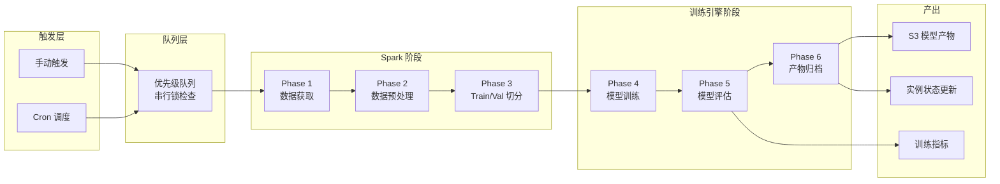
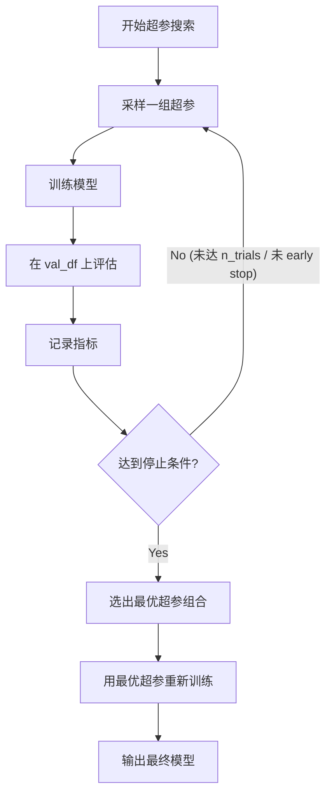
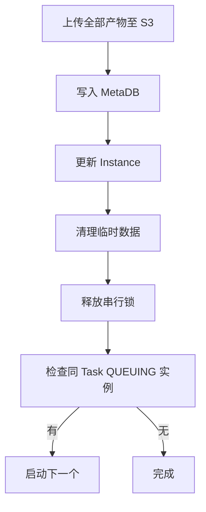

# Training Data Pipeline — 详细设计

## 1. 文档目的与范围

- **目的**：定义 Training Data Pipeline 全 6 Phase 的输入/输出、执行逻辑、引擎适配、异常处理与产物归档规范，为后端开发提供实现依据。
- **范围**：从 Trigger 创建 Instance 开始，到模型产物归档至 S3 为止的完整数据管道。不包含任务配置 CRUD（见 [系统架构说明.md](../architecture/系统架构说明.md)）和 UI 交互（待后续输出）。
- **前置依赖**：阅读 [系统架构说明.md](../architecture/系统架构说明.md) §3 领域模型、§4.2 模型训练模块、§6 任务调度与串行控制。

---

## 2. Pipeline 总体流程

### 2.1 流程概览



### 2.2 Phase 责任划分

| Phase | 执行环境 | 职责 |
|-------|----------|------|
| Phase 1: 数据获取 | Spark | 从 Hive 表读取原始数据 |
| Phase 2: 数据预处理 | Spark | 缺失值处理、类别编码、归一化、特征筛选 |
| Phase 3: 数据切分 | Spark | 按配置策略切分 Train / Validation 集 |
| Phase 4: 模型训练 | 独立训练引擎 | 模型拟合（含超参搜索） |
| Phase 5: 模型评估 | 独立训练引擎 | 在 Validation 集上计算评估指标 |
| Phase 6: 产物归档 | 独立训练引擎 → S3 | 模型文件 + 指标 + 日志 + 配置快照归档至 S3 |

### 2.3 Spark 与训练引擎的交接

Spark 阶段（Phase 1–3）完成后，数据需要交接给训练引擎阶段（Phase 4–6）。交接方式取决于训练引擎类型：

| 训练引擎 | 交接方式 | 说明 |
|----------|----------|------|
| XGBoost / LightGBM（Spark 分布式） | Spark DataFrame 直传 | 使用 SynapseML 或框架原生 Spark 集成，无需落盘 |
| XGBoost / LightGBM / CatBoost / sklearn（单机） | 临时 Parquet 写 HDFS | Spark 写出 Parquet 文件到 HDFS 临时目录，训练引擎读取 |
| PyTorch / TensorFlow（GPU 集群） | 临时 Parquet 写 HDFS / S3 staging | Spark 写出后，GPU 节点从 HDFS 或 S3 staging 路径读取 |

临时 staging 数据在 Phase 6 归档完成后清理。

---

## 3. 各 Phase 详细说明

### 3.1 Phase 1: 数据获取（Spark）

#### 输入

来自 `TaskConfig.DataSourceConfig`：

| 参数 | 类型 | 必填 | 说明 |
|------|------|------|------|
| hive_server | enum | Yes | 数据服务标识（如 reg_sg_hive / reg_us_hive） |
| table_schema | string | Yes | Hive Schema 名称 |
| table_name | string | Yes | Hive 表名 |
| partition_filter | string | No | 分区过滤条件（如 `dt >= '2025-01-01' AND dt < '2025-07-01'`） |
| custom_filter | string | No | 自定义 WHERE 条件（如 `country = 'ID' AND status = 1`） |

#### 执行逻辑

```
1. 构造 SparkSQL 查询：
   SELECT * FROM {table_schema}.{table_name}
   [WHERE {partition_filter}]
   [AND {custom_filter}]

2. 通过 HiveContext / SparkSQL 执行查询
3. 应用 partition_filter 和 custom_filter 作为 pushdown predicate（优化读取性能）
4. 记录数据基础统计信息（行数、列数、分区数）到日志
```

#### 输出

- `raw_df`：Spark DataFrame（原始数据集）

#### 异常处理

| 异常场景 | 处理方式 |
|----------|----------|
| 表不存在 | Instance 状态 → FAILED；error_message = "Table {schema}.{table} not found" |
| 无权限 | Instance 状态 → FAILED；error_message = "Access denied to table {schema}.{table}" |
| 数据为空（0 行） | Instance 状态 → FAILED；error_message = "No data returned from table {schema}.{table} with given filters" |
| Spark 连接超时 | 重试 2 次（指数退避），仍失败则 FAILED |

---

### 3.2 Phase 2: 数据预处理（Spark）

#### 输入

- `raw_df`：Phase 1 输出的 Spark DataFrame
- `TaskConfig.PreprocessConfig`：预处理配置
- `TaskConfig.DataSourceConfig.label_column`：标签列名
- `TaskConfig.DataSourceConfig.feature_columns`：特征列名列表

#### 预处理步骤

步骤顺序固定，按配置逐步执行。每步均操作在 `feature_columns` 范围内，`label_column` 不做预处理。

##### Step 1: 特征列筛选

在执行后续预处理前，先按 `feature_columns` 配置筛选出参与训练的列：

```
selected_df = raw_df.select(feature_columns + [label_column])
```

若配置了 `feature_selection_mode`：

| 模式 | 说明 |
|------|------|
| manual | 使用 `feature_columns` 配置（即用户在 UI 勾选的列） |
| variance_threshold | 自动过滤方差低于阈值的特征列（阈值可配，默认 0.01） |
| correlation_filter | 自动过滤与 label 相关性低于阈值或特征间高相关的列 |

##### Step 2: 缺失值处理

| 策略 | 参数 | 说明 |
|------|------|------|
| drop_rows | — | 删除包含缺失值的行 |
| fill_mean | — | 数值列用均值填充 |
| fill_median | — | 数值列用中位数填充 |
| fill_mode | — | 用众数填充（适用于类别列） |
| fill_constant | fill_value | 用指定常量填充 |

- 支持**全局配置**（所有列统一策略）或**按列配置**（不同列不同策略）。
- 按列配置优先级高于全局配置。

##### Step 3: 类别特征编码

| 编码方式 | 说明 | 适用场景 |
|----------|------|----------|
| label_encoding | 整数编码（0, 1, 2, ...） | 有序类别、树模型 |
| one_hot_encoding | 独热编码，展开为多列 | 无序类别、线性模型 |
| target_encoding | 用目标变量均值编码 | 高基数类别列 |

**高基数处理**：当某列唯一值数量超过配置阈值（默认 50）时：
- one_hot_encoding 自动降级为 frequency_encoding（频率编码）
- 记录 warning 到日志

##### Step 4: 特征归一化/标准化

| 策略 | 公式 | 说明 |
|------|------|------|
| min_max | (x - min) / (max - min) | 缩放到 [0, 1] |
| z_score | (x - mean) / std | 标准正态分布 |
| robust_scaler | (x - median) / IQR | 对异常值更鲁棒 |
| none | — | 不做归一化（树模型常选此项） |

- 仅对数值列生效；类别列（已编码为数值后）是否归一化取决于配置。
- 支持全局配置或按列配置。

#### 输出

- `preprocessed_df`：预处理后的 Spark DataFrame
- `preprocessor_metadata`：预处理元数据（JSON），包含：

```json
{
  "feature_columns_final": ["col_a", "col_b", "col_c_encoded", ...],
  "label_column": "label",
  "missing_value_config": { "col_a": "fill_mean", "col_b": "fill_constant:0" },
  "encoding_mappings": {
    "col_c": { "method": "label_encoding", "mapping": {"cat_a": 0, "cat_b": 1} }
  },
  "normalization_params": {
    "col_a": { "method": "min_max", "min": 0.0, "max": 100.0 },
    "col_b": { "method": "z_score", "mean": 50.0, "std": 10.0 }
  },
  "dropped_features": ["col_x", "col_y"],
  "rows_before": 1000000,
  "rows_after": 985432
}
```

此元数据将在 Phase 6 归档至 S3，供后续 Serving 阶段复用同样的预处理逻辑。

#### 异常处理

| 异常场景 | 处理方式 |
|----------|----------|
| label_column 不存在 | FAILED；error_message = "Label column '{col}' not found in dataframe" |
| feature_columns 中有列不存在 | FAILED；列出缺失列名 |
| 预处理后数据为空 | FAILED（例如 drop_rows 导致全部删除） |
| one_hot_encoding 后列数爆炸（超 10000 列） | FAILED；建议改用 label_encoding 或 target_encoding |

---

### 3.3 Phase 3: Train/Validation 切分（Spark）

#### 输入

- `preprocessed_df`：Phase 2 输出
- `TaskConfig.SplitConfig`：切分配置

#### 切分策略

##### 策略 1: random_ratio（随机比例切分）

| 参数 | 类型 | 必填 | 默认值 | 说明 |
|------|------|------|--------|------|
| train_ratio | float | Yes | 0.8 | 训练集比例 |
| seed | int | No | 42 | 随机种子（可复现） |

```
train_df, val_df = preprocessed_df.randomSplit([train_ratio, 1 - train_ratio], seed=seed)
```

##### 策略 2: time_based（时间切分）

| 参数 | 类型 | 必填 | 说明 |
|------|------|------|------|
| time_column | string | Yes | 时间列名 |
| split_point | string | Yes | 切分时间点（如 `2025-06-01`） |

```
train_df = preprocessed_df.filter(col(time_column) < split_point)
val_df = preprocessed_df.filter(col(time_column) >= split_point)
```

##### 策略 3: column_based（列标记切分）

| 参数 | 类型 | 必填 | 说明 |
|------|------|------|------|
| split_column | string | Yes | 标记列名 |
| train_value | string | Yes | 训练集标记值（如 `train`） |
| val_value | string | Yes | 验证集标记值（如 `val`） |

```
train_df = preprocessed_df.filter(col(split_column) == train_value)
val_df = preprocessed_df.filter(col(split_column) == val_value)
```

切分完成后从两个 DataFrame 中 drop 掉 `split_column`（不参与训练）。

##### 策略 4: separate_table（独立验证表）

| 参数 | 类型 | 必填 | 说明 |
|------|------|------|------|
| val_hive_server | enum | Yes | 验证集数据服务 |
| val_table_schema | string | Yes | 验证集 Schema |
| val_table_name | string | Yes | 验证集表名 |
| val_partition_filter | string | No | 验证集分区过滤 |
| val_custom_filter | string | No | 验证集自定义过滤 |

```
train_df = preprocessed_df  (来自 Phase 2 的主表)
val_df = spark.sql("SELECT ... FROM {val_schema}.{val_table} WHERE ...")
         → 对 val_df 应用与 Phase 2 相同的预处理流程（复用 preprocessor_metadata）
```

注意：验证集需要经过与训练集相同的预处理（使用 Phase 2 产出的 `preprocessor_metadata` 中的参数，而非重新拟合）。

##### 策略 5: separate_partition（同表不同分区）

| 参数 | 类型 | 必填 | 说明 |
|------|------|------|------|
| val_partition_filter | string | Yes | 验证集的分区过滤条件 |

```
train_df = preprocessed_df  (Phase 1 的 partition_filter 决定训练集范围)
val_df = spark.sql("SELECT ... FROM {schema}.{table} WHERE {val_partition_filter}")
         → 对 val_df 应用与 Phase 2 相同的预处理
```

#### 输出

- `train_df`：训练集 Spark DataFrame
- `val_df`：验证集 Spark DataFrame
- 切分统计信息：train 行数 / val 行数 / 比例，写入日志

#### 异常处理

| 异常场景 | 处理方式 |
|----------|----------|
| 切分后 train_df 为空 | FAILED；error_message = "Training set is empty after split" |
| 切分后 val_df 为空 | FAILED；error_message = "Validation set is empty after split" |
| time_column 不存在或非时间类型 | FAILED；列出错误详情 |
| separate_table 的验证表不存在/无权限 | FAILED；与 Phase 1 相同的异常处理 |

---

### 3.4 Phase 4: 模型训练（独立训练引擎）

#### 输入

- `train_df` + `val_df`：Phase 3 输出
- `TaskConfig.ModelHyperParams`：超参配置
- `TaskConfig.TrainingObjective`：训练目标

#### 引擎适配层

根据 `TaskConfig.framework` 分发到对应训练引擎：

| Framework | 训练引擎 | 计算环境 | 数据接收方式 |
|-----------|----------|----------|--------------|
| xgboost | xgboost.train() 分布式 via Spark/Dask | Spark 集群 | Spark DataFrame 直传 |
| lightgbm | SynapseML LightGBMClassifier/Regressor | Spark 集群 | Spark DataFrame 直传 |
| catboost | catboost.CatBoostClassifier/Regressor | Spark Driver 或独立节点 | Parquet 读取 |
| sklearn | sklearn Pipeline | Spark Driver 或独立节点 | Parquet 读取（pandas 转换） |
| pytorch | PyTorch Distributed / TorchRun | GPU 集群（K8s） | HDFS/S3 staging 读取 |
| tensorflow | tf.distribute.Strategy | GPU 集群（K8s） | HDFS/S3 staging 读取 |

#### 超参搜索

当 `TaskConfig.hyperparam_search != none` 时启用超参搜索：

| 搜索方式 | 实现 | 说明 |
|----------|------|------|
| grid_search | 全量网格组合 | 适合搜索空间小的场景 |
| random_search | 随机采样 N 组 | 需配置 `n_trials` |
| bayesian | Optuna TPE / GP | 自动优化搜索方向，需配置 `n_trials` |

**搜索空间定义**（`TaskConfig.search_space`）：

```json
{
  "learning_rate": { "type": "float", "low": 0.01, "high": 0.3, "log": true },
  "max_depth": { "type": "int", "low": 3, "high": 10 },
  "n_estimators": { "type": "categorical", "choices": [100, 200, 500, 1000] },
  "subsample": { "type": "float", "low": 0.6, "high": 1.0 }
}
```

**搜索流程**：



**停止条件**：
- 达到 `n_trials` 上限
- Early Stopping：连续 `patience` 轮未改善超过 `min_delta`

#### Early Stopping（训练内部）

| 参数 | 说明 |
|------|------|
| early_stopping | 是否启用（bool） |
| patience | 连续多少轮/epoch 无改善则停止 |
| min_delta | 最小改善阈值 |

- 树模型（XGBoost/LightGBM）：基于 eval_metric 的 early_stopping_rounds。
- 深度学习（PyTorch/TensorFlow）：基于 validation loss 的 EarlyStopping callback。

#### 输出

- `best_model`：最优模型对象（内存中）
- `best_hyperparams`：最优超参组合（dict）
- `training_history`：训练过程记录（loss curve 数据点，每轮/epoch 的指标值）

#### 异常处理

| 异常场景 | 处理方式 |
|----------|----------|
| 训练过程 OOM | FAILED；error_message 含内存使用详情，建议降低 resource_level 或数据量 |
| 模型不收敛（loss 发散） | 训练到 max_epochs 后正常完成，但 metrics 会体现效果差 |
| GPU 不可用（深度学习） | FAILED；error_message = "No GPU resources available" |
| 用户 Kill | 向计算引擎发送 cancel 信号；清理临时数据；Instance → KILLED |

---

### 3.5 Phase 5: 模型评估

#### 输入

- `best_model`：Phase 4 产出的最优模型
- `val_df`：验证集
- `TaskConfig.TrainingObjective`：训练目标

#### 评估指标

根据 `TaskConfig.model_type` 动态选择评估指标：

##### Classification（分类任务）

| 指标 | 说明 | 数据格式 |
|------|------|----------|
| AUC | ROC 曲线下面积 | float |
| Precision | 精确率 | float |
| Recall | 召回率 | float |
| F1 | F1 分数 | float |
| Accuracy | 准确率 | float |
| Confusion Matrix | 混淆矩阵 | 2D array |
| ROC Curve | FPR/TPR 序列 | array of [fpr, tpr] |
| PR Curve | Precision/Recall 序列 | array of [precision, recall] |

##### Regression（回归任务）

| 指标 | 说明 | 数据格式 |
|------|------|----------|
| RMSE | 均方根误差 | float |
| MAE | 平均绝对误差 | float |
| MSE | 均方误差 | float |
| R² | 决定系数 | float |
| MAPE | 平均绝对百分比误差 | float |

##### 通用指标

| 指标 | 说明 | 数据格式 |
|------|------|----------|
| Training Loss Curve | 训练过程 loss 变化 | array of [epoch/round, loss] |
| Validation Loss Curve | 验证 loss 变化 | array of [epoch/round, loss] |
| Feature Importance | 特征重要性排序 | array of { feature, importance } |

Feature Importance 实现方式根据框架决定：
- 树模型：impurity-based importance（gain / split count）
- 深度学习 / 通用：SHAP values（若计算资源允许；否则降级为 permutation importance）

#### 输出

`TrainingMetrics` 结构化 JSON 对象：

```json
{
  "model_type": "classification",
  "optimization_metric": "auc",
  "optimization_metric_value": 0.923,
  "best_hyperparams": {
    "learning_rate": 0.05,
    "max_depth": 6,
    "n_estimators": 500
  },
  "scalar_metrics": {
    "auc": 0.923,
    "precision": 0.87,
    "recall": 0.81,
    "f1": 0.84,
    "accuracy": 0.89
  },
  "confusion_matrix": [[850, 120], [95, 435]],
  "roc_curve": { "fpr": [0.0, 0.01, ...], "tpr": [0.0, 0.12, ...] },
  "pr_curve": { "precision": [1.0, 0.98, ...], "recall": [0.0, 0.05, ...] },
  "training_loss_curve": [[0, 0.693], [1, 0.512], [2, 0.421], ...],
  "validation_loss_curve": [[0, 0.701], [1, 0.534], [2, 0.445], ...],
  "feature_importance": [
    { "feature": "col_a", "importance": 0.23 },
    { "feature": "col_b", "importance": 0.18 },
    { "feature": "col_c", "importance": 0.15 }
  ],
  "data_stats": {
    "train_rows": 800000,
    "val_rows": 200000,
    "feature_count": 45,
    "split_method": "random_ratio",
    "split_params": { "train_ratio": 0.8, "seed": 42 }
  },
  "training_duration_seconds": 1234
}
```

---

### 3.6 Phase 6: 产物归档（S3）

#### S3 路径规范

所有产物统一存储在 S3，路径规范如下：

```
s3://{bucket}/model-training/{task_id}/{instance_id}/
├── model.*                    # 模型文件（框架原生格式）
├── preprocessor.json          # 预处理元数据
├── metrics.json               # 训练指标（Phase 5 输出）
├── config_snapshot.json       # 训练时的完整 TaskConfig 快照
├── train.log                  # 训练过程日志
└── hyperparams_search.json    # 超参搜索历史（可选，仅超参搜索时）
```

#### 各产物详情

| 产物 | 文件名 | 格式 | 说明 |
|------|--------|------|------|
| 模型文件 | `model.*` | 框架原生格式 | `.pkl`（sklearn/xgb/lgb/catboost）/ `.pt`（PyTorch）/ `.h5` 或 `SavedModel/`（TensorFlow） |
| 预处理元数据 | `preprocessor.json` | JSON | Phase 2 产出的编码映射、归一化参数等，供 Serving 复用 |
| 训练指标 | `metrics.json` | JSON | Phase 5 产出的结构化指标（含曲线数据点） |
| 任务配置快照 | `config_snapshot.json` | JSON | 训练时的完整 TaskConfig，含所有 6 个配置区块 |
| 训练日志 | `train.log` | 文本 | Pipeline 执行全过程的 stdout/stderr |
| 超参搜索历史 | `hyperparams_search.json` | JSON | 每组试验的超参 + 指标（仅超参搜索时生成） |

#### 归档完成后的回调



1. **上传产物**：将上述所有文件上传至 S3 指定路径。
2. **更新 MetaDB**：
   - Instance.status → SUCCESS
   - Instance.artifact_s3_path → `s3://{bucket}/model-training/{task_id}/{instance_id}/model.*`
   - Instance.metrics_s3_path → `s3://{bucket}/model-training/{task_id}/{instance_id}/metrics.json`
   - Instance.log_s3_path → `s3://{bucket}/model-training/{task_id}/{instance_id}/train.log`
   - Instance.config_snapshot_s3_path → `s3://{bucket}/model-training/{task_id}/{instance_id}/config_snapshot.json`
   - Instance.finished_at → 当前时间
3. **清理临时数据**：删除 HDFS/S3 staging 中的临时 Parquet 文件。
4. **释放串行锁**：允许同一 Task 的下一个 QUEUING 实例获取锁并执行。

#### FAILED 场景的归档

即使训练失败，也需要归档已有产物以便排查：

| 失败发生在 | 归档内容 |
|------------|----------|
| Phase 1（数据获取） | config_snapshot.json + train.log |
| Phase 2（预处理） | config_snapshot.json + train.log |
| Phase 3（切分） | config_snapshot.json + preprocessor.json + train.log |
| Phase 4（训练） | config_snapshot.json + preprocessor.json + train.log |
| Phase 5（评估） | config_snapshot.json + preprocessor.json + 部分 metrics + train.log |

---

## 4. 计算资源档位映射

用户在任务配置中选择 `resource_level`（low / medium / high），平台将其映射为具体的计算资源参数。映射关系由运维配置，以下为参考值：

### 4.1 Spark 集群（传统 ML）

| Resource Level | Executor 数量 | Executor 内存 | Executor Cores | Driver 内存 |
|----------------|---------------|---------------|----------------|-------------|
| low | 4 | 4G | 2 | 2G |
| medium | 8 | 8G | 4 | 4G |
| high | 16 | 16G | 4 | 8G |

### 4.2 GPU 集群（深度学习）

| Resource Level | GPU 数量 | GPU 类型 | 内存 | CPU Cores |
|----------------|----------|----------|------|-----------|
| low | 1 | T4 | 16G | 4 |
| medium | 2 | V100 | 32G | 8 |
| high | 4 | A100 | 80G | 16 |

实际映射值可在平台运维配置中调整，不硬编码在代码中。

---

## 5. 错误处理与重试策略

### 5.1 Pipeline 级别

- Pipeline 任何 Phase 失败即整体失败，不做自动重试（由用户决定是否 Re-trigger）。
- 失败时记录详细的 error_message 和 stack trace 到 train.log。
- 临时数据在失败后也需要清理（由 finally block 保证）。

### 5.2 组件级别重试

| 组件 | 重试策略 | 说明 |
|------|----------|------|
| Hive 连接 | 最多 3 次，指数退避（1s, 2s, 4s） | 瞬时网络问题 |
| S3 上传 | 最多 3 次，指数退避 | 网络抖动 |
| 训练引擎启动 | 不重试 | 资源不足应反映为 FAILED |

### 5.3 Kill 处理

| Instance 状态 | Kill 行为 |
|---------------|-----------|
| QUEUING | 从优先级队列移除，Instance → KILLED |
| RUNNING（Spark 阶段） | 调用 SparkContext.cancelJobGroup()，清理临时数据，Instance → KILLED |
| RUNNING（训练引擎阶段） | 向引擎进程发送 SIGTERM/SIGKILL，清理临时数据，Instance → KILLED |

---

## 6. 监控与日志

### 6.1 日志内容

train.log 按时间顺序记录 Pipeline 全过程：

```
[2025-07-15 10:00:01] [INFO] Pipeline started. instance_id=inst_001, task_id=task_042
[2025-07-15 10:00:01] [INFO] Phase 1: Reading from hive_sg.feature_wide_table_v3
[2025-07-15 10:00:15] [INFO] Phase 1: Loaded 1,234,567 rows, 89 columns
[2025-07-15 10:00:15] [INFO] Phase 2: Starting preprocessing
[2025-07-15 10:00:16] [INFO] Phase 2: Missing values - col_a: 1.2% filled with mean(45.3)
[2025-07-15 10:00:18] [INFO] Phase 2: Encoding - col_category: label_encoding (15 unique values)
[2025-07-15 10:00:20] [INFO] Phase 2: Normalization - 42 numeric columns with min_max
[2025-07-15 10:00:20] [INFO] Phase 2: After preprocessing: 1,220,345 rows, 95 columns
[2025-07-15 10:00:20] [INFO] Phase 3: Splitting with random_ratio (0.8/0.2, seed=42)
[2025-07-15 10:00:22] [INFO] Phase 3: Train=976,276 rows, Val=244,069 rows
[2025-07-15 10:00:22] [INFO] Phase 4: Training XGBoost with bayesian search (n_trials=50)
[2025-07-15 10:00:22] [INFO] Phase 4: Trial 1/50 - lr=0.1, depth=5 → AUC=0.891
[2025-07-15 10:05:30] [INFO] Phase 4: Trial 50/50 - lr=0.05, depth=6 → AUC=0.923
[2025-07-15 10:05:30] [INFO] Phase 4: Best trial: #37 (AUC=0.923)
[2025-07-15 10:06:00] [INFO] Phase 5: Evaluating on validation set
[2025-07-15 10:06:05] [INFO] Phase 5: AUC=0.923, F1=0.84, Precision=0.87, Recall=0.81
[2025-07-15 10:06:05] [INFO] Phase 6: Archiving artifacts to S3
[2025-07-15 10:06:10] [INFO] Phase 6: Upload complete. Cleaning temp data.
[2025-07-15 10:06:12] [INFO] Pipeline completed. Duration=372s. Status=SUCCESS
```

### 6.2 Instance 元数据记录

每个 Instance 在 MetaDB 中记录：

| 字段 | 更新时机 | 说明 |
|------|----------|------|
| queued_at | 创建时 | 入队时间 |
| started_at | QUEUING → RUNNING | 开始执行时间 |
| finished_at | → SUCCESS / FAILED / KILLED | 结束时间 |
| error_message | → FAILED | 错误摘要 |
| artifact_s3_path | → SUCCESS | 模型产物路径 |
| metrics_s3_path | → SUCCESS | 指标文件路径 |
| log_s3_path | → SUCCESS / FAILED / KILLED | 日志文件路径（始终归档） |

---

## 7. 文档索引

| 文档 | 用途 |
|------|------|
| [系统架构说明.md](../architecture/系统架构说明.md) | 系统架构、领域模型、模块职责、状态机、上下游边界 |
| 本文档（Training-Data-Pipeline.md） | Training Data Pipeline 全 6 Phase 详细设计 |
| 产品原型图.md（待输出） | 模型管理页、模型训练页、任务配置详情页的交互规格 |

---

*文档版本：MVP；数据采样与实验对比为后续迭代 Scope，仅列出不展开。*
