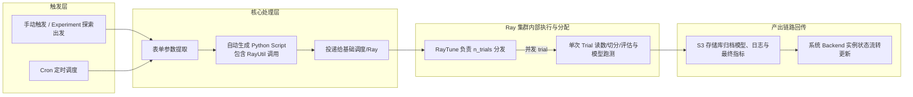
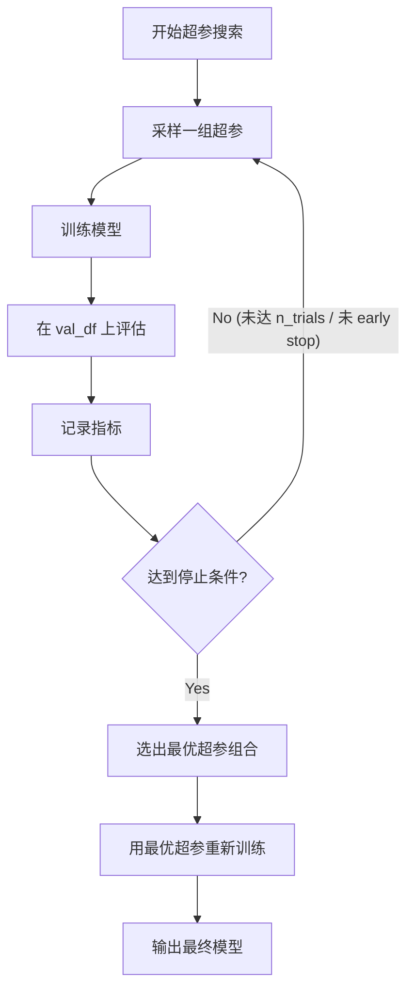
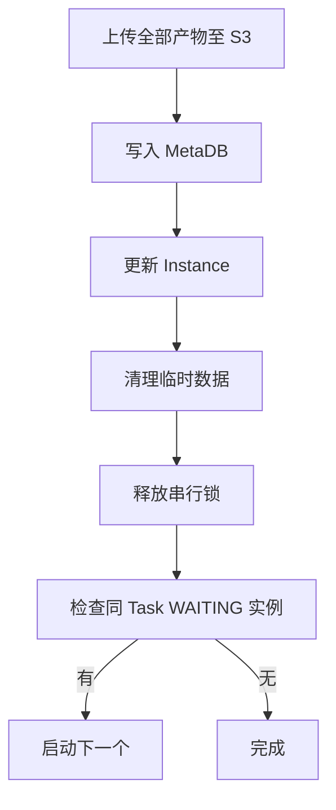

# Training Data Pipeline — 详细设计

## 1. 文档目的与范围

- **目的**：定义 Training Data Pipeline 构建时的全阶段流程规范。
- **范围**：从 Trigger 创建 Instance 开始，说明平台如何将表单配置转换为内部 Python 代码（基于 `RayUtil` 包裹）投递并在 Ray 分布式集群上执行寻参、训练、回传模型。
- **前置依赖**：阅读 [系统架构说明.md](../architecture/系统架构说明.md)。
- **数据责任**：本平台仅提供表单能力与算力对接保障；模型所需的全部逻辑依赖特征平台宽表或直接 Hive 读取，平台仅生成选择和预处理的 Python 代码。
- **Experiment 与 Run**：Experiment 绑定已注册 Model，保留当前/最新画布配置；Run 为一次执行（Run id 标识），配置快照与中间产物均绑定 Run id。执行本质为将画布配置转化为 Python `RayUtil` 并交给 **RayTune** 的调度机制。

---

## 2. Pipeline 总体流程

### 2.1 流程概览




**与 Figma / 控制台交互**：**Manual** 对应用户在 **Model Experiments** 配置页的 **Action → Trigger Run**（及设计意图中的列表 Trigger）；**Cron** 与顶栏 **Execute Config · Schedule**（ONCE / Cron 表达式）对应，是否已由后端调度器落地以迭代为准。详见 [_FIGMA_SYNC_REVIEW.md](./_FIGMA_SYNC_REVIEW.md)。

### 2.2 Phase 责任划分


| 逻辑阶段      | 环境映射     | 职责描述                                                                                                                                                                                               |
| --------- | -------- | -------------------------------------------------------------------------------------------------------------------------------------------------------------------------------------------------- |
| 数据获取      | Ray Data | Python 脚本包含获取设定范围内数据的指令。**当前实现（risk_model_on_ray）**：由 Ray 任务从 **S3 路径**（Parquet）读取，使用 Ray Dataset；若数据源为 Hive，需由上游或单独流程导出至 S3。                                                                      |
| 特征选择与 WOE | Ray 环境   | 根据配置中的 `feature_selection_methods` 和 `woe_enabled` 决定是否处理并生成特征。实现对齐：`feature_selection` / `feature_selection_v2`（含 by_stability）、WOE v2.4（ray_woe_fit_v2_4 / ray_woe_transform_v2_4）、woe_merge_v2。 |
| 数据切分      | Ray Data | Train / Validation 数据按指定条件打上标识位或者分别切分加载                                                                                                                                                            |
| 搜索与模型训练   | Ray Tune | Python 脚本包裹空间参数（`search_space`, `n_trials`），由下层 Ray 集群多节点并发跑试验搜出最优超参                                                                                                                               |
| 产物最终归档    | Backend  | Ray 执行结束会由包裹壳把最终结果（最佳 metrics 和打包出的模型以及 preprocessor 元数据）传输到 S3 并告知后台成功                                                                                                                            |


### 2.3 `RayUtil` 生成设计概念

为了屏蔽分布式运算以及异构配置，后台不会从头构造 Python 执行链路，而是**统一套壳调用 `RayUtil` 包下的相应功能类**。任务投递目标为 **RayHub**，entrypoint 脚本为对应的 **ray_*.py**（如 `ray_woe_fit_v2_4.py`、`ray_train.py`、`ray_tune.py`），配置通过 **RAY_JOB_CONFIG_JSON** 注入。RayUtil 方法（与 risk_model_on_ray 的 `ray_util.py` 一致）包括：

- **特征**：`woe_fit`、`woe_transform`、`woe_merge` / `woe_merge_v2`、`feature_selection` / `feature_selection_v2`、`feature_report`
- **模型**：`model_tune`、`model_train`、`model_predict`、`model_bm` / `model_bm_v2`
- **校准**：`calibrate_fit`、`calibrate_transform`（及 `multi_stage_calibrate_fit` / `multi_stage_calibrate_transform`）

平台收集表单内容后：

1. 如果是特征环节（选用了包含缺失/分箱/WOE 等配置），平台拼接 `ray_util.woe_fit(...)` 与对应的 `ray_util.feature_selection(...)` / `feature_selection_v2(...)` 参数。
2. 如果是训练模型请求，则调用 `ray_util.model_tune()` 或者 `model_train()`。由于平台默认使用寻找最优模型流程，往往平台会直接封装调用 `model_tune`，指定搜索空间 `search_space`。
3. 这些封装包裹调用指令被放入一份生成的 `task_id.py` 里，借助 Scheduler Adapter 向 **RayHub** 投递，集群上执行对应 ray_* 脚本，Config 经 RAY_JOB_CONFIG_JSON 注入。

### 2.4 CheckPoint 与 SavePoint 机制（SOP 对齐）

画布中节点可配置 **CheckPoint**（布尔 `isCheckPoint`，**默认关闭**）与 **SavePoint**（布尔 `isSavePoint`）。平台支持 CheckPoint 与 SavePoint；画布**每个节点支持独立运行并存记录**。

**Run 状态**：以 [产品原型与PRD §2.1](./产品原型与PRD.md) 为准；`**QUEUING` 为界面主展示**的排队态；运行级含 `**RUNNING`**、可选 `**CHECKING**`（人工卡点，Continue/Kill）、终态 `**SUCCESS` / `FAILED` / `KILLED**` 等；数据模型可含 `**WAITING**` 与 `**QUEUING**` 同位兼容。状态流转见 [系统架构说明 §4.2.2](../architecture/系统架构说明.md)。仅 SUCCESS 可注册为 Build。

- **改配置后执行**：用户在画布配置页调整配置后执行 → **新 Run id**，按**最新 Experiment 配置**执行；执行时分析配置是否变更，无变更部分可走缓存。**Trigger Run** 弹窗 **Use Cache** 表达缓存策略。设计意图中的「从某节点执行」见 [产品原型与PRD §4.1](./产品原型与PRD.md)。不提供「自动从最近 SavePoint 重跑」。

**SavePoint 定义**：可为**多个节点**的产出；每个节点完成后产出缓存于 S3，并记录到 Run 的 `savepoint_snapshots`（node_id、s3_path、completed_at）。每个 Run 的产物均有对应存储路径（`s3://…/{exp_id}/{run_id}/`）。

---

## 3. 各 Phase 详细说明

### 3.1 Phase 1: 数据获取

#### Data Ingestion 策略

MVP 阶段 **不引入 Spark**。数据获取有两条路径：


| 数据源类型              | 路径                                                                 | 责任方                                   |
| ------------------ | ------------------------------------------------------------------ | ------------------------------------- |
| **S3 Parquet**（推荐） | Ray Dataset 直接读取 S3 路径                                             | 上游将 Hive 表导出为 Parquet；或用户手动指定已有 S3 路径 |
| **Hive 表**         | 平台 Data Ingestion Service 将 Hive 表导出到 S3 Parquet，再由 Ray Dataset 读取 | 平台提供导出工具（Phase 2 可引入 Spark on-demand） |


**设计约束**：Ray Job 内部**不直接访问 Hive**；所有训练数据通过 S3 路径 + Ray Dataset 读取。

#### 输入

来自 Run 配置快照的 DataSourceConfig（如 `RunConfig.DataSourceConfig`）：

**Type=Hive 时**（平台负责 Hive → S3 导出）：


| 参数               | 类型                  | 必填  | 说明                                                   |
| ---------------- | ------------------- | --- | ---------------------------------------------------- |
| hive_server      | enum                | Yes | 数据服务标识（如 reg_sg_hive / reg_us_hive）                  |
| table_schema     | string              | Yes | Hive Schema 名称                                       |
| table_name       | string              | Yes | Hive 表名                                              |
| partition_filter | string              | No  | 分区过滤条件（如 `dt >= '2025-01-01' AND dt < '2025-07-01'`） |
| custom_filter    | string              | No  | 自定义 WHERE 条件（如 `country = 'ID' AND status = 1`）      |
| label            | string              | Yes | 目标列/标签列名                                             |
| sample_use_col   | string              | No  | 样本划分列，默认 'sample_use'                                |
| categorical_col  | list[string] 或 逗号分隔 | No  | 不经 WOE 的类别变量，供后续 WOE/FS 使用                           |


**Type=S3 时**（直接读取，与 risk_model_on_ray 一致）：


| 参数              | 类型                  | 必填  | 说明                    |
| --------------- | ------------------- | --- | --------------------- |
| sample_path     | string              | Yes | S3 Parquet 路径         |
| label           | string              | Yes | 目标列/标签列名              |
| sample_use_col  | string              | No  | 样本划分列，默认 'sample_use' |
| categorical_col | list[string] 或 逗号分隔 | No  | 不经 WOE 的类别变量          |


#### 执行逻辑

```
Type=Hive 时（在 Ray Job 外部执行）：
1. Platform BE 调用 Data Ingestion Service
2. 构造导出 SQL：
   SELECT * FROM {table_schema}.{table_name}
   [WHERE {partition_filter}]
   [AND {custom_filter}]
3. 导出为 Parquet 至 S3 staging 路径：
   s3://{bucket}/{base_prefix}/{exp_id}/{run_id}/staging/raw_data/
4. 将 staging 路径作为 sample_path 注入 Ray Job Config

Type=S3 时：
1. 直接使用 sample_path

所有路径统一后（Ray Job 内部）：
1. ray.data.read_parquet(sample_path)
2. 校验 label 列存在、feature columns 存在
3. 记录数据基础统计信息（行数、列数）到日志
```

#### 输出

- `raw_ds`：Ray Dataset（原始数据集）
- `staging_s3_path`：数据的 S3 路径（供后续节点引用）

#### 异常处理


| 异常场景                | 处理方式                                                                      |
| ------------------- | ------------------------------------------------------------------------- |
| Hive 表不存在           | Run 状态 → FAILED；error_message = "Table {schema}.{table} not found"        |
| 无权限                 | Run 状态 → FAILED；error_message = "Access denied to table {schema}.{table}" |
| 数据为空（0 行）           | Run 状态 → FAILED；error_message = "No data returned with given filters"     |
| Hive 导出超时           | 重试 2 次（指数退避），仍失败则 FAILED                                                  |
| S3 路径不存在            | Run 状态 → FAILED；error_message = "S3 path not found: {sample_path}"        |
| Parquet schema 校验失败 | Run 状态 → FAILED；列出缺失列名                                                    |


---

### 3.2 Phase 2: 特征工程（WOE Fit + Report、Feature Selection + Report、WOE Update + Merge）

**画布对齐（SOP）**：本 Phase 对应画布节点 3、4、5。**节点 3**：WOE Fit + All Feature Report（woe_fit → feature_report 全部特征）；**节点 4**：Feature Selection + Fine Feature Report（feature_selection → feature_report 选中特征）；**节点 5**：可选 woe_update 后 woe_transform + woe_merge。

**实现对齐**：WOE 使用 **v2.4**（ray_woe_fit_v2_4、ray_woe_transform_v2_4）；woe_merge 推荐 **woe_merge_v2**（Ray 原生 join）；特征选择为 **feature_selection**（v1）或 **feature_selection_v2**（含 **by_stability** 及分布式 L1 LR 参数）；可选精调为 **woe_update** / **woe_update_by_adding_cutoff**（ray_woe_update.py 等）。手册见 [分布式训练使用手册_v1.3.md](../risk_model_on_ray/com/seamoney/risk/spl_acard/分布式训练使用手册_v1.3.md)（或英文版 distributed_training_manual_en_v1.3.md）。

#### 输入

- `raw_df`：Phase 1 输出的数据（**上游已清洗**；实现侧为 S3 路径 + Ray Dataset，无 Spark DataFrame）
- Run 配置的 PreprocessConfig（如 `RunConfig.PreprocessConfig`）：特征选择与可选 WOE 配置
- Run 配置 DataSourceConfig.label_column：标签列名
- Run 配置 DataSourceConfig.feature_columns：特征列名列表（候选）
- Run 配置 DataSourceConfig.sample_use_col（可选）：样本划分列，与 RAY 一致（如 train/test）

#### 步骤

##### Step 1: 特征自动选择（必选，P0）

与 RAY 手册 Step 2（feature_selection / feature_selection_v2）对齐。


| 配置项                       | 类型    | 说明                                                               |
| ------------------------- | ----- | ---------------------------------------------------------------- |
| feature_selection_methods | list  | 方法列表：`by_iv` / `by_corr` / `by_gini` / `by_psi` / `by_stability` |
| fp_fs_iv_threshold        | float | IV 筛选阈值（默认 0.02），低于该值的特征剔除                                       |
| fp_fs_corr_threshold      | float | 相关性阈值（默认 0.7），高于该值视为冗余                                           |
| fp_fs_psi_threshold       | float | PSI 阈值（默认 0.1），高于该值视为不稳定                                         |
| exclude                   | list  | 剔除列（如 ID、label）；与 RAY BaseConfig.exclude 一致                      |


**by_stability 专用参数**：


| 配置项                             | 类型    | 说明                                    |
| ------------------------------- | ----- | ------------------------------------- |
| fp_fs_lambda_grid               | list  | L1 正则化系数网格（如 np.logspace(-3, -1, 10)） |
| fp_fs_stability_threshold       | float | 稳定性阈值（默认 0.1）                         |
| fp_fs_stability_n_resampling    | int   | 重采样次数（默认 50）                          |
| fp_fs_stability_sample_fraction | float | 每次重采样样本比例（0.0–1.0）                    |
| fp_fs_random_state              | int   | 随机种子                                  |


**输出**：筛选后特征列表；`selection_report_{model_name}.csv` 或等价物路径，供后续 WOE/训练使用。

##### Step 2: 可选 WOE 变换

若 Run 配置 `PreprocessConfig.woe_enabled == true`，执行与 RAY Feature 域一致的子步骤（实现：WOE v2.4，woe_merge 推荐 woe_merge_v2）：

1. **woe_fit**：分箱与编码器拟合；配置与手册 §1.1 对齐（label、sample_use_col、n_bins、method、transform_method、encoder_save_path、categorical_features、exclude 等）；实现脚本 `ray_woe_fit_v2_4.py`。
2. **woe_transform**：应用编码器；配置与手册 §1.2 对齐（data_path、data_save_path、encoder_load_path）；实现脚本 `ray_woe_transform_v2_4.py`。
3. **woe_merge**：多特征域合并；配置与手册 §1.3 对齐（on、how、data_path_dict、data_save_path）；实现推荐 `woe_merge_v2`（Ray 原生 join），脚本 `ray_woe_merge_v2.py`。

若不启用 WOE，本步跳过；Phase 2 输出为经特征选择后的 DataFrame 或落盘路径。

#### 输出

- 特征选择结果（筛选后特征列表 + selection_report 路径）
- 可选 WOE 后的训练就绪数据（DataFrame 或 Parquet/S3 路径）
- `preprocessor_metadata`（JSON）：记录 `feature_columns_final`、`label_column`、可选 `woe_encoder_path`、`selection_report_path`；供 Phase 6 归档与 Serving 复用。

#### 可选兜底：数据清洗（上游未清洗时）

仅当上游未完成清洗且配置明确启用时，可执行最小兜底（**默认跳过**）：

- **缺失值**：fill_mean / fill_median / fill_constant 等（见原 Step 2 表）
- **编码/归一化**：label_encoding、min_max / z_score 等（见原 Step 3–4）

上述逻辑标注为「上游已清洗时可选或跳过」，不纳入默认训练计划。

#### 异常处理


| 异常场景                   | 处理方式                                                    |
| ---------------------- | ------------------------------------------------------- |
| label_column 不存在       | FAILED；error_message = "Label column '{col}' not found" |
| feature_columns 中有列不存在 | FAILED；列出缺失列名                                           |
| 特征选择后无剩余特征             | FAILED；建议放宽阈值或检查数据                                      |
| WOE fit 失败（如分箱样本不足）    | FAILED；error_message 含具体原因                              |
| selection_report 写出失败  | FAILED；检查 S3/HDFS 权限与路径                                 |


---

### 3.3 Phase 3: Train/Validation 切分（Ray Data）

#### 输入

- `preprocessed_ds`：Phase 2 输出（Ray Dataset 或 S3 Parquet 路径）
- Run 配置 SplitConfig：切分配置

#### 切分策略

##### 策略 1: random_ratio（随机比例切分）


| 参数          | 类型    | 必填  | 默认值 | 说明        |
| ----------- | ----- | --- | --- | --------- |
| train_ratio | float | Yes | 0.8 | 训练集比例     |
| seed        | int   | No  | 42  | 随机种子（可复现） |


```python
train_ds, val_ds = preprocessed_ds.train_test_split(
    test_size=1 - train_ratio, seed=seed
)
```

##### 策略 2: time_based（时间切分）


| 参数          | 类型     | 必填  | 说明                    |
| ----------- | ------ | --- | --------------------- |
| time_column | string | Yes | 时间列名                  |
| split_point | string | Yes | 切分时间点（如 `2025-06-01`） |


```python
train_ds = preprocessed_ds.filter(
    lambda row: row[time_column] < split_point
)
val_ds = preprocessed_ds.filter(
    lambda row: row[time_column] >= split_point
)
```

##### 策略 3: column_based（列标记切分）


| 参数           | 类型     | 必填  | 说明                     |
| ------------ | ------ | --- | ---------------------- |
| split_column | string | Yes | 标记列名（如 sample_use_col） |
| train_value  | string | Yes | 训练集标记值（如 `train`）      |
| val_value    | string | Yes | 验证集标记值（如 `val`）        |


```python
train_ds = preprocessed_ds.filter(
    lambda row: row[split_column] == train_value
).drop_columns([split_column])
val_ds = preprocessed_ds.filter(
    lambda row: row[split_column] == val_value
).drop_columns([split_column])
```

##### 策略 4: separate_table（独立验证表）


| 参数                   | 类型     | 必填  | 说明                            |
| -------------------- | ------ | --- | ----------------------------- |
| val_sample_path      | string | Yes | 验证集 S3 Parquet 路径（Hive 表需先导出） |
| val_partition_filter | string | No  | 验证集分区过滤（Hive 导出时使用）           |
| val_custom_filter    | string | No  | 验证集自定义过滤（Hive 导出时使用）          |


```python
train_ds = preprocessed_ds
val_ds = ray.data.read_parquet(val_sample_path)
# 对 val_ds 应用与 Phase 2 相同的预处理（复用 preprocessor_metadata）
```

注意：验证集需要经过与训练集相同的预处理（使用 Phase 2 产出的 `preprocessor_metadata` 中的参数，而非重新拟合）。

##### 策略 5: separate_partition（同表不同分区）


| 参数                   | 类型     | 必填  | 说明                     |
| -------------------- | ------ | --- | ---------------------- |
| val_partition_filter | string | Yes | 验证集的分区过滤条件（Hive 导出时使用） |


```python
# 验证集分区在 Phase 1 时已由 Data Ingestion Service 导出为独立 Parquet
train_ds = preprocessed_ds
val_ds = ray.data.read_parquet(val_staging_path)
# 对 val_ds 应用与 Phase 2 相同的预处理
```

#### 输出

- `train_ds`：训练集 Ray Dataset
- `val_ds`：验证集 Ray Dataset
- 切分统计信息：train 行数 / val 行数 / 比例，写入日志
- 落盘 Parquet（可选）：供后续 model_tune / model_train 引用的 S3 路径

#### 异常处理


| 异常场景                         | 处理方式                                                         |
| ---------------------------- | ------------------------------------------------------------ |
| 切分后 train_ds 为空              | FAILED；error_message = "Training set is empty after split"   |
| 切分后 val_ds 为空                | FAILED；error_message = "Validation set is empty after split" |
| time_column 不存在或非时间类型        | FAILED；列出错误详情                                                |
| separate_table 的验证集 S3 路径不存在 | FAILED；与 Phase 1 相同的异常处理                                     |


---

### 3.4 Phase 4: 模型训练（独立训练引擎）

#### 输入

- `train_df` + `val_df`：Phase 3 输出
- Run 配置 ModelHyperParams：超参配置
- Run 配置 TrainingObjective：训练目标

#### 引擎适配层

根据 Run 配置 framework 分发到对应训练引擎：

由于采用的是基于 Ray 的 MVP，执行层已经统一抽象并转移为 Ray 物理环境的负荷：


| Framework | 训练引擎实现                                           |
| --------- | ------------------------------------------------ |
| xgboost   | backend 生成脚本中指定 Ray Tune 调用 XGBoost Trainer 引擎参数 |
| lightgbm  | backend 生成脚本中指定 Ray Tune 调用 LightGBM Trainer 引擎  |


#### 超参搜索

当 Run 配置 `hyperparam_search != none` 时启用超参搜索：


| 搜索方式          | 实现              | 说明                      |
| ------------- | --------------- | ----------------------- |
| grid_search   | 全量网格组合          | 适合搜索空间小的场景              |
| random_search | 随机采样 N 组        | 需配置 `n_trials`          |
| bayesian      | Optuna TPE / GP | 自动优化搜索方向，需配置 `n_trials` |


**搜索空间定义**（Run 配置 search_space）：

```json
{
  "learning_rate": { "type": "float", "low": 0.01, "high": 0.3, "log": true },
  "max_depth": { "type": "int", "low": 3, "high": 10 },
  "n_estimators": { "type": "categorical", "choices": [100, 200, 500, 1000] },
  "subsample": { "type": "float", "low": 0.6, "high": 1.0 }
}
```

**搜索流程**：




**停止条件**：

- 达到 `n_trials` 上限
- Early Stopping：连续 `patience` 轮未改善超过 `min_delta`

#### Early Stopping（训练内部）


| 参数             | 说明                 |
| -------------- | ------------------ |
| early_stopping | 是否启用（bool）         |
| patience       | 连续多少轮/epoch 无改善则停止 |
| min_delta      | 最小改善阈值             |


- 树模型（XGBoost/LightGBM）：基于 eval_metric 的 early_stopping_rounds。
- 深度学习（PyTorch/TensorFlow）：基于 validation loss 的 EarlyStopping callback。

#### 与 RAY 引擎对接（model_tune / model_train / model_predict）

当 framework 对接 RAY 分布式训练引擎（见 [分布式训练使用手册](../risk_model_on_ray/com/seamoney/risk/spl_acard/分布式训练使用手册_v1.3.md)）时：

- **画布节点**：**Model Tune**、**Model Train** 为独立节点，可配置多子路径做不同超参组合；可选 **CheckPoint（择优）** 节点在多子路径训练完成后暂停，用户择优选定结果；**Model Inference** 节点使用选定结果执行 model_predict（`ray_predict.py`）。
- **超参空间**：Run 配置 search_space 映射为 RAY **init_hypers**（支持字典、字符串、tune. 前缀）；类型与 uniform/randint/choice 等一致。
- **搜索次数**：Run 配置 n_trials 对应 RAY **n_trails**。
- **停止条件**：early_stopping / patience / min_delta 对应 RAY **early_stopping_round**、**TrialPlateauStopper**；可选 metric_for_train_tune、train_val_ks_diff_threshold 与手册 model_tune 对齐。
- **训练输入**：Phase 2 产出的 WOE merge 或特征选择后 Parquet 路径作为 **sample_path**；特征选择报告路径作为 **feature_selection_path**；use_feature_selection 对应所选 methods。
- **最优超参**：调参阶段产出 best_hypers_path；训练阶段可优先使用 **best_hyper_path**，与手册 model_train 一致。
- **实现脚本**：Model Tune → `ray_tune.py`；Model Train → `ray_train.py`；Model Inference → `ray_predict.py`；配置来自 Config 与 RAY_JOB_CONFIG_JSON。

#### 输出

- `best_model`：最优模型对象（内存中）
- `best_hyperparams`：最优超参组合（dict）
- `training_history`：训练过程记录（loss curve 数据点，每轮/epoch 的指标值）

#### 异常处理


| 异常场景           | 处理方式                                                  |
| -------------- | ----------------------------------------------------- |
| 训练过程 OOM       | FAILED；error_message 含内存使用详情，建议降低 resource_level 或数据量 |
| 模型不收敛（loss 发散） | 训练到 max_epochs 后正常完成，但 metrics 会体现效果差                 |
| GPU 不可用（深度学习）  | FAILED；error_message = "No GPU resources available"   |
| 用户 Kill        | 向计算引擎发送 cancel 信号；清理临时数据；Instance → KILLED            |


---

### 3.5 Phase 5: 模型评估

#### 输入

- `best_model`：Phase 4 产出的最优模型
- `val_df`：验证集
- Run 配置 TrainingObjective：训练目标

#### 评估指标

根据 Run 配置 model_type 动态选择评估指标：

##### Classification（分类任务）


| 指标               | 说明                  | 数据格式                         |
| ---------------- | ------------------- | ---------------------------- |
| AUC              | ROC 曲线下面积           | float                        |
| Precision        | 精确率                 | float                        |
| Recall           | 召回率                 | float                        |
| F1               | F1 分数               | float                        |
| Accuracy         | 准确率                 | float                        |
| Confusion Matrix | 混淆矩阵                | 2D array                     |
| ROC Curve        | FPR/TPR 序列          | array of [fpr, tpr]          |
| PR Curve         | Precision/Recall 序列 | array of [precision, recall] |


##### Regression（回归任务）


| 指标   | 说明        | 数据格式  |
| ---- | --------- | ----- |
| RMSE | 均方根误差     | float |
| MAE  | 平均绝对误差    | float |
| MSE  | 均方误差      | float |
| R²   | 决定系数      | float |
| MAPE | 平均绝对百分比误差 | float |


##### 通用指标


| 指标                    | 说明           | 数据格式                             |
| --------------------- | ------------ | -------------------------------- |
| Training Loss Curve   | 训练过程 loss 变化 | array of [epoch/round, loss]     |
| Validation Loss Curve | 验证 loss 变化   | array of [epoch/round, loss]     |
| Feature Importance    | 特征重要性排序      | array of { feature, importance } |


Feature Importance 实现方式根据框架决定：

- 树模型：impurity-based importance（gain / split count）
- 深度学习 / 通用：SHAP values（若计算资源允许；否则降级为 permutation importance）

#### 输出

`TrainingMetrics` 结构化 JSON 对象：

```json
{
  "model_type": "classification",
  "optimization_metric": "auc",
  "optimization_metric_value": 0.923,
  "best_hyperparams": {
    "learning_rate": 0.05,
    "max_depth": 6,
    "n_estimators": 500
  },
  "scalar_metrics": {
    "auc": 0.923,
    "precision": 0.87,
    "recall": 0.81,
    "f1": 0.84,
    "accuracy": 0.89
  },
  "confusion_matrix": [[850, 120], [95, 435]],
  "roc_curve": { "fpr": [0.0, 0.01, ...], "tpr": [0.0, 0.12, ...] },
  "pr_curve": { "precision": [1.0, 0.98, ...], "recall": [0.0, 0.05, ...] },
  "training_loss_curve": [[0, 0.693], [1, 0.512], [2, 0.421], ...],
  "validation_loss_curve": [[0, 0.701], [1, 0.534], [2, 0.445], ...],
  "feature_importance": [
    { "feature": "col_a", "importance": 0.23 },
    { "feature": "col_b", "importance": 0.18 },
    { "feature": "col_c", "importance": 0.15 }
  ],
  "data_stats": {
    "train_rows": 800000,
    "val_rows": 200000,
    "feature_count": 45,
    "split_method": "random_ratio",
    "split_params": { "train_ratio": 0.8, "seed": 42 }
  },
  "training_duration_seconds": 1234
}
```

---

### 3.6 Phase 6: 产物归档（S3）

#### S3 路径规范

所有产物统一存储在 S3，路径规范如下：

```
s3://{bucket}/{base_prefix}/{exp_id}/{run_id}/
├── nodes/{node_id}/artifacts/ # 各节点产出
├── nodes/{node_id}/logs/      # 各节点日志
├── model.*                    # 最终模型文件（框架原生格式）
├── preprocessor.json          # 预处理元数据
├── metrics.json               # 训练指标（Phase 5 输出）
├── config_snapshot.json       # 训练时的完整 Run 配置快照
├── manifest.json              # 各节点产物路径索引
├── train.log                  # 训练过程日志
└── hyperparams_search.json    # 超参搜索历史（可选，仅超参搜索时）
```

> 路径规范与 [系统架构说明 §4.2.3](../architecture/系统架构说明.md) 保持一致。

#### 各产物详情


| 产物     | 文件名                       | 格式     | 说明                                                                                  |
| ------ | ------------------------- | ------ | ----------------------------------------------------------------------------------- |
| 模型文件   | `model.*`                 | 框架原生格式 | `.pkl`（sklearn/xgb/lgb/catboost）/ `.pt`（PyTorch）/ `.h5` 或 `SavedModel/`（TensorFlow） |
| 预处理元数据 | `preprocessor.json`       | JSON   | Phase 2 产出的特征列表、WOE 编码器路径、selection_report 等；缺失值/编码/归一化仅兜底时产出，上游已清洗时可选；供 Serving 复用 |
| 训练指标   | `metrics.json`            | JSON   | Phase 5 产出的结构化指标（含曲线数据点）                                                            |
| 任务配置快照 | `config_snapshot.json`    | JSON   | 训练时的完整 Run 配置快照，含所有 6 个配置区块                                                         |
| 训练日志   | `train.log`               | 文本     | Pipeline 执行全过程的 stdout/stderr                                                       |
| 超参搜索历史 | `hyperparams_search.json` | JSON   | 每组试验的超参 + 指标（仅超参搜索时生成）                                                              |


#### 归档完成后的回调




1. **上传产物**：将上述所有文件上传至 S3 指定路径。
2. **更新 MetaDB**：
  - Run.status → SUCCESS
  - Run.artifact_s3_path → `s3://{bucket}/{base_prefix}/{exp_id}/{run_id}/model.`*
  - Run.metrics_s3_path → `s3://{bucket}/{base_prefix}/{exp_id}/{run_id}/metrics.json`
  - Run.log_s3_path → `s3://{bucket}/{base_prefix}/{exp_id}/{run_id}/train.log`
  - Run.config_snapshot_s3_path → `s3://{bucket}/{base_prefix}/{exp_id}/{run_id}/config_snapshot.json`
  - Run.manifest_s3_path → `s3://{bucket}/{base_prefix}/{exp_id}/{run_id}/manifest.json`
  - Run.finished_at → 当前时间
3. **MLflow 登记**：同步将节点产物登记至 MLflow（见 [mlflow-integration.md](../architecture/mlflow-integration.md)）。
4. **清理临时数据**：删除 S3 staging 中的临时 Parquet 文件。
5. **释放串行锁**：允许同一 Experiment 的下一个 QUEUING Run 获取锁并执行。

#### FAILED 场景的归档

即使训练失败，也需要归档已有产物以便排查：


| 失败发生在         | 归档内容                                                              |
| ------------- | ----------------------------------------------------------------- |
| Phase 1（数据获取） | config_snapshot.json + train.log                                  |
| Phase 2（预处理）  | config_snapshot.json + train.log                                  |
| Phase 3（切分）   | config_snapshot.json + preprocessor.json + train.log              |
| Phase 4（训练）   | config_snapshot.json + preprocessor.json + train.log              |
| Phase 5（评估）   | config_snapshot.json + preprocessor.json + 部分 metrics + train.log |


---

## 4. 计算资源档位映射

用户在任务配置中选择 `resource_level`（low / medium / high），平台将其映射为具体的计算资源参数。映射关系由运维配置，以下为参考值：

### 4.1 Ray 集群（MVP — 传统 ML）


| Resource Level | Worker 数量 | Worker 内存 | Worker CPU Cores | Head 内存 |
| -------------- | --------- | --------- | ---------------- | ------- |
| low            | 2         | 8G        | 4                | 4G      |
| medium         | 4         | 16G       | 8                | 8G      |
| high           | 8         | 32G       | 8                | 16G     |


### 4.2 GPU 集群（后续 — 深度学习）


| Resource Level | GPU 数量 | GPU 类型 | 内存  | CPU Cores |
| -------------- | ------ | ------ | --- | --------- |
| low            | 1      | T4     | 16G | 4         |
| medium         | 2      | V100   | 32G | 8         |
| high           | 4      | A100   | 80G | 16        |


实际映射值可在平台运维配置中调整，不硬编码在代码中。

---

## 5. 错误处理与重试策略

### 5.1 Pipeline 级别

- Pipeline 任何 Phase 失败即整体失败，不做自动重试（由用户决定是否 Re-trigger）。
- 失败时记录详细的 error_message 和 stack trace 到 train.log。
- 临时数据在失败后也需要清理（由 finally block 保证）。

### 5.2 组件级别重试


| 组件      | 重试策略                    | 说明              |
| ------- | ----------------------- | --------------- |
| Hive 连接 | 最多 3 次，指数退避（1s, 2s, 4s） | 瞬时网络问题          |
| S3 上传   | 最多 3 次，指数退避             | 网络抖动            |
| 训练引擎启动  | 不重试                     | 资源不足应反映为 FAILED |


### 5.3 Kill 处理


| Run 状态   | Kill 行为                                      |
| -------- | -------------------------------------------- |
| QUEUING  | 从优先级队列移除，Run → KILLED                        |
| RUNNING  | 调用 RayHub Job cancel API，清理临时数据，Run → KILLED |
| CHECKING | Run → KILLED，释放锁                             |


---

## 6. 监控与日志

### 6.1 日志内容（从 Ray 拉取）

`train.log` 中直接留存投递的 `task_id.py` 输出（主要是 `RayUtil` 包的运行栈），由于封装好了进度追踪，这里会直接呈现每次 trial 的探索记录和收敛进展信息：

```

### 6.2 Instance 元数据记录

每个 Instance 在 MetaDB 中记录：

| 字段 | 更新时机 | 说明 |
|------|----------|------|
| queued_at | 创建时 | 入队时间 |
| started_at | WAITING → RUNNING | 开始执行时间 |
| finished_at | → SUCCESS / FAILED / KILLED | 结束时间 |
| error_message | → FAILED | 错误摘要 |
| savepoint_s3_path | Phase 1 WOE fit 完成后 | SavePoint 数据 S3 路径 |
| artifact_s3_path | → SUCCESS | 模型产物路径 |
| metrics_s3_path | → SUCCESS | 指标文件路径 |
| log_s3_path | → SUCCESS / FAILED / KILLED | 日志文件路径（始终归档） |

---

## 7. Cache Policy（Use Cache 策略）

Trigger Run 弹窗提供 **Use Cache** 开关，控制是否复用前序 Run 的节点产出。本节定义缓存的判定规则、粒度和过期策略。

### 7.1 缓存判定规则

缓存以**节点级**为粒度。每个画布节点是否命中缓存由以下条件联合决定：

```

cache_hit(node) = Use Cache 开关为 ON
                  AND 存在同 Experiment 的前序 SUCCESS Run
                  AND 该节点的 config_hash 与前序 Run 对应节点一致
                  AND 该节点的 input_data_hash 与前序 Run 对应节点一致
                  AND 该节点的所有上游节点均命中缓存或产出一致

```

#### Config Hash 计算

对节点配置（RunConfig 中该节点对应的配置区块）做 **canonical JSON 序列化 → SHA-256**：

```python
import hashlib, json

def compute_config_hash(node_config: dict) -> str:
    canonical = json.dumps(node_config, sort_keys=True, ensure_ascii=False)
    return hashlib.sha256(canonical.encode()).hexdigest()
```

#### Input Data Hash 计算

- **Data Source 节点**：`SHA-256(hive_server + table_schema + table_name + partition_filter + custom_filter)` 或 `SHA-256(sample_path)`
- **下游节点**：继承上游节点的 output_path hash；若上游命中缓存，则 input hash 与前序 Run 一致

### 7.2 缓存粒度


| 粒度        | 说明                                    |
| --------- | ------------------------------------- |
| **节点级**   | 每个画布节点独立判定缓存命中                        |
| **Run 级** | 不存在整个 Run 的缓存；逐节点判定后，从第一个未命中缓存的节点开始执行 |


**执行流程**（Use Cache = ON）：

```
Node 1 (DataSource)  → cache hit? → Yes: skip, use previous output
                                   → No: execute
Node 2 (WOE Fit)     → cache hit? → Yes: skip, use previous output
                                   → No: execute (all subsequent nodes must re-execute)
Node 3 (WOE Transform) → ...
...
```

一旦某节点未命中缓存，**该节点及其所有下游节点**必须重新执行（因输入已变化）。

### 7.3 过期策略


| 策略                  | 说明                                                  |
| ------------------- | --------------------------------------------------- |
| **无自动过期**           | 缓存不按时间自动失效                                          |
| **Use Cache = OFF** | 强制所有节点重新执行（Force Restart）                           |
| **数据源变更**           | 若 Hive 表分区或 S3 路径内容变更（通过 input_data_hash 检测），缓存自动失效 |
| **配置变更**            | 节点配置变更（config_hash 不同），该节点及下游缓存失效                   |


### 7.4 缓存存储

- 缓存候选集 = **SavePoint 产出**：每个节点完成后持久化的 S3 路径
- 缓存元数据存储在 Run 的 `savepoint_snapshots` 中：`{ node_id, s3_path, config_hash, input_data_hash, completed_at }`
- 新 Run 创建时，Platform BE 对比前序 Run 的 savepoint_snapshots 与当前配置，逐节点判定缓存命中

### 7.5 用户可见性


| 场景                            | 用户看到什么                                                           |
| ----------------------------- | ---------------------------------------------------------------- |
| Trigger Run (Use Cache = ON)  | 弹窗显示各节点缓存命中预览（如 "Nodes 1-3: cached, Nodes 4-6: will re-execute"） |
| Trigger Run (Use Cache = OFF) | 提示 "All nodes will re-execute from scratch"                      |
| Run 执行中                       | 画布 DAG 中，缓存命中的节点标记为 "Cached" + 跳过耗时显示                            |
| Run 详情                        | 各节点标注 "cached" 或 "executed"，含 cache_hit 布尔值                      |


---

## 8. 文档索引


| 文档                                     | 用途                                    |
| -------------------------------------- | ------------------------------------- |
| [系统架构说明.md](../architecture/系统架构说明.md) | 系统架构、领域模型、模块职责、状态机、上下游边界              |
| 本文档（Training-Data-Pipeline.md）         | Training Data Pipeline 全 6 Phase 详细设计 |
| 产品原型图.md（待输出）                          | 模型管理页、模型训练页、任务配置详情页的交互规格              |


---

*文档版本：MVP；数据采样与实验对比为后续迭代 Scope，仅列出不展开。*