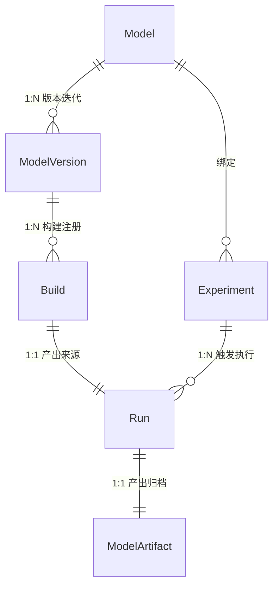
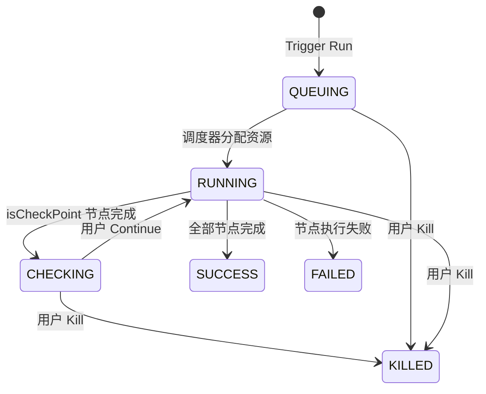
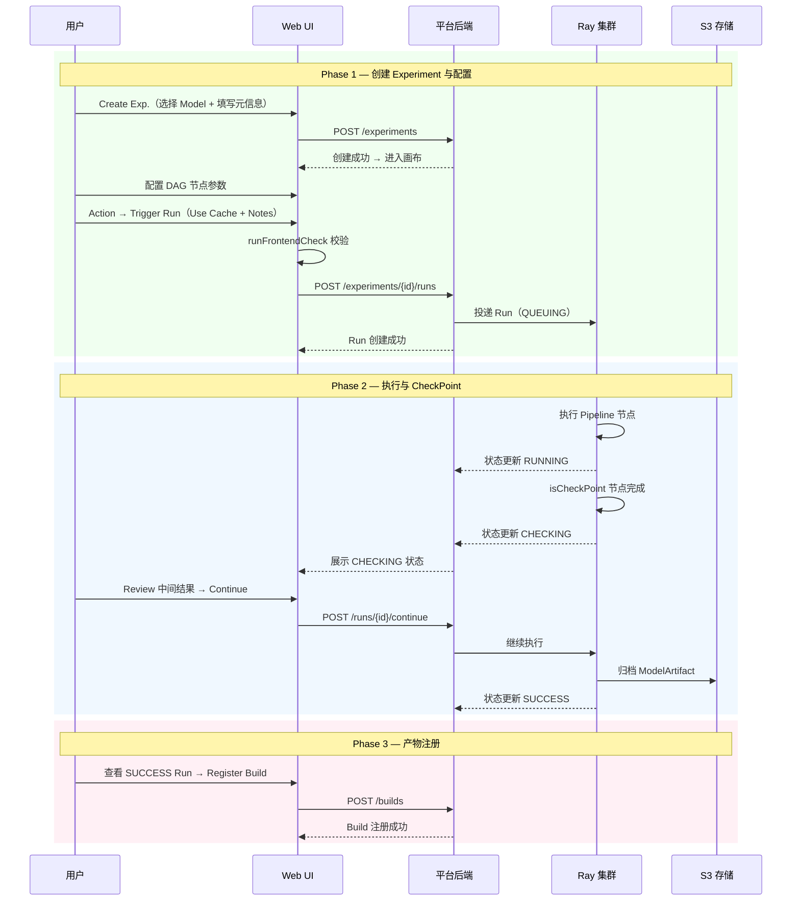

```mermaid
flowchart LR
    subgraph step0 [Step_0_Init]
        Init["init_ray_util()<br/>Config + RayUtil cluster"]
    end

    subgraph step1 [Step_1_WOE]
        WOEFit["woe_fit() x N 域<br/>n_bins, method, encoder_save_path"]
        WOETrans["woe_transform()<br/>training_features + test_features"]
        WOEFit --> WOETrans
    end

    subgraph step2 [Step_2_Merge]
        Merge["woe_merge_v2()<br/>data_path_dict, on, how"]
    end

    subgraph step3 [Step_3_FS]
        FS["feature_selection_v2()<br/>by_iv/corr/gini/psi/stability"]
    end

    subgraph step4 [Step_4_Tune]
        Tune["model_tune()<br/>n_trials, init_hypers, best_hypers_path"]
    end

    subgraph step5 [Step_5_Train]
        Train["model_train()<br/>best_hyper_path, best_model_path"]
    end

    subgraph step6 [Step_6_Predict]
        Predict["model_predict()<br/>sample_path, predict_result_path"]
    end

    Init --> WOEFit
    WOETrans --> Merge
    Merge --> FS
    FS --> Tune
    Tune --> Train
    Train --> Predict
```

# 模型训练平台 MVP — 分层产品需求文档（PRD）

**文档状态**: 草稿 → 结构化改写
**设计框架**: Garrett 五层模型（Strategy → Scope → Structure → Skeleton → Surface）
**交互验收基准**: [`docs/prototype/model-experiment-web`](../prototype/model-experiment-web/README.md) 仓库实现；[Figma: Model Experiment](https://www.figma.com/design/C15E8rRER0qSqYsQZgdVif/Model-Experiment) 为设计迁移原本与风格参考
**领域映射**: 界面 ↔ 领域映射见 [`Naming-And-Responsibilities.md`](./Naming-And-Responsibilities.md)；矛盾追溯见 [`_FIGMA_SYNC_REVIEW.md`](./_FIGMA_SYNC_REVIEW.md)

---

## Impact Triage

**需求摘要**: 构建离线模型训练平台 MVP，将 Spark+YAML 编排替换为 Ray 统一执行 + Web 画布配置，覆盖 Experiment 管理、Run 执行、Build 注册全流程。
**生命周期阶段**: Zero-to-One
**产品类型**: 功能型（平台类）产品 — 工作流驱动（训练任务的配置、执行、产物管理）

**设计层级影响**:
- 起源层: **战略层 Strategy**（新平台，需定义用户角色、North Star、核心价值主张）
- 写入集: Strategy → Scope → Structure → Skeleton → Surface（全层，Zero-to-One 要求）
- 稳定层: 无（首次构建）

**技术层级影响**: Data（领域实体全新设计）、Business Logic（状态机、权限、调度）、API（全新 endpoint）、Application（Web Console）、Observability（事件追踪）

---

## Layer 1 — 战略层 Strategy

### 问题陈述

现有系统基于**6-Phase Spark 管道 + YAML 拖拽**编排模型训练。核心问题：

| 问题 | 影响 | 数据/证据 |
|------|------|---------|
| **配置门槛极高** | 纯 Python 方式约 480 行代码、60+ 个需手动填写的参数（路径、阈值、超参），初阶算法工程师无法独立完成 | 详见[附录 A: Before/After 对比](#附录-a-用户操作对比与平台价值) |
| **执行环境异构** | Spark 与本地混合执行，稳定性不足，排错成本高 | — |
| **无统一对比能力** | 多模型/多参数对比依赖手动收集指标 + Excel/Notebook 整理，步骤约 12+，易出错 | — |
| **知识锁在代码中** | 历史训练配置与效果数据分散在各个 Python 脚本和 S3 路径中，无法被平台沉淀和复用 | — |

### North Star 指标

**North Star = 周活跃 Experiment 数 × Run 成功率**

分解树：
```
North Star: 周活跃 Experiment 数 × Run 成功率
  ├── Acquisition: 新注册 Model 数 / 周
  ├── Activation: 首次 Trigger Run 的 Experiment 数 / 周
  ├── Efficiency: 任务配置提单耗时（Target: < 5 分钟 vs 现状 2-4 小时）
  └── Quality: Run SUCCESS 率（Target: > 95%，依赖 Ray 稳定剥离）
```

### 目标用户

| 角色 | Job-to-be-Done | 当前痛点 | 平台期望 |
|------|---------------|---------|---------|
| **初阶算法工程师** | 按业务需求完成模型训练和评估 | 不熟悉 Python Pipeline 的 60+ 参数和路径规划，依赖老手指导 | 通过画布表单配置，确认默认值后一键提交 |
| **资深算法工程师** | 多模型多参数对比寻优 | 需手写 4+ 份配置脚本、手动收集指标对比 | Experiment 画布 + Run History 统一对比 |
| **Team Owner / Admin** | 管理团队模型资产和训练资源 | 无统一模型注册和版本管理；计算资源分配不透明 | Model Registry + 资源配额 + 审计日志 |

---

## Layer 2 — 范围层 Scope

### In Scope（MVP）

| 编号 | 能力 | 说明 |
|------|------|------|
| S-01 | **Experiment 画布配置** | 左侧 DAG + 右侧固定配置面板；6 节点线性画布（Data Source → WOE Fit → WOE Transform → Feature Selection → Tune & Train → Inference）；节点配置规范见 [Task-Canvas-Config.md](./Task-Canvas-Config.md) |
| S-02 | **Run 生命周期管理** | Trigger Run（Use Cache + Run Notes）→ 状态机 QUEUING → RUNNING → CHECKING → SUCCESS / FAILED / KILLED；Ray 集群执行 |
| S-03 | **CheckPoint 人工卡点** | DAG 节点 `isCheckPoint` 属性；触发后 Run 进入 CHECKING，用户可 Continue 或 Kill |
| S-04 | **SavePoint 中间产物缓存** | WOE All Feature / WOE Selected Feature 节点支持 SavePoint，配合 Use Cache 开关实现增量执行 |
| S-05 | **配置版本与 Run 历史** | Experiment 保留当前/最新画布配置；每次 Run 携带 Config Snapshot；支持 History Run 只读查看和 Rollback Config |
| S-06 | **Model / ModelVersion / Build 注册** | Run SUCCESS → ModelArtifact 归档 S3 → 用户主动 Review → 注册 Build 到 ModelVersion |
| S-07 | **Experiment 列表管理** | 列表筛选（Name / Model / Owner）、Create / Edit / Copy / Delete；展开行 Run 子表 |
| S-08 | **AI Prompt 探索实验**（P1） | AI 生成多组 Task 配置 → 用户 Review → 批量提交 → 统一对比面板（详见 Scope AI/LLM Justification） |

### Out of Scope（及原因）

| 排除项 | 原因 |
|--------|------|
| Canvas 画布拖拽编排 | MVP 使用固定线性 DAG；拖拽编排复杂度高，待 MVP 验证核心价值后再考虑 |
| YAML 编辑器模式 | 与画布表单互斥，增加认知负担；用户调研显示初阶工程师偏好表单 |
| 复杂容错重试配置 | MVP 仅支持全量重跑 + Use Cache；细粒度重试策略依赖后端成熟度 |
| 多物理机分布图监控 | Ray Dashboard 已提供基础监控；平台层不重复建设 |
| 9+ 节点扩展画布（SOP） | 含 WOE Selected Feature、CheckPoint（择优）、Calibrate 等；本期 Deferred，详见 [Pipeline-Steps-and-Canvas-Nodes.md](./Pipeline-Steps-and-Canvas-Nodes.md) |
| 训练过程中实时调参 | 需 Ray Tune 深度集成，复杂度高，后续迭代 |

### 非功能性需求

| 需求 | 指标 |
|------|------|
| 画布配置页加载 | P95 ≤ 2s（含 DAG 渲染和节点配置面板） |
| Trigger Run 响应 | 前端校验 + 后端创建 Run ≤ 3s |
| Run 列表刷新 | P95 ≤ 500ms（含状态轮询） |
| Run 状态同步延迟 | Ray 回报 → Web 展示 ≤ 10s |
| 并发 Run 支持 | 单 Experiment 允许多 Run 并行（MVP 不实现串行锁） |
| S3 Artifact 归档 | Run SUCCESS 后 ≤ 60s 完成归档 |

### 数据模型

#### 核心实体定义

| 概念 | 英文 | 定义 | 关系 |
|------|------|------|------|
| **模型** | Model | 逻辑模型实体，代表一个业务场景下的预测/分类任务（如"欺诈检测模型"）。包含元信息：名称、任务类型（classification / regression）、框架偏好、Owner、所属 biz_team。**不绑定具体训练产物，仅作顶层逻辑归类与注册入口** | 1 Model → N ModelVersion |
| **模型版本** | ModelVersion | Model 的一次重大迭代（架构变更、特征集重构、数据源切换），以 `v1 / v2` 标签区分。同一 Model 下可并行存在多个 Version | 1 ModelVersion → N Build |
| **构建产物** | Build | SUCCESS Run 产出的模型快照，经用户主动 Review 后注册。引用 ModelArtifact 的 S3 路径，冻结指标快照与配置快照。注册后不可修改 | 1 Build ← 1 Run |
| **实验** | Experiment | **MVP 核心**。绑定已注册 Model 的训练编排单元，保留当前/最新画布配置。任务级状态 DRAFT / ENABLED / DISABLED | 1 Model → N Experiment；1 Experiment → N Run |
| **运行** | Run | Experiment 的一次实际执行（Run ID = TaskInstance.id）。创建时携带 Config Snapshot，中间产物与配置均绑定 Run ID | 1 Run → 1 ModelArtifact；0..1 Build 引用 |
| **训练数据管道** | Training Data Pipeline | 从 Hive 读数据到产物归档 S3 的端到端执行流水线。平台根据 Run 配置生成 Python RayUtil 脚本在 Ray 集群执行 | 每次 Run 执行一次完整流水线 |
| **模型产物** | ModelArtifact | Run SUCCESS 后归档至 S3 的全部文件集合。S3 路径：`s3://{bucket}/model-training/{exp_id}/{run_id}/` | 1 Artifact ↔ 1 Run |

> **Trial 辨析**：Ray Tune 在一次 Run 内部自动发起的超参搜索迭代（由 `n_trials` 控制），属引擎行为，不对应平台独立实体。

#### 实体关系图



#### 实体层级关系

```
Model（逻辑模型，顶层注册入口）
├── ModelVersion v1（重大迭代：架构 / 特征集 / 数据源变更）
│   ├── Build #1 ← Run #101 (SUCCESS) → ModelArtifact @ S3
│   └── Build #2 ← Run #205 (SUCCESS) → ModelArtifact @ S3
└── ModelVersion v2
    └── Build #1 ← Run #310 (SUCCESS) → ModelArtifact @ S3

Model → Experiment（绑定已注册 Model，继承 name / region）
├── Experiment A（XGBoost 画布）
│   ├── Run #101 (SUCCESS) → ModelArtifact
│   ├── Run #102 (RUNNING)
│   └── Run #103 (FAILED)
└── Experiment B（LightGBM 画布）
    └── Run #201 (SUCCESS) → ModelArtifact → 注册为 Build
```

#### 关键辨析

| 易混淆点 | 辨析 |
|---------|------|
| **Build vs ModelArtifact** | ModelArtifact 是 Run 原始产出（SUCCESS 后自动归档 S3）；Build 是用户主动 Review 后注册到 ModelVersion 下的动作结果。非所有 Artifact 都会成为 Build |
| **Experiment vs Run** | Experiment 是编排单元（保留画布配置）；Run 是一次执行（Config Snapshot + 产物均绑定 Run ID） |
| **Run vs Trial** | Run 是平台层面的完整执行；Trial 是 Ray Tune 引擎层面的超参组合尝试。一个 Run 内含 `n_trials` 次 Trial，对用户透明 |
| **Model vs ModelVersion** | Model 是抽象逻辑归类（不随训练变化）；ModelVersion 是重大迭代升级。日常迭代在同一 Version 下产生新 Build |
| **CHECKING vs CheckPoint 节点** | Run 级 CHECKING 是 `isCheckPoint` 节点成功完成后的人工卡点状态；CheckPoint（择优）是 DAG 内"汇总多路分支结果并择优"的流程语义节点。二者并存但含义不同 |

#### Run 状态机



> 界面排队态以 `QUEUING` 为主展示；数据模型中 `WAITING` 与 `QUEUING` 同位兼容。

### API 变更（MVP 新建）

| 方法 | 路径 | 说明 |
|------|------|------|
| POST | `/api/v1/experiments` | 创建 Experiment（绑定 Model） |
| GET | `/api/v1/experiments` | 列表查询（支持 Name / Model / Owner 筛选） |
| PUT | `/api/v1/experiments/{id}` | 更新画布配置 / 元信息 |
| DELETE | `/api/v1/experiments/{id}` | 删除 Experiment |
| POST | `/api/v1/experiments/{id}/runs` | Trigger Run（含 Use Cache + Run Notes） |
| GET | `/api/v1/experiments/{id}/runs` | Run 列表（含状态） |
| POST | `/api/v1/runs/{id}/continue` | CHECKING 状态下 Continue |
| POST | `/api/v1/runs/{id}/kill` | Kill 运行中 Run |
| GET | `/api/v1/runs/{id}/config-snapshot` | 获取 Run 的配置快照 |
| POST | `/api/v1/experiments/{id}/rollback` | Rollback Config（用指定 Run 的快照覆盖当前配置） |
| POST | `/api/v1/builds` | 注册 Build（引用 Run 的 ModelArtifact） |
| GET | `/api/v1/models` | Model 列表 |
| GET | `/api/v1/models/{id}/versions` | ModelVersion 列表 |

完整 API 规范见 [`docs/api/openapi.yaml`](../api/openapi.yaml)。

### AI / LLM Justification — Experiment AI Prompt 探索实验（S-08）

> S-08 为 P1 优先级（MVP 后首期迭代）。以下论证需在实施前完成验证。

**1. 使用了什么 AI 能力？**

| 能力 | 用途 | 占比 |
|------|------|------|
| **Content Generation** | 根据用户 Prompt + Hive Schema + 目标列，生成 N 组结构化 Task 配置 JSON | 70% |
| **Reasoning / Decision** | 综合数据源特征、框架特性和超参搜索空间约束，推导合理的参数组合 | 30% |

**2. 为什么需要动态判断？**

用户 Prompt 的意图空间极大——"对比 XGB 与 LGBM 各窄宽两套搜索空间"和"帮我生成 3 个不同特性的树模型配置并尝试更大范围的学习率空间（0.001 - 0.2）"是完全不同的配置生成需求。Hive 表的 Schema（列数、类型分布）和目标列的语义也影响合理的参数范围。这个组合空间无法用有限的模板穷举。

**3. 为什么 AI 优于替代方案？**

| 替代方案 | 评估 | 不足 |
|---------|------|------|
| **固定模板库** | 成本最低 | 仅覆盖预定义场景（如"分类 + LightGBM"），无法响应用户自由描述的意图（如"尝试更大范围的学习率"） |
| **参数化模板 + 表单** | 中等成本 | 用户仍需逐个填写 4+ 份表单，无法从一句话生成多组配置 |

AI 的精确加成点：将**一句自然语言意图**转化为**多组结构化训练配置**，同时确保参数组合的合理性（不生成非法框架或越界参数）。

**4. 失败模式**

| 失败场景 | 处理 |
|---------|------|
| 生成的 JSON 不符合 TrainingTask Schema | 前端 Schema 校验拦截，不合法的卡片不展示 |
| 参数组合不合理（如 learning_rate = 10） | 前端表单校验 + 用户 Review 卡片（human-in-the-loop） |
| LLM 幻觉填入不支持的框架 | 框架枚举白名单校验 |
| LLM 服务不可用 | 降级为手动创建 Task（主流程不阻塞） |

**错误成本评估**：低。生成的是 Task **草稿配置**，需用户 Review + 编辑后才提交执行。错误推荐仅增加 Review 时间，不导致资源浪费。

**5. 成本与延迟边界**

| 指标 | 上限 | 理由 |
|------|------|------|
| 单次生成延迟 | P95 ≤ 15s | 用户可接受"生成中"等待；超过 15s 体验劣化 |
| 单次生成成本 | ≤ $0.10 | 日均 ~50 次生成 → 月成本 ≤ $150 |
| LLM Token | ≤ 8K input（Schema + Prompt）+ 4K output（N 组 JSON） | 控制成本 |

---

## Layer 3 — 结构层 Structure

### User Stories

| 编号 | Story | 优先级 |
|------|-------|--------|
| US-01 | 作为**初阶算法工程师**，我希望通过画布表单配置训练参数并一键提交，以便不需要手写 Python 脚本 | P0 |
| US-02 | 作为**算法工程师**，我希望 Trigger Run 时可选择 Use Cache，以便仅重跑配置变更的节点，节省时间 | P0 |
| US-03 | 作为**算法工程师**，我希望在 Run History 中查看历史配置快照并一键回滚，以便复现过去的训练结果 | P0 |
| US-04 | 作为**算法工程师**，我希望在 isCheckPoint 节点完成后暂停 Run 并 Review 中间结果，以便决定是否继续 | P0 |
| US-05 | 作为**算法工程师**，我希望将 SUCCESS Run 的 Artifact 注册为 Build，以便纳入模型版本管理 | P0 |
| US-06 | 作为**资深算法工程师**，我希望通过 Experiment 列表管理多个训练配置变体并对比 Run 结果 | P0 |
| US-07 | 作为**资深算法工程师**，我希望用一句 Prompt 生成多组 Task 配置并统一对比，以便快速探索最优参数（P1） | P1 |
| US-08 | 作为 **Team Owner**，我希望查看团队下所有 Model 和 Experiment 的执行状态，以便掌握资源使用情况 | P0 |

### 页面结构

```
Web Console（侧栏 Aimos Model）
├── Model Experiments 模块
│   ├── Experiment 列表页 — 主入口，展示 Exp ID / Name / Model+Version / Owner 等
│   │   ├── 展开行: Run 子表（Run ID / Status / Notes / Trigger Time / Actions）
│   │   └── 操作: Create Exp. / Edit / Copy / Delete
│   ├── 画布配置页 — Experiment 的 DAG 配置与执行入口
│   │   ├── 左侧: 点阵 DAG（缩放、小地图）
│   │   ├── 右侧: 固定配置面板（384px）
│   │   ├── 顶栏: Back / 任务名 / Region / Current Config 徽章
│   │   │   ├── Edit Meta / ENV / Settings / Execute Config
│   │   │   └── Action → Trigger Run
│   │   ├── History Run 模式（只读 + Rollback Config）
│   │   └── Run View 模式（只读 + Continue / Kill）
│   └── AI Prompt 探索实验页 — P1，批量生成 Task 配置（US-07）
│       ├── 左侧: AI Prompt 构建区（数据源选择 + Prompt 输入）
│       └── 右侧: Task 卡片 Review 区（Edit / Remove / Lock / Submit All）
├── Model Registry 模块
│   ├── 模型大盘 — Model 列表与概览
│   └── 版本详情页 — ModelVersion + Build 注册记录
└── Experiment 对比大盘 — P1，平行坐标图 + 指标排序表
```

**页面角色与流转**:

| 页面 | 主要角色 | 核心功能 | 入口 | 出口 |
|------|---------|---------|------|------|
| Experiment 列表 | 所有角色 | 查看/筛选/管理 Experiment 与 Run | 侧栏导航 | Edit → 画布；View → Run View |
| 画布配置页 | 算法工程师 | 配置 DAG 节点参数、Trigger Run | 列表 Edit / Create | Trigger Run → Run 子表；Back → 列表 |
| Run View | 算法工程师 | 查看运行中/历史 Run 的 DAG 状态 | 列表 View / Run History 下拉 | Continue/Kill → 回到列表；Register Build → 版本详情 |
| AI Prompt 页 | 资深算法工程师 | 批量生成 Task 配置 | 列表入口（P1） | Submit All → 多个 Run 创建 |
| 对比大盘 | 资深算法工程师 | 横向对比多 Run 指标 | Experiment 详情（P1） | Register Build → 版本详情 |

---

## Layer 4 — 框架层 Skeleton

### 交互设计原则（全局约束）

1. **弹窗 Esc 关闭**: 所有模态弹窗必须支持 Esc 键关闭（效果同点击遮罩或 Cancel）。例外：仅阻断型弹窗（强制阅读、合规确认）可不响应 Esc，须在本文档单独标注。
2. **验收基准**: 以 `model-experiment-web` 仓库实现为准；Figma 为设计风格参考，逻辑以最新实现为准。

### Experiment 列表页

| 编号 | 功能需求 |
|------|---------|
| FR-01 | **列表工具栏** — 页面顶部 — 包含 "Owned by me" Toggle + "Refresh" 按钮 + "Create Exp." Primary 按钮 → Create Exp. 点击打开创建弹窗 |
| FR-02 | **筛选条** — 工具栏下方 — Experiment Name / Model / Owner 三字段 + Reset 按钮 → 宽屏（≥ lg）横向紧凑排布，窄屏纵向堆叠；有任一筛选值时显示 Reset |
| FR-03 | **主表** — Data table with inline row actions — 列: Exp ID / Exp Name / Model（含 Version 角标）/ Region / Owner / Biz Team / Description / Update Time / Actions（Edit / Copy / Alert / Delete）→ 行可展开为 Run 子表 |
| FR-04 | **Run 子表** — 展开行内嵌 Data table — 列: Run ID / Run Status（含 CHECKING 状态徽章）/ Notes / Trigger Time / Actions → View（所有状态）/ Continue（仅 CHECKING）/ Kill（进行中态）/ More 下拉（Artifact / View Log） |
| FR-05 | **创建弹窗** — Modal（Esc 可关闭）— Create Exp. 触发 → 表单: Experiment Name / Model @ Version（级联选择）/ Model Level（sub / mega，编辑态只读）/ Template（可选下拉，当前用户可见实验名）/ Owner（多选）/ Biz Team / Description → 提交 "To Canvas" 进入画布配置页 |
| FR-06 | **编辑弹窗** — 同 FR-05 布局但标题为 "Edit Model Experiment" → Model / Model Level 只读 → 提交 "Save Changes" |
| FR-07 | **复制弹窗** — 同 FR-05 布局但标题为 "Copy Model Experiment"，预填源实验数据 → 提交 "Create Copy" → 进入新实验画布 |

### 画布配置页

| 编号 | 功能需求 |
|------|---------|
| FR-08 | **DAG 画布** — 页面左侧（全高）— 点阵 DAG，支持缩放 + 小地图 + 右键拖平移 → 6 节点线性排列（无 Start/End 占位），首位为数据源节点 |
| FR-09 | **配置面板** — 页面右侧固定面板（宽度 384px）— 点击 DAG 节点触发 → 面板显示该节点的 Config / Last Run 双 Tab；Config Tab 展示节点参数表单；Last Run Tab 展示对应 Run ID 与节点级执行信息 |
| FR-10 | **顶栏导航** — 页面顶部 sticky — Back 按钮 / 任务名 / Region 标签 / Current Config 徽章（或 History Run / Run View 徽章）→ 右侧: Run History 下拉（仅 Current Config 模式）/ ENV 按钮 / Settings 按钮 / Action 下拉 |
| FR-11 | **Trigger Run 流程** — Action 下拉 → "Trigger Run" → 先执行 `runFrontendCheck`（必填校验 + DAG 连通性）→ 校验失败: 画布区展示 "Validation failed" 浮层 → 校验通过: 打开 Trigger Run Modal → Use Cache Switch（开=优先复用缓存，关=全量重跑）+ Run Notes 文本框 + "Run" Submit 按钮 → 提交后新 Run 以 QUEUING 状态出现在 Run 子表 |
| FR-12 | **Edit Meta** — 顶栏笔形图标触发 → Drawer / Modal → Experiment Name / Model（只读）/ Owner / Description → Save 更新 Experiment 实体 |
| FR-13 | **ENV 配置** — 顶栏 ENV 按钮触发 → Modal → 实验级全局变量表（Parameter / Description / Value 三列，行级增删）→ Save |
| FR-14 | **Execute Config** — 顶栏按钮触发 → Modal（布局与 [Feature WideTable](https://github.com/Cedric-Chan/FeatureStore) 一致）→ Resource Tier / Queue Priority / Schedule（ONCE / Cron 表达式）/ Pipeline Input Fields → Save |
| FR-15 | **History Run 模式** — Run History 下拉选择历史 Run → 顶栏切换为 "History Run" 黄色徽章 → DAG + 配置面板变为只读 → 顶栏显示 "Rollback Config" + "Back to Config" 按钮 |
| FR-16 | **Rollback Config** — History Run 或 Run View 模式下点击 "Rollback Config" → PopConfirm 确认 → 用该 Run 的 Canvas Snapshot（DAG 拓扑 + nodePatches + propOverrides + Pipeline ENV）覆盖当前 Current Config → 退出只读模式 |
| FR-17 | **Run View 模式** — 列表 View 或 Run History 选择 → 顶栏切换为 "Run View" 蓝色徽章 → DAG 节点显示执行状态（成功/失败/运行中/排队）→ Run 为 CHECKING 时 Action 含 Continue；运行中态含 Kill |

### AI Prompt 探索实验页（P1）

| 编号 | 功能需求 |
|------|---------|
| FR-18 | **左侧 Prompt 构建区** — 页面左侧 50% — 标题 "创建一个探索实验" → 输入域 1: Hive 表下拉 + 目标列下拉（必选）→ 输入域 2: 多行文本框（Placeholder: "例如：我想对收入预测这列做评估..."）+ "Generate Tasks ✨" 按钮 → 点击触发 LLM 生成 |
| FR-19 | **右侧 Review 区** — 页面右侧 50% — Card List 展示 N 张 Task 配置卡片 → 每卡片含框架 / Search Space 摘要 / 关键参数 → 卡片操作: Edit（弹窗打开完整表单）/ Remove / Lock → 底部 "Submit All Tasks" 按钮 → 提交后创建 Experiment + N 个 Run |

### Experiment 对比大盘（P1）

| 编号 | 功能需求 |
|------|---------|
| FR-20 | **平行坐标图** — 页面顶部 — 展示不同 Task × Trial 的超参到 AUC 等目标指标分布 → 支持拖拽筛选轴范围 |
| FR-21 | **指标排序表** — 图下方 — 级联列表: Task 级折叠，展开为 Trial 详情 → 列: Task Name / Framework / Search Space Summary / Best Metric / Status / Logs → 行操作: Register Build（仅 SUCCESS） |

### 弹窗清单

| 弹窗 | 触发 | Esc 关闭 | 备注 |
|------|------|---------|------|
| Create Model Experiment | 列表 Create Exp. | 是 | |
| Edit Model Experiment | 列表 Edit | 是 | |
| Copy Model Experiment | 列表 Copy | 是 | |
| Trigger Run | Action → Trigger Run（校验通过后） | 是 | |
| Edit Meta | 顶栏笔形图标 | 是 | |
| ENV 配置 | 顶栏 ENV | 是 | |
| Execute Config | 顶栏 Execute Config | 是 | |
| Artifact 查看 | Run 子表 More → Artifact | 是 | Mock 指标/参数 |
| Version History | 画布 Version History | 是 | 左侧版本列表 + 右侧 JSON |
| Delete 确认 | 列表 Delete | 是 | PopConfirm |
| Rollback Config 确认 | History Run / Run View 顶栏 | 是 | PopConfirm |

---

## Layer 5 — 表现层 Surface

### 技术栈

**Frontend**: Vite + React + TypeScript + Ant Design Pro
**图表**: 平行坐标图使用 ECharts 或 Plotly（P1 对比大盘）
**DAG 渲染**: React Flow（点阵背景 + 缩放 + 小地图）

### 设计语言

复用平台现有 Ant Design Pro 体系。以下为 Model Experiment 模块的专属视觉约定：

| 元素 | 处理 |
|------|------|
| **Current Config 徽章** | 绿色 Tag，标示当前处于可编辑配置模式 |
| **History Run 徽章** | 黄色 Tag，标示只读历史模式 |
| **Run View 徽章** | 蓝色 Tag，标示 Run 实例查看模式 |
| **Run 状态色** | QUEUING = 灰色；RUNNING = 蓝色；CHECKING = 橙色；SUCCESS = 绿色；FAILED = 红色；KILLED = 灰色斜体 |
| **DAG 节点状态** | 未执行 = 默认边框；运行中 = 蓝色脉冲边框；成功 = 绿色实心边框；失败 = 红色实心边框 |
| **配置面板宽度** | 384px（较早期 256px 增宽 50%，降低信息密度） |
| **isCheckPoint 节点标识** | 节点右上角 ⏸ 图标 |
| **SavePoint 节点标识** | 节点右上角 💾 图标 |

### 交互原则

- **Loading**: 画布加载用 Skeleton；Run 状态轮询用 Spinner
- **Error**: 校验失败用画布内 Alert 浮层；API 错误用 Toast
- **Empty State**: 空列表展示引导文案 + Create Exp. CTA

---

## 成功指标

| 指标 | 基线 | 目标 | 度量方式 |
|------|------|------|---------|
| 任务配置提单耗时 | ~2-4 小时（Python 手写） | < 5 分钟 | `experiment_run_triggered` 事件中 config_duration |
| Run SUCCESS 率 | 未知（需先采集） | > 95% | `run_completed` 事件 status 分布 |
| 周活跃 Experiment 数 | 0（新平台） | ≥ 20（上线 3 个月后） | 周内至少有 1 次 Trigger Run 的 Experiment 数 |
| Build 注册转化率 | — | ≥ 30%（SUCCESS Run → Build） | `build_registered` / `run_completed(SUCCESS)` |

---

## 事件追踪

| 事件 | 触发条件 | 属性 | 回答的问题 |
|------|---------|------|-----------|
| `experiment_created` | 创建 Experiment | exp_id, model_id, framework, template_used, created_by | 创建活跃度、模板使用率 |
| `experiment_run_triggered` | Trigger Run 提交 | exp_id, run_id, use_cache, has_notes, config_duration_ms | 缓存使用率、配置耗时 |
| `run_status_changed` | Run 状态变更 | run_id, from_status, to_status, duration_ms | 状态流转分布、执行耗时 |
| `run_checkpoint_action` | CHECKING 状态下 Continue/Kill | run_id, action, checkpoint_node_id | CheckPoint 使用频率、通过率 |
| `config_rollback` | Rollback Config 确认 | exp_id, source_run_id | 配置回滚频率（高则说明配置迭代频繁） |
| `build_registered` | 注册 Build | build_id, run_id, model_version_id, registered_by | Build 转化率、版本分布 |
| `ai_prompt_generated` | AI Prompt 生成完成（P1） | exp_id, prompt_length, tasks_generated, latency_ms | AI 生成频率、卡片数分布 |
| `ai_task_reviewed` | AI 卡片 Edit/Remove/Lock（P1） | task_id, action, field_changed | 用户对 AI 推荐的修改率 |

---

## 完整生命周期（时序图）



---

## 附录 A: 用户操作对比与平台价值

### Python Pipeline 分模块流程图

以下对应 `full_training_pipeline.py` 的 7 个 Step 模块：



**模块与 ray_util 对应关系**:

| 模块 | ray_util 方法 | 关键参数（需手写） |
|------|--------------|-----------------|
| Step 0 | Config + RayUtil 构造 | fp_base, label, sample_use_col, 凭证 |
| Step 1 | woe_fit, woe_transform | 每域: data_path, encoder_save_path, n_bins, method |
| Step 2 | woe_merge_v2 | model_name, data_path_dict, on, how |
| Step 3 | feature_selection_v2 | fp_fs_input_path, fp_fs_methods, 各阈值 |
| Step 4 | model_tune | sample_path, feature_selection_path, n_trials, init_hypers |
| Step 5 | model_train | best_hyper_path, best_model_path, num_workers |
| Step 6 | model_predict | sample_path, best_model_path, predict_result_path |

### Before (Python) vs After (平台表单) 对比

| Python 侧（Before） | 平台侧（After） | 表单类型 |
|---------------------|----------------|---------|
| Config 凭证、fp_base、label | 数据源: Hive 表 + 分区 + 目标列 | **硬表单** |
| 各域 data_path、encoder 路径 | 平台按 Exp ID + Run ID 自动生成 S3 路径 | **自动** |
| woe_fit 参数（n_bins、method 等） | 特征与预处理: WOE 开关 + 默认参数 | **硬表单 + 软表单默认** |
| feature_selection 阈值 | FS 阈值 + stability 参数 | **软表单默认** |
| model_tune 超参搜索空间 | 框架 + n_trials + Search Space | **硬表单 + 软表单默认** |
| num_workers、cpu、memory | 资源档位 Low/Medium/High | **软表单默认** |
| 串行执行 7 步、手动查日志 | 提交后 QUEUING → RUNNING，Web 查看 | **平台自动** |

**结论**: Python 约 **2-4 小时**（编写 + 调参 + 路径管理 + 串行等待）；平台 **< 5 分钟**。

### 多模型多参数对比：三种模式

| 模式 | 步骤数 | 描述 |
|------|--------|------|
| A. 纯 Python | ~12+ 步 | 手写 4 份脚本 → 分别提交 Ray → 手动收集指标 → Excel 对比 |
| B. 平台仅 Task | ~8 步 | 4 次重复填表 → 逐个查看指标 → 手动对比 |
| C. 平台 + Experiment | ~4 步 | 一句 Prompt → AI 生成 4 张卡片 → Review → Submit All → 统一对比面板 |
