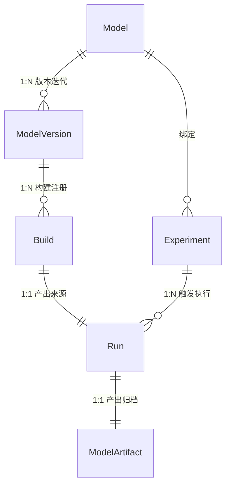
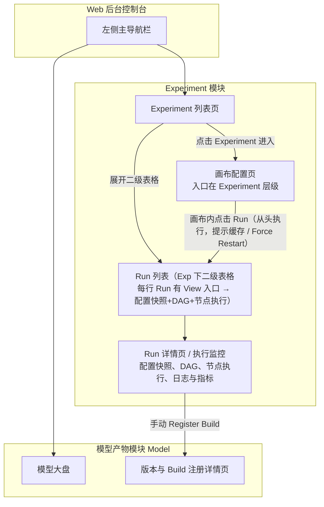
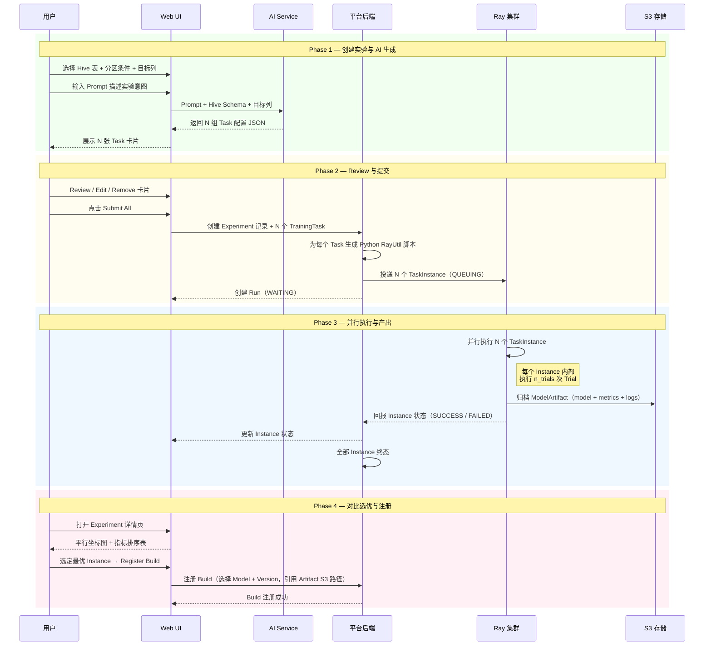
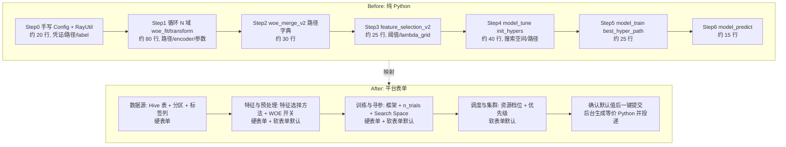
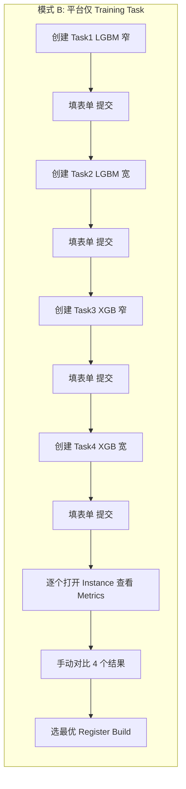
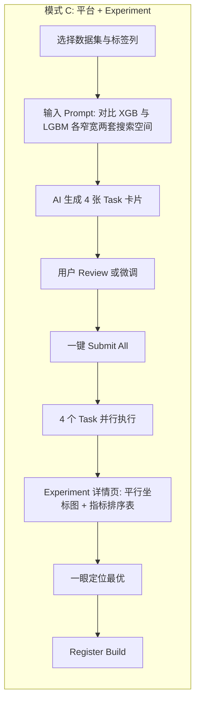

# 模型训练平台 MVP：产品原型与 PRD

**文档状态**: Draft
**基于模板**: Product Manager Toolkit - Standard PRD Template
**作者**: AI Product Manager

---

## 1. Executive Summary (执行摘要)

**Purpose**: 定义离线模型训练平台本期 MVP 迭代的产品需求文档（PRD）及页面结构约束。

- **问题陈述**: 现有的系统编排基于复杂的 6-Phase Spark 管道与 yaml 拖拽，对于普通业务人员或初阶算法工程师而言，构建、组合多任务寻优的门槛极高，执行环境异构导致稳定性不足。
- **解决方案**: 将底层执行统一包裹为 Ray Python 脚本，并对用户侧提供 **Experiment（EXP）画布**：Experiment 绑定已注册 Model，保留当前/最新画布配置；一次执行为 **Run**（Run id 标识），中间产物与画布配置均绑定 Run id；画布入口在 Experiment 层级，新建 Run 在画布内点击「Run」执行调度。
- **业务影响**: 降低训练环境配置时间；Run 始终从头执行，执行时分析配置是否变更、无变更部分走缓存，默认提示使用缓存并支持 Force Restart，便于迭代与复现。
- **核心指标 (Success Metrics)**:
  - 任务配置提单耗时缩短比例 (Target: < 5 分钟)
  - 底层失败率 (Target: < 5%，依赖 Ray 稳定剥离)

---

## 2. 核心概念定义与辨析

本节统一定义平台核心领域概念，供产品、开发、业务各方对齐理解。概念定义以 [系统架构说明 §3、§10](../architecture/系统架构说明.md) 为基准，结合本 PRD 产品视角进行补充与修正。

### 2.1 概念定义表

| 概念 | 英文 | 定义 | 与其他概念的关系 |
|------|------|------|------------------|
| **模型** | Model | 逻辑模型实体，代表一个业务场景下的预测/分类任务（如「欺诈检测模型」「信用评分模型」），包含元信息：名称、任务类型（classification / regression）、框架偏好、Owner、所属业务团队。**Model 不绑定具体训练产物，仅作顶层逻辑归类与注册入口。** | 1 Model → N ModelVersion。Model 是模型注册与版本管理的顶层入口。 |
| **模型版本** | ModelVersion | Model 的一次**重大迭代**（如架构变更、特征集重构、数据源切换），以 `v1 / v2` 标签区分。同一 Model 下可并行存在多个 Version，便于 A/B 或灰度评估。Version Tag 通常作为 Model 名称后缀（如 `fraud_detection_model_v2`）。 | 1 ModelVersion → N Build。归属于一个 Model。 |
| **构建产物** | Build | 一次 SUCCESS 的 Run 产出的模型快照，经**用户主动 Review 后注册**。Build 不复制文件，而是**引用** ModelArtifact 的 S3 路径，并冻结指标快照与配置快照。注册后不可修改。 | 1 Build ← 1 Run（产出方）；注册到 1 ModelVersion 下。 |
| **实验** | Experiment (EXP) | **（P0 本期 MVP 核心）** 绑定已注册 Model 的训练编排单元；默认继承 Model 的 name 与 region（Experiment 与 Run 不覆盖 Model 元信息）。**Experiment 无状态**，仅承载每次执行 Run 的配置信息。**系统只记录 Run 对应的 Config Snapshot，不区分具体 Version**；Experiment 列表页无 Version 入口。保留**当前/最新画布配置**，历史 Run 可对应当时配置以溯源与复现。**画布配置入口在 Experiment 层级**；Exp 展开二级表格为下属 **Run 列表**，**每行 Run 保留 View 入口**，点击可查看该 Run 的配置快照、DAG 及节点执行情况（仅执行信息与状态管理 Action，不对应画布入口）。新建 Run 在**画布内**点击右上角「Run」执行调度。 | 1 Model → N Experiment；1 Experiment → N Run。 |
| **运行** | Run | Experiment 的一次实际执行，以 **Run id** 标识；创建时携带**配置快照（Config Snapshot）**，不记录 Version 信息，**中间产物与画布配置均绑定 Run id**。在配置详情页调整配置后执行 = Kill 原 Run、生成新 Run id，按最新 Experiment 配置从头执行。状态机：`WAITING → RUNNING → SUCCESS / FAILED / KILLED`。S3 路径：`s3://{bucket}/model-training/{exp_id}/{run_id}/`。 | 1 Run ← 1 Experiment；SUCCESS 时 1:1 产出 ModelArtifact；可被 0..1 个 Build 引用。 |
| **训练数据管道** | Training Data Pipeline | 从 Hive 读数据到模型产物归档至 S3 的端到端执行流水线；由平台根据 Run 配置画布自动生成的 Python `RayUtil` 脚本在 Ray 集群上执行。**每次 Run 从头执行**；执行时分析配置是否变更，无变更部分可直接使用缓存。画布点击 Run 时提示是否默认使用缓存，用户可选择 **Force Restart**。节点有 **CheckPoint** 属性（默认关闭）。画布节点命名与 SOP 对齐：**WOE All Feature**（全部特征 fit→transform→merge）、**WOE Selected Feature**（选中特征可选 update→transform→merge）、**CheckPoint（择优）**含 **Best Select（Model Summary）**；详见 [Task-Canvas-Config.md](./Task-Canvas-Config.md)。**实现参考** risk_model_on_ray；配置与脚本映射见 Task-Canvas-Config 与 [Training-Data-Pipeline.md](./Training-Data-Pipeline.md)。 | 每次 Run 执行一次完整流水线；产出 ModelArtifact。 |
| **模型产物** | ModelArtifact | Run 执行 SUCCESS 后统一归档至 S3 的全部文件集合。 | 1 Artifact ↔ 1 Run；Build 注册时引用 Artifact 的 S3 路径。 |

> **Trial 辨析**：文中涉及的"Trial"指 Ray Tune 在一次 Run 执行内部自动发起的超参搜索迭代（由 `n_trials` 控制），属于底层引擎行为，不对应平台的独立实体。用户通过 Experiment 画布配置设置 `n_trials` 值即可，无需关心单次 Trial 细节。

### 2.2 实体关系图



### 2.3 概念层级关系

```
Model（逻辑模型，顶层注册入口）
├── ModelVersion v1（重大迭代：架构 / 特征集 / 数据源变更）
│   ├── Build #1 ← Run #101 (SUCCESS) → ModelArtifact @ S3
│   └── Build #2 ← Run #205 (SUCCESS) → ModelArtifact @ S3
└── ModelVersion v2
    └── Build #1 ← Run #310 (SUCCESS) → ModelArtifact @ S3

Model → Experiment（绑定已注册 Model，继承 name / region）
├── Experiment A（XGBoost 画布）
│   ├── Run #101 (SUCCESS) → ModelArtifact
│   ├── Run #102 (RUNNING)
│   └── Run #103 (FAILED)
└── Experiment B（LightGBM 画布）
    └── Run #201 (SUCCESS) → ModelArtifact → 注册为 Build
```

### 2.4 关键辨析

| 易混淆点 | 辨析说明 |
|----------|----------|
| **Build vs ModelArtifact** | ModelArtifact 是 Run 的原始产出（SUCCESS 后自动归档到 S3）；Build 是用户主动 Review 后将 Artifact **注册** 到 ModelVersion 下的动作结果。并非所有 Artifact 都会成为 Build——只有用户认为满意的才值得注册。 |
| **Experiment vs Run** | Experiment 是绑定 Model 的训练编排单元，保留当前/最新画布配置；Run 是一次执行（Run id 标识），配置快照与中间产物均绑定 Run id。画布入口在 Experiment 层级；新建 Run 在画布内点击「Run」。 |
| **Run vs Trial** | Run 是平台层面的一次**完整执行**（端到端）；Trial 是 Ray Tune 引擎层面的一次**超参组合尝试**。一个 Run 内部可包含 `n_trials` 次 Trial，Trial 对用户透明、不持久化为独立实体。 |
| **Model vs ModelVersion** | Model 是抽象的逻辑归类（如"欺诈检测"这件事），不随训练变化；ModelVersion 是对同一逻辑模型的一次**重大迭代升级**。日常迭代通常在同一 Version 下产生新 Build，仅当架构或特征集发生根本变更时才新建 Version。 |
| **Experiment 与 Run 状态** | **Experiment 无状态**，仅承载每次执行 Run 的配置信息。Run 状态（`WAITING / RUNNING / SUCCESS / FAILED / KILLED`）管理**执行生命周期**：WAITING 等待资源，RUNNING 执行中，complete → SUCCESS、error → FAILED、用户 kill → KILLED。 |
| **与 Figma 设计稿（Model Experiment）的对应** | 设计稿中 **TrainingTask** → 本系统 **Experiment**，**TaskInstance** → **Run**。产品不提供配置 Version、Rollback、Experiment 级 Status 与 Enable/Disable；Run 在画布内创建，Run 状态使用 **WAITING**（设计稿中 QUEUING 与 WAITING 同义）。 |
| **Framework：LightGBM/XGBoost vs benchmark** | **LightGBM / XGBoost** 对应完整训练画布（画布节点 1–10：Experiment Meta → 数据源 → WOE All Feature → Feature Selection + Fine Feature Report → WOE Selected Feature → Model Tune → Model Train → CheckPoint（择优）/ Best Select → Model Inference → Calibrate），数据源为 Hive 表。**benchmark** 画布仅含 Experiment Meta、S3 数据源、model_bm、校准等节点。创建 Experiment 时选择 Template（含 Framework），画布模板随之确定。 |

---

## 3. 页面信息架构图 (Information Architecture)

展示了本期 MVP 的 Web 层级结构与用户流转路径：



---

## 4. 核心功能场景与页面原型说明

### 4.1 核心页面：Experiment 画布配置页

**页面定位**：**画布配置入口统一在 Experiment 层级**。首次 **Create Experiment** 需选择 **Template**（含 Framework），点击即进入画布页。各节点**右侧配置栏为 Tag 分页**：**左分页 = 配置单**，**右分页 = last run 信息并显示对应 Run ID Tag**。**新建 Run** 均在**画布内**点击右上角 **「Run」** 执行调度并新建一个 Run；**Run 即从头执行**，执行前提示是否默认使用缓存，支持 **Force Restart**。

**画布节点粒度**：首位为 **Experiment Meta**（**Task Config**：元信息、资源分配、任务优先级），随后为**数据源**、**WOE All Feature**（对全部特征 woe_fit → woe_transform → woe_merge，再可选 All Feature Report；Time Travel 实验 checkpoint（WOE 部分），可配置 SavePoint）、**Feature Selection + Fine Feature Report**（特征选择 + 对选中特征的 Fine Feature Report；CheckPoint 属性可开启）、**WOE Selected Feature**（对选中特征可选 woe_update → woe_transform → woe_merge；可配置 SavePoint）、**Model Tune**、**Model Train**、**CheckPoint（择优）**（**Best Select / Model Summary**：汇总多路 TUNE+Train 分支结果并识别最优，用户择优后 Continue 至 Model Inference）、**Model Inference**、**Calibrate**（本期 Pending）。节点有 **CheckPoint** 属性（**默认关闭**），Run 无 CHECKING 状态，仅五态（WAITING/RUNNING/SUCCESS/FAILED/KILLED）。画布内**不提供「从当前节点执行」或「从头执行」选项**，仅提供 **Run**（始终从头执行）。画布节点类型与配置规范见 [Task-Canvas-Config.md](./Task-Canvas-Config.md) 与 [Pipeline-Steps-and-Canvas-Nodes.md](./Pipeline-Steps-and-Canvas-Nodes.md)。

- **LightGBM / XGBoost**：画布含 Experiment Meta、数据源（Hive）、**WOE All Feature**、Feature Selection + Fine Feature Report、**WOE Selected Feature**、Model Tune、Model Train、**CheckPoint（择优）（Best Select / Model Summary）**、Model Inference、Calibrate（默认关闭，本期 Pending）。
- **benchmark**：画布含 Experiment Meta、S3 数据源、model_bm、校准节点。
- **Model Inference 独立画布**：需支持「数据源 + Model Inference」组成**最小可执行画布**，用于策略回扫、批量预测等场景（产品需求）。

**产品级说明**：**特征选择与裁切**：Feature Selection 节点只产出选择报告（如 selection_report_*.csv），不产出裁切后的数据集；训练阶段（Model Tune / Model Train）读表时按报告过滤列，仅使用选中特征。**WOE 配置**：节点 3（WOE All Feature）与节点 5（WOE Selected Feature）可共用同一套 WOE 参数配置（如 n_bins、method 等），通过 scope（all / selected）与 feature_selection_path 区分；详见 [Task-Canvas-Config.md](./Task-Canvas-Config.md) §2.2.0。未配置 woe_update 时，节点 5 的 transform+merge 在训练结果上等价于下游仅使用选中特征训练；节点 5 仍可执行以保留 SavePoint/sample_path 语义，详见设计文档。建模实验 SOP 与画布节点配置的完整对照见 [Task-Canvas-Config.md](./Task-Canvas-Config.md) 中的建模实验 SOP 对照表。

**Experiment Meta**：Meta 节点内对元信息 / Execute Info 的修改直接更新 Experiment 实体；Experiment 保留**当前/最新画布配置**，便于历史 Run 溯源与复现。Experiment 与 Run 不覆盖 Model 元信息；仅继承 Model 的 name 与 region。

**CheckPoint / SavePoint**：平台支持 SavePoint（节点产出持久化）；CheckPoint 为节点属性、默认关闭，可用于产出存档等，**Run 无 CHECKING 状态**，仅存在 WAITING / RUNNING / SUCCESS / FAILED / KILLED。改配置后执行 = Kill 原 Run、新 Run id，按**最新 Experiment 配置**从头执行。**SavePoint 适用节点**：WOE All Feature（节点 3）、WOE Selected Feature（节点 5）；**CheckPoint 适用节点**：Feature Selection + Fine Feature Report（节点 4）、CheckPoint（择优）（节点 8，可选）。

**Check（校验）**：保存或执行前可进行**前端配置完整性校验**（必填项、格式等）。

**交互说明（User Flow）**：
- **创建**：Experiment 列表页点击「Create Experiment」→ 选择 Template → 进入画布页 → 配置各节点 → 保存；画布内点击「Run」新建 Run。
- **编辑 / 复制**：从 Experiment 列表进入画布（Framework 由 Template 决定，只读）；复制时保留原 Experiment 的 `framework`。

#### 4.1.1 原型实现说明（docs/prototype/MODEL_TRAINING.html）

以下为当前 HTML 原型的交互与视觉约定，与 §4.1 设计对齐并作为实现参考。

**全局与品牌**：平台名称使用 **Aimos Model**（侧栏与标题）。

**Experiment 列表与 Run 列表**：**Experiment 列表页无 Version 列或 Version 入口**。二级 **Run 列表**每行提供 **View** 入口，点击进入该 Run 的详情页（配置快照 + DAG + 节点执行情况）。画布顶栏**不展示「Version: Latest」或历史版本切换**，仅保留当前画布配置相关操作；Run 操作区为单一 **Run** 按钮，并提示是否使用缓存、支持 **Force Restart**。

**设计稿差异**：Figma Model Experiment（含导出 zip）中的 Task 状态（DRAFT/ENABLED/DISABLED）、Version/History、Rollback、列表 Trigger/Enable/Disable、Continue 等**以本 PRD 为准**：Experiment 无状态，列表不展示 Status、不提供 Trigger/Enable/Disable；Run 在画布内点击「Run」创建；Run 状态使用 **WAITING**（设计稿中 QUEUING 视为同义）。实现与设计对接时以本文档及 [系统架构说明](../architecture/系统架构说明.md) 为准。

| 设计稿（Model Experiment） | 本期产品（以本 PRD 为准） |
|---------------------------|---------------------------|
| TrainingTask + TaskInstance | Experiment + Run |
| Task status: DRAFT/ENABLED/DISABLED | Experiment 无状态 |
| Instance status: QUEUING / ... | Run status: **WAITING** / RUNNING / SUCCESS / FAILED / KILLED |
| history[]、bindTask、Rollback | 不区分 Version，无 Rollback；改配置后执行 = 新 Run |
| 列表 Trigger、Enable/Disable | Run 在画布内创建；列表无 Status/Trigger/Manage |
| Continue | 不提供 Continue（无 CHECKING 状态） |

**任务列表与实例列表 Action**：
- 一级表格（Training Task）与二级表格（Task Instance / Run）的 Action 列为**无边框文本链接**样式（无按钮外框、主色链接态）；Run 行必有 **View**；不可用操作（如非 RUNNING 下的 Kill）置灰且 `cursor: not-allowed`。
- 一级 Manage 下拉中 **Disable** 项使用红色样式（`.text-danger`）。
- 二级 Run 行的 **View** 进入 Run 详情（配置快照、DAG、节点执行）；**More** 下拉（Log / Build）通过 `overflow: visible` 与较高 `z-index` 避免被表格下边界截断。

**弹窗交互**：
- **Artifact**：任意 Instance 状态均可点击 Artifact，打开 Mock 弹窗展示 Parameter path、Metrics path 等占位信息。
- **Run 配置快照**：在 Run View 或 Run 详情中查看该 Run 的 Config Snapshot（JSON）；若原型保留 History 弹窗，则用于按 Run 查看配置快照，非按 Version。

**任务配置详情页（画布 + 抽屉）**：
- 布局：左侧为**点阵背景的 DAG 画布区**（节点 + SVG 连线），右侧为**滑出式配置抽屉（Drawer）**；点击画布空白或抽屉关闭按钮可收起抽屉。
- 节点链按 **Framework**（Template）固定生成，**首位均为 Experiment Meta**：**LightGBM / XGBoost** 为 Experiment Meta → Data Source → **Feature & Preprocessing**（对应画布节点 **WOE All Feature**、**Feature Selection + Fine Feature Report**、**WOE Selected Feature**）→ **Training & Search Space**（对应 **Model Tune**、**Model Train**）；规范节点名称以 [Task-Canvas-Config.md](./Task-Canvas-Config.md) 为准。**Benchmark** 为 Experiment Meta → Data Source (S3) → Mega Model → Calibration。
- 点击某一节点后该节点高亮，右侧配置栏为 **Tag 分页**：**左分页 = 配置单**，**右分页 = last run 信息 + Run ID Tag**。**Experiment Meta** 节点左分页包含两区：**Meta Info**（Experiment Name 只读回显、Region 仅查看、Owner 可编辑多选、Description 可编辑）与 **Execute Info**（Resource Tier、Queue Priority）。**Data Source** 节点仅含数据源表单。切换节点或关闭前将当前表单值写回（Experiment Meta 写入 Experiment 实体且不落版，其余写入当前画布配置 / Run 配置快照）。
- 画布顶部操作栏：**Save**、**Check**及画布内 **Run**（不提供 Experiment 级 Enable，Experiment 无状态）。

### 4.2 核心创新：Experiment (AI Prompt 向导页)

**页面定位**：用于批量发起、启发式生成多个带有不同 Search Space 和基础设置的 Training Task。
**UI/UX 布局 (分为左右分屏布局)**：

#### 左侧面板：AI Prompt 构建区
- **标题**：“创建一个探索实验”
- **输入域 1 (基础必选项)**：选择基础的数据集 (Hive 表) 和 最终的目标列 (Target Label)。*(限制大模型胡乱猜测范围)*
- **输入域 2 (Prompt 对话框)**：
  - **Placeholder**: "例如：我想对收入预测这列做评估，麻烦帮我生成 3 个不同特性的树模型配置，并尝试更大范围的学习率空间（0.001 - 0.2）。"
  - **组件**：多行文本框 + 「Generate Tasks (✨)」按钮。

#### 右侧面板：AI 推荐的任务清单评审区 (Review Area)
- 当用户点击生成后，右侧会以卡片列表形式 (Card List) 展现 AI 推导出的 1 到 N 个 `Training Task` 草稿配置。
- **卡片内容说明**：
  - 每个卡片代表一个独立的、填好参数的 Training Task（包含自动选择的框架如 XGB、指定的 search space）。
  - 卡片支持「编辑 (Edit)」、「删除 (Remove)」、「锁定 (Lock)」三个动作。
  - 点击编辑可直接弹窗打开 `4.1` 中的完整表单进行核对修改。
- **底部操作**：
  - 「全部提交 (Submit All Tasks)」按钮。点击后，所有罗列在右侧的卡片会正式被转化为独立的 Training Task 派发给调度引擎，Experiment 记录生成。

### 4.3 核心页面：Experiment 详情对比大盘

**页面定位**：实验运行后的 Metrics 横向对比。
**页面组件**：
- **平行坐标图 (Parallel Coordinates Plot)**：用于一览不同 Trial 轮数下（例如 3 个 task x 30 trials = 90 条折线）不同超参到最终 AUC 目标的分布情况。
- **实验任务数据表格**：
  - 级联列表：Task 级别折叠，展开后为该任务下的 `Trial` 列表跑测详情（由 Ray 提供数据回来）。
  - 列包含：`Task Name`, `Framework`, `Search Space Summary`, `Best Metric`, `Status`, `Logs`。

### 4.4 Experiment 数据模型与生命周期

本节补充 Experiment 模块的数据模型、约束规则与端到端生命周期，作为 §4.2 / §4.3 UI 设计的底层支撑。**Experiment 无状态**，仅承载每次执行 Run 的配置信息。

#### 实体定义

| 字段 | 类型 | 说明 |
|------|------|------|
| experiment_id | string (PK) | 实验唯一标识 |
| name | string | 实验名称（用户自定义或由 AI 根据 Prompt 自动推荐） |
| description | text | 实验目的描述（可选，用户手动补充） |
| prompt_text | text | 用户输入的原始 AI Prompt 文本，完整留存用于溯源与复现 |
| hive_table | string | 锁定的数据源 Hive 表名（创建时指定，旗下所有 Task 共享） |
| partition_filter | string (nullable) | 锁定的分区条件（可选） |
| target_column | string | 锁定的目标列（创建时指定，旗下所有 Task 共享） |
| owner | string | 创建人 |
| create_time | datetime | 创建时间 |
| update_time | datetime | 更新时间 |

**关联外键**：TrainingTask 表新增可空字段 `experiment_id`（FK → Experiment）。独立创建的 Task 该字段为 `null`；由 Experiment 生成的 Task 该字段指向所属 Experiment。

#### 数据约束与业务规则

| 约束项 | 说明 |
|--------|------|
| **数据基线锁定** | Experiment 创建时锁定 `hive_table` + `partition_filter` + `target_column`，旗下所有 Task 共享同一数据基线，确保对比公平性。Task 表单中对应字段显示为**只读（Disabled）**。 |
| **Task 差异化维度** | 各 Task 之间允许差异的维度包括：引擎框架（XGBoost / LightGBM）、超参搜索空间（`search_space`）、特征选择算法组合、WOE 开关、`n_trials`、评价指标（`metric`）。 |
| **Experiment 内 Task 绑定** | 由 Experiment 生成的 Task 与该 Experiment 绑定，生命周期跟随 Experiment。不支持将 Experiment 内的 Task 拆出独立使用，也不支持将已有独立 Task 挂载到 Experiment 下。 |
| **Submit All 原子性** | 「Submit All」操作要求一次性将所有卡片对应的 TrainingTask 持久化并触发执行。不支持部分提交。 |
| **Build 注册入口** | Experiment 详情页的对比大盘中，用户可针对任意 SUCCESS 的 TaskInstance 直接发起 Register Build 操作，流程与独立 Task 的 Build 注册一致。 |

#### 完整生命周期（时序图）



---

## 5. Technical Feasibility & MVP Scope 约束

- **Out of Scope (本期不实现)**:
  - Canvas 画布拖拽编排。
  - YAML 编辑器模式。
  - 复杂的底层容错重试配置与多物理机分布图监控。
- **AI 接口对接要求**:
  - Web UI 需要将 Prompt 连同 Schema 传入大模型 API，期望返回固定的 JSON List（格式遵循 TrainingTask Schema）。
  - 表单需要做好前置 Schema 校验，防止大模型幻觉填入不支持的框架或非法数据字段。

---

## 6. 用户操作说明与平台价值对比

本章以项目内 **Python 基线脚本** [samples/full_training_pipeline.py](../samples/full_training_pipeline.py) 为参照，说明「无平台时需手写的完整训练流程」与「有平台后通过画布/Experiment 操作」的差异，便于产品与研发对齐平台价值。

### 6.1 Python Pipeline 分模块流程图

以下流程图对应 `full_training_pipeline.py` 的 7 个 Step 模块，每个节点标注对应的 `ray_util.*()` 方法及关键参数，便于理解纯 Python 方式下需要编排的步骤。

```mermaid
flowchart LR
    subgraph step0 [Step_0_Init]
        Init["init_ray_util()<br/>Config + RayUtil cluster"]
    end

    subgraph step1 [Step_1_WOE]
        WOEFit["woe_fit() x N 域<br/>n_bins, method, encoder_save_path"]
        WOETrans["woe_transform()<br/>training_features + test_features"]
        WOEFit --> WOETrans
    end

    subgraph step2 [Step_2_Merge]
        Merge["woe_merge_v2()<br/>data_path_dict, on, how"]
    end

    subgraph step3 [Step_3_FS]
        FS["feature_selection_v2()<br/>by_iv/corr/gini/psi/stability"]
    end

    subgraph step4 [Step_4_Tune]
        Tune["model_tune()<br/>n_trials, init_hypers, best_hypers_path"]
    end

    subgraph step5 [Step_5_Train]
        Train["model_train()<br/>best_hyper_path, best_model_path"]
    end

    subgraph step6 [Step_6_Predict]
        Predict["model_predict()<br/>sample_path, predict_result_path"]
    end

    Init --> WOEFit
    WOETrans --> Merge
    Merge --> FS
    FS --> Tune
    Tune --> Train
    Train --> Predict
```



**模块与 ray_util 对应关系**：

| 模块 | ray_util 方法 | 关键参数（需手写/配置） |
|------|----------------|-------------------------|
| Step 0 | 无（Config + RayUtil 构造） | fp_base, label, sample_use_col, 凭证 |
| Step 1 | woe_fit, woe_transform | 每域: data_path, encoder_save_path, n_bins, method, categorical_features, exclude |
| Step 2 | woe_merge_v2 | model_name, data_path_dict, on, how, data_save_path |
| Step 3 | feature_selection_v2 | fp_fs_input_path, fp_fs_methods, 各阈值, by_stability 参数 |
| Step 4 | model_tune | sample_path, feature_selection_path, n_trails, init_hypers, 各输出路径 |
| Step 5 | model_train | best_hyper_path, best_model_path, num_workers 等 |
| Step 6 | model_predict | sample_path, best_model_path, predict_result_path, auxilary_cols |

纯 Python 方式下约 **480 行代码**、**60+ 个需手动填写的参数**，且需自行规划 S3 路径与串行等待。画布节点与 Python Step 的对应关系（含合并节点：WOE All Feature = fit+transform+merge 全部特征，WOE Selected Feature = 选中特征 update+transform+merge）见 [Task-Canvas-Config.md](./Task-Canvas-Config.md) §2.1、§2.2。

### 6.2 Before (Python) vs After (平台表单) 上下映射对比

下图将「纯 Python 手工编排」与「平台表单配置」逐模块上下对齐，展示平台如何用**硬表单（用户必填）**、**软表单（可改默认）**和**自动填充**减少操作量。画布共 10 节点，与本节 Before/After 映射的对应关系见 [Task-Canvas-Config.md](./Task-Canvas-Config.md)。



**上下映射与表单类型**：

| Python 侧（Before） | 平台侧（After） | 表单类型说明 |
|---------------------|-----------------|--------------|
| Config 凭证、fp_base、label、sample_use_col | 数据源区块：Hive 表名、分区条件、**目标列**（必选） | **硬表单**：用户必填 |
| 各域 data_path、encoder 路径、PATHS 字典 | 平台按「任务 ID + 实例 ID」自动生成 S3 路径 | **自动**：无需填写 |
| woe_fit 的 n_bins、method、categorical_features、exclude | 特征与预处理：**特征选择算法**多选、**开启 WOE**、剔除列 | **硬表单** + **软表单默认**（如 5 bin、best_ks、IV 0.02） |
| feature_selection 的阈值、lambda_grid、n_resampling | 同上区块，FS 阈值与 by_stability 参数 | **软表单默认**（可改） |
| model_tune 的 init_hypers、n_trails、各输出路径 | 训练与寻参：**框架**、**n_trials**、**Search Space**、评价指标 | **硬表单** + **软表单默认**（如 metric=auc） |
| num_workers、cpu_per_worker、memory_per_worker | 调度与集群：资源档位 Low/Medium/High、优先级 | **软表单默认** |
| 串行执行 7 步、本地等待、手动查日志 | 提交后 QUEUING → RUNNING，Web 查看日志与 Metrics | **平台自动** |

**对比结论**：Python 约 **2–4 小时**（编写 + 调参 + 路径管理 + 串行等待）；平台 **&lt; 5 分钟** 填硬表单、确认软表单默认值、一键提交即可。

### 6.3 多模型多参数对比探索：三种模式流程图

**使用目的（白话）**：同一份数据集，想尝试「XGBoost + LightGBM」两种框架，每种再试「窄搜索空间」和「宽搜索空间」，共 4 组配置，跑完对比哪组效果最好。下面三种方式分别对应：无平台、有平台但只能一个个建 Task、有平台且用 Experiment 批量创建并统一对比。

---

**流程图 A — 纯 Python（无平台）**

手写 4 份脚本，分别提交 Ray，再手动收集指标并对比；步骤多、易出错、无统一视图。

```mermaid
flowchart TB
    subgraph modeA [模式 A: 纯 Python]
        A1["手写 config_1.py LGBM 窄搜索"]
        A2["提交 Ray 等待"]
        A3["手动下载 metrics_1.json"]
        A4["手写 config_2.py LGBM 宽搜索"]
        A5["提交 Ray 等待"]
        A6["手动下载 metrics_2.json"]
        A7["手写 config_3.py XGB 窄搜索"]
        A8["提交 Ray 等待"]
        A9["手动下载 metrics_3.json"]
        A10["手写 config_4.py XGB 宽搜索"]
        A11["提交 Ray 等待"]
        A12["手动下载 metrics_4.json"]
        A13["Excel 或 Notebook 对比 4 份指标"]
        A14["人工判断最优并 Register Build"]
        A1 --> A2 --> A3 --> A4 --> A5 --> A6 --> A7 --> A8 --> A9 --> A10 --> A11 --> A12 --> A13 --> A14
    end
```



*约 12+ 步，4 份独立脚本，路径/参数易不一致，对比靠人工整理。*

---

**流程图 B — 有平台，仅 Training Task（无 Experiment）**

每个配置单独创建一条 Training Task、填表单、提交；路径与 WOE/FS 由平台统一处理，但需重复填表 4 次，对比时仍需逐个点开 Instance 看指标。



*约 8 步，4 次重复填表，路径与预处理自动；对比仍依赖人工。*

---

**流程图 C — 有平台 + Experiment（AI 批量创建 + 统一对比）**

选同一数据源与标签列，用一句 Prompt 描述意图，AI 生成 4 张 Task 卡片，用户 Review 后一键提交；执行后在 Experiment 详情页用平行坐标图与指标表统一对比，直接定位最优并 Register Build。



*约 4 步操作，一次输入、AI 填 4 张表单，统一对比面板，全流程 &lt; 10 分钟。*

---

**小结**：同一「多模型多参数对比」目标下，三种模式的步骤数约为 **A 12+ 步 / B 8 步 / C 4 步**；平台 + Experiment 在减少重复配置与统一结论输出上价值最大。
