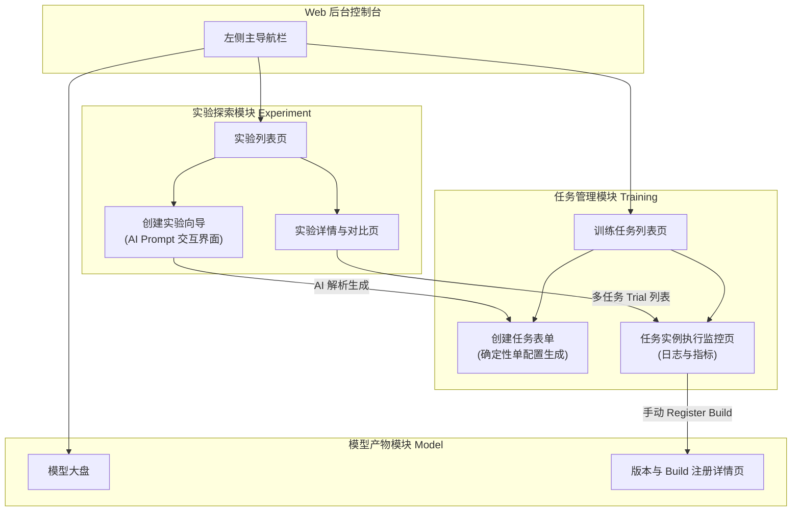
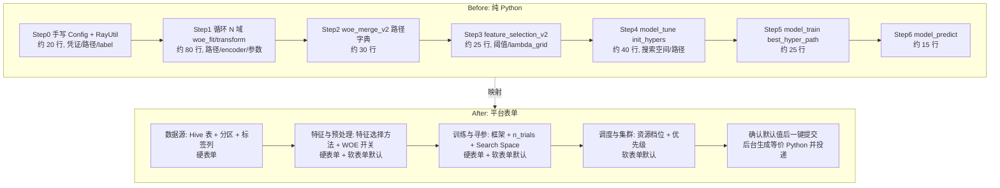
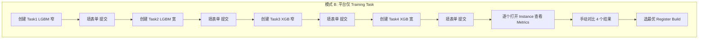
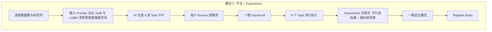

# 模型训练平台 MVP：产品原型与 PRD

**文档状态**: Draft
**基于模板**: Product Manager Toolkit - Standard PRD Template
**作者**: AI Product Manager

---

## 1. Executive Summary (执行摘要)

**Purpose**: 定义离线模型训练平台本期 MVP 迭代的产品需求文档（PRD）及页面结构约束。

- **问题陈述**: 现有的系统编排基于复杂的 6-Phase Spark 管道与 yaml 拖拽，对于普通业务人员或初阶算法工程师而言，构建、组合多任务寻优的门槛极高，执行环境异构导致稳定性不足。
- **解决方案**: 将底层执行统一包裹为 Ray Python 脚本，并对用户侧进行两层抽象：1) 提供所见即所得的 **Training Task 基础表单**；2) 引入 **Experiment 模块** 结合 **AI Prompt** 实现启发式空间探索。
- **业务影响**: 降低 70% 的训练环境配置时间；引入大模型生成表单策略，推动普通业务数据直接落地预测。
- **核心指标 (Success Metrics)**:
  - 任务配置提单耗时缩短比例 (Target: < 5 分钟)
  - 通过 AI Experiment 批量发起的任务数占比 (Target: > 40%)
  - 底层失败率 (Target: < 5%，依赖 Ray 稳定剥离)

---

## 2. 页面信息架构图 (Information Architecture)

展示了本期 MVP 的 Web 层级结构与用户流转路径：

---

## 3. 核心功能场景与页面原型说明

### 3.1 核心页面：Training Task (任务配置表单)

**页面定位**：底层逻辑的基础配置页。用户手动填写，或者由 Experiment AI 自动生成的只读/待确认视角。
**表单区域结构**：

| 表单模块 | 字段项与交互控件 | 说明 / 默认值 |
|---------|-----------------|--------------|
| **1. 基础信息** | `任务名称` (Text Input) `描述` (Text Area) | 必填 |
| **2. 数据源接入** | `Hive 表名` (Select + 搜索) `取数条件/分区` (Input) `Target 目标列` (Select) | 需联动查询 Hive schema 以供下拉选择目标列。 |
| **3. 特征与预处理** | `特征选择算法` (Multi-Select, 选项包括 Pearson, IV, Tree 等) `开启 WOE 转换` (Switch) `剔除列` (Tags Input) | 控制后端是否生成 `ray_util.feature_selection()` 和 `woe_fit()` 包裹代码。 |
| **4. 训练与寻参** | `引擎框架` (Select, XGBoost/LightGBM) `寻优最大轮数 n_trials` (Number, 默认 30) `评价指标 Metric` (Select, AUC/RMSE 等) `超参探索空间 Search Space` (Key-Value 动态表单) | 若由 AI 生成，此处的 Search Space 会自动填好带有 `tune.uniform()` 等提示的语义范围。 |
| **5. 调度与集群** | `计算资源档位` (Radio: Low/Medium/High) `调度优先级` (Radio: Normal/Important/Critical) | 决定此表单发往下方的队列优先级。 |

**交互说明（User Flow）**：
- 用户填写完毕后点击「保存并提交」，系统流转校验，并将表单 JSON 打包交给 Backend 生成包裹 `RayUtil` 的 `task_id.py`，进入 `QUEUING`。

### 3.2 核心创新：Experiment (AI Prompt 向导页)

**页面定位**：用于批量发起、启发式生成多个带有不同 Search Space 和基础设置的 Training Task。
**UI/UX 布局 (分为左右分屏布局)**：

#### 左侧面板：AI Prompt 构建区
- **标题**：“创建一个探索实验”
- **输入域 1 (基础必选项)**：选择基础的数据集 (Hive 表) 和 最终的目标列 (Target Label)。*(限制大模型胡乱猜测范围)*
- **输入域 2 (Prompt 对话框)**：
  - **Placeholder**: "例如：我想对收入预测这列做评估，麻烦帮我生成 3 个不同特性的树模型配置，并尝试更大范围的学习率空间（0.001 - 0.2）。"
  - **组件**：多行文本框 + 「Generate Tasks (✨)」按钮。

#### 右侧面板：AI 推荐的任务清单评审区 (Review Area)
- 当用户点击生成后，右侧会以卡片列表形式 (Card List) 展现 AI 推导出的 1 到 N 个 `Training Task` 草稿配置。
- **卡片内容说明**：
  - 每个卡片代表一个独立的、填好参数的 Training Task（包含自动选择的框架如 XGB、指定的 search space）。
  - 卡片支持「编辑 (Edit)」、「删除 (Remove)」、「锁定 (Lock)」三个动作。
  - 点击编辑可直接弹窗打开 `3.1` 中的完整表单进行核对修改。
- **底部操作**：
  - 「全部提交 (Submit All Tasks)」按钮。点击后，所有罗列在右侧的卡片会正式被转化为独立的 Training Task 派发给调度引擎，Experiment 记录生成。

### 3.3 核心页面：Experiment 详情对比大盘

**页面定位**：实验运行后的 Metrics 横向对比。
**页面组件**：
- **平行坐标图 (Parallel Coordinates Plot)**：用于一览不同 Trial 轮数下（例如 3 个 task x 30 trials = 90 条折线）不同超参到最终 AUC 目标的分布情况。
- **实验任务数据表格**：
  - 级联列表：Task 级别折叠，展开后为该任务下的 `Trial` 列表跑测详情（由 Ray 提供数据回来）。
  - 列包含：`Task Name`, `Framework`, `Search Space Summary`, `Best Metric`, `Status`, `Logs`。

---

## 4. Technical Feasibility & MVP Scope 约束

- **Out of Scope (本期不实现)**:
  - Canvas 画布拖拽编排。
  - YAML 编辑器模式。
  - 复杂的底层容错重试配置与多物理机分布图监控。
- **AI 接口对接要求**:
  - Web UI 需要将 Prompt 连同 Schema 传入大模型 API，期望返回固定的 JSON List（格式遵循 TrainingTask Schema）。
  - 表单需要做好前置 Schema 校验，防止大模型幻觉填入不支持的框架或非法数据字段。

---

## 5. 用户操作说明与平台价值对比

本章以项目内 **Python 基线脚本** [samples/full_training_pipeline.py](../samples/full_training_pipeline.py) 为参照，说明「无平台时需手写的完整 Pipeline」与「有平台后通过表单/Experiment 操作」的差异，便于产品与研发对齐平台价值。

### 5.1 Python Pipeline 分模块流程图

以下流程图对应 `full_training_pipeline.py` 的 7 个 Step 模块，每个节点标注对应的 `ray_util.*()` 方法及关键参数，便于理解纯 Python 方式下需要编排的步骤。

```mermaid
flowchart LR
    subgraph step0 [Step_0_Init]
        Init["init_ray_util()<br/>Config + RayUtil cluster"]
    end

    subgraph step1 [Step_1_WOE]
        WOEFit["woe_fit() x N 域<br/>n_bins, method, encoder_save_path"]
        WOETrans["woe_transform()<br/>training_features + test_features"]
        WOEFit --> WOETrans
    end

    subgraph step2 [Step_2_Merge]
        Merge["woe_merge_v2()<br/>data_path_dict, on, how"]
    end

    subgraph step3 [Step_3_FS]
        FS["feature_selection_v2()<br/>by_iv/corr/gini/psi/stability"]
    end

    subgraph step4 [Step_4_Tune]
        Tune["model_tune()<br/>n_trials, init_hypers, best_hypers_path"]
    end

    subgraph step5 [Step_5_Train]
        Train["model_train()<br/>best_hyper_path, best_model_path"]
    end

    subgraph step6 [Step_6_Predict]
        Predict["model_predict()<br/>sample_path, predict_result_path"]
    end

    Init --> WOEFit
    WOETrans --> Merge
    Merge --> FS
    FS --> Tune
    Tune --> Train
    Train --> Predict
```

**模块与 ray_util 对应关系**：

| 模块 | ray_util 方法 | 关键参数（需手写/配置） |
|------|----------------|-------------------------|
| Step 0 | 无（Config + RayUtil 构造） | fp_base, label, sample_use_col, 凭证 |
| Step 1 | woe_fit, woe_transform | 每域: data_path, encoder_save_path, n_bins, method, categorical_features, exclude |
| Step 2 | woe_merge_v2 | model_name, data_path_dict, on, how, data_save_path |
| Step 3 | feature_selection_v2 | fp_fs_input_path, fp_fs_methods, 各阈值, by_stability 参数 |
| Step 4 | model_tune | sample_path, feature_selection_path, n_trails, init_hypers, 各输出路径 |
| Step 5 | model_train | best_hyper_path, best_model_path, num_workers 等 |
| Step 6 | model_predict | sample_path, best_model_path, predict_result_path, auxilary_cols |

纯 Python 方式下约 **480 行代码**、**60+ 个需手动填写的参数**，且需自行规划 S3 路径与串行等待。

### 5.2 Before (Python) vs After (平台表单) 上下映射对比

下图将「纯 Python 手工编排」与「平台表单配置」逐模块上下对齐，展示平台如何用**硬表单（用户必填）**、**软表单（可改默认）**和**自动填充**减少操作量。

**上下映射与表单类型**：

| Python 侧（Before） | 平台侧（After） | 表单类型说明 |
|---------------------|-----------------|--------------|
| Config 凭证、fp_base、label、sample_use_col | 数据源区块：Hive 表名、分区条件、**目标列**（必选） | **硬表单**：用户必填 |
| 各域 data_path、encoder 路径、PATHS 字典 | 平台按「任务 ID + 实例 ID」自动生成 S3 路径 | **自动**：无需填写 |
| woe_fit 的 n_bins、method、categorical_features、exclude | 特征与预处理：**特征选择算法**多选、**开启 WOE**、剔除列 | **硬表单** + **软表单默认**（如 5 bin、best_ks、IV 0.02） |
| feature_selection 的阈值、lambda_grid、n_resampling | 同上区块，FS 阈值与 by_stability 参数 | **软表单默认**（可改） |
| model_tune 的 init_hypers、n_trails、各输出路径 | 训练与寻参：**框架**、**n_trials**、**Search Space**、评价指标 | **硬表单** + **软表单默认**（如 metric=auc） |
| num_workers、cpu_per_worker、memory_per_worker | 调度与集群：资源档位 Low/Medium/High、优先级 | **软表单默认** |
| 串行执行 7 步、本地等待、手动查日志 | 提交后 QUEUING → RUNNING，Web 查看日志与 Metrics | **平台自动** |

**对比结论**：Python 约 **2–4 小时**（编写 + 调参 + 路径管理 + 串行等待）；平台 **&lt; 5 分钟** 填硬表单、确认软表单默认值、一键提交即可。

### 5.3 多模型多参数对比探索：三种模式流程图

**使用目的（白话）**：同一份数据集，想尝试「XGBoost + LightGBM」两种框架，每种再试「窄搜索空间」和「宽搜索空间」，共 4 组配置，跑完对比哪组效果最好。下面三种方式分别对应：无平台、有平台但只能一个个建 Task、有平台且用 Experiment 批量创建并统一对比。

---

**流程图 A — 纯 Python（无平台）**

手写 4 份脚本，分别提交 Ray，再手动收集指标并对比；步骤多、易出错、无统一视图。

```mermaid
flowchart TB
    subgraph modeA [模式 A: 纯 Python]
        A1["手写 config_1.py LGBM 窄搜索"]
        A2["提交 Ray 等待"]
        A3["手动下载 metrics_1.json"]
        A4["手写 config_2.py LGBM 宽搜索"]
        A5["提交 Ray 等待"]
        A6["手动下载 metrics_2.json"]
        A7["手写 config_3.py XGB 窄搜索"]
        A8["提交 Ray 等待"]
        A9["手动下载 metrics_3.json"]
        A10["手写 config_4.py XGB 宽搜索"]
        A11["提交 Ray 等待"]
        A12["手动下载 metrics_4.json"]
        A13["Excel 或 Notebook 对比 4 份指标"]
        A14["人工判断最优并 Register Build"]
        A1 --> A2 --> A3 --> A4 --> A5 --> A6 --> A7 --> A8 --> A9 --> A10 --> A11 --> A12 --> A13 --> A14
    end
```

*约 12+ 步，4 份独立脚本，路径/参数易不一致，对比靠人工整理。*

---

**流程图 B — 有平台，仅 Training Task（无 Experiment）**

每个配置单独创建一条 Training Task、填表单、提交；路径与 WOE/FS 由平台统一处理，但需重复填表 4 次，对比时仍需逐个点开 Instance 看指标。

*约 8 步，4 次重复填表，路径与预处理自动；对比仍依赖人工。*

---

**流程图 C — 有平台 + Experiment（AI 批量创建 + 统一对比）**

选同一数据源与标签列，用一句 Prompt 描述意图，AI 生成 4 张 Task 卡片，用户 Review 后一键提交；执行后在 Experiment 详情页用平行坐标图与指标表统一对比，直接定位最优并 Register Build。

*约 4 步操作，一次输入、AI 填 4 张表单，统一对比面板，全流程 &lt; 10 分钟。*

---

**小结**：同一「多模型多参数对比」目标下，三种模式的步骤数约为 **A 12+ 步 / B 8 步 / C 4 步**；平台 + Experiment 在减少重复配置与统一结论输出上价值最大。
