# 竞品调研：Netflix Metaflow

**来源出处**：[Metaflow 官方文档](https://docs.metaflow.org/) / [GitHub - Netflix/metaflow](https://github.com/Netflix/metaflow)

## 1. 来源与概述

Metaflow 是 Netflix 开源、现由 Outerbounds 维护的 **Build, Manage and Deploy AI/ML Systems** 框架，面向从原型到生产的全生命周期。其设计强调「人本」：本地与 Notebook 友好、实验可追踪与版本化、一键扩展到云上执行，并与生产级调度器（Airflow、AWS Step Functions、Argo Workflows 等）集成。

**与本文档的关系**：与 [竞品调研_火山引擎机器学习平台.md](./竞品调研_火山引擎机器学习平台.md) 同属架构层竞品调研，用于 Canvas DAG 技术选型时与「常规调度 + 仅最新结果」方案、火山引擎式 Pipeline+Task 方案对比；重点考察其 **Checkpoint** 与 **Time Travel**（按 Run/Step 访问历史结果、Resume 复用成功步）能力，以及如何支撑内部模型探索 SOP。

## 2. 核心概念

Metaflow 用 **代码即 DAG** 的方式定义流水线：用户编写继承 `FlowSpec` 的类，用 `@step` 装饰方法，通过 `self.next(...)` 声明步骤间转移，形成有向图。

**对象层级**（与 [Client API](https://docs.metaflow.org/api/client) 一致）：

| 层级 | 含义 | 说明 |
|------|------|------|
| **Flow** | 流水线定义 | 对应一个 FlowSpec 类，如 `HelloFlow` |
| **Run** | 一次完整执行 | 每次 `python flow.py run` 产生一个 Run，有唯一 run id |
| **Step** | 步骤 | 对应一个被 `@step` 装饰的方法，如 `start`、`train` |
| **Task** | 步骤的一次执行 | 某 Run 下某 Step 的一次运行；foreach 时一步可有多个 Task |
| **DataArtifact** | 数据产物 | Task 结束时持久化的 Python 对象（如 dataframe、model、路径） |

路径示例：`Flow('HelloFlow')['2']['start']['1']` 表示 HelloFlow 的 Run 2、Step start、Task 1。所有对象可通过 `pathspec` 实例化并访问（如 `Run('HelloFlow/2')`），便于跨 Run、跨 Step 的「时间旅行」式访问。

## 3. Artifact 与持久化

- **步骤边界持久化**：每个 Step 的 Task 成功结束后，该 Task 内赋值给 `self` 的变量会**自动序列化并写入 datastore**（本地或 S3 等），成为该 Task 的 DataArtifact。
- **访问方式**：通过 Client API 可按 `Run → Step → Task → data.artifact_name` 访问任意历史 Run 的任意已完成 Step 的产出，无需重新执行。这就是 **Time Travel 的数据基础**：任意时刻的「某次 Run 的某步结果」都可被读取、对比或作为新 Run 的输入。
- **大对象**：大量数据建议写路径（如 S3 path）到 artifact，避免把整块数据放进 datastore；Metaflow 负责代码与元数据版本，大数据由用户自行管理路径与生命周期。

## 4. Resume 与失败恢复

- **resume**：从**失败步**重新执行，**此前所有成功步的结果会被复用**，不会重跑。命令形式：`python flow.py resume`（使用上次 run id）或 `python flow.py resume --origin-run-id <R>` 指定 Run。
- **从指定步恢复**：`python flow.py resume start` 表示从 `start` 步开始重跑（仍会复用该步之前已存在的成功结果）。不能跳过步骤：若指定步在失败步之后，实际仍从失败步恢复。
- **参数与配置**：Resume 时**不能修改** Flow 的 Parameters 与 Config；沿用原 Run 的参数，以保证可复现。
- **生产调试**：可用生产失败 Run 的 id 在本地 `resume`，在本地命名空间内复现并修 bug，再部署修复版本重启生产 Run，而不影响其他生产 Run。

与「只记录当前 Run 最新结果」的常规调度相比，Resume 明确提供了「复用历史成功步 + 仅重跑失败及之后」的语义，是 Time Travel 在**执行**层面的体现。

## 5. Checkpoint 与 Time Travel

除步骤边界的 Artifact 外，Metaflow 提供 **@checkpoint** 扩展（需单独安装：`pip install metaflow-checkpoint`），用于**步内**周期性持久化，避免长时任务（如训练数小时）因中断而丢失全部进度。

### 5.1 步内 Checkpoint

- **用途**：在单个 Step 内部（如训练循环中）定期将进度写入 datastore；配合 `@retry` 可在重试时从最新 checkpoint 续跑，而不是从该步开头重跑。
- **使用方式**：用 `@checkpoint` 装饰该 Step；在步内通过 `current.checkpoint.directory` 准备要持久化的文件，然后调用 `current.checkpoint.save()` 写入 datastore；步入口若存在 checkpoint，可通过 `current.checkpoint.is_loaded` 判断并加载，实现断点续跑。
- **作用域**：默认 checkpoint 按 **flow name + step name + foreach index** 区分，因此 foreach 多分支时各分支的 checkpoint 互不干扰。

### 5.2 加载策略（load_policy）

| 策略 | 含义 | 典型场景 |
|------|------|----------|
| **fresh**（默认） | 仅在本 Task 内、retry 时加载最新 checkpoint；新 Run 不加载旧 checkpoint | 生产/部署：隔离各 Run，避免误用旧进度 |
| **eager** | 同 namespace 下可跨 Run 加载最新 checkpoint；可中断后改代码再 `resume` 从该步续跑 | 迭代开发：改代码后从上次进度继续 |
| **None** | 不自动加载；由用户在代码里用 Client API 或 `current.checkpoint.list(task=...)` 自选要加载的 checkpoint | 自定义：如从另一 Flow 的某 Run 的某 Step 选 checkpoint 再继续 |

### 5.3 跨 Run / 跨 Flow 选用 Checkpoint

- 将 `current.checkpoint.save()` 的返回值（checkpoint 引用）存为 artifact（如 `self.latest_checkpoint`），则其他 Run 或 Flow 可通过 Client API 取到该 Run 的该 Task 的 artifact，再调用 `current.checkpoint.load(cp)` 加载指定 checkpoint。
- **运行中 Task**：若某 Task 尚未结束（如长时间训练），可用 `current.checkpoint.list(task=run['step_name'].task)` 列出该 Task 已产生的 checkpoint，取最新或某一时刻的 checkpoint 加载，实现「从历史某时刻的进度继续」的 Time Travel 用法。

## 6. 与火山引擎及方案 A 的对比

| 维度 | 方案 A（常规调度 + 仅最新） | 火山引擎 MLP | Metaflow |
|------|----------------------------|--------------|----------|
| **编排方式** | 画布 Node + DAG，平台调度 | YAML PipelineTemplate + taskTemplates/tasks | 代码 FlowSpec + @step，self.next 声明 DAG |
| **执行粒度** | Node | Task（高自由度） | Step/Task |
| **结果保留** | 每 Node 仅当前 Run 最新结果 | 需自建或依托 Task 产出 | 每 Run 每 Step 的 Artifact 持久化，多版本 |
| **断点/重跑** | 手动触发上游再序贯重跑下游 | 需在 Task 或平台层自设计 | Resume 复用成功步，仅重跑失败步及之后 |
| **Time Travel** | 无 | 无内置 | 内置：Client API 访问任意 Run/Step/Task 的 data；@checkpoint 步内 + load_policy 跨 Run |
| **Experiment/追踪** | 与画布/Run 绑定，视实现而定 | 后置 Tracking（WandB/TensorBoard） | 与 Run/Step/Artifact 天然绑定，可加 tag/namespace |

## 7. 基于 Metaflow 实现内部模型探索 SOP 的实践

本节将我们内部模型探索 SOP（见 [Task-Canvas-Config.md](../design/Task-Canvas-Config.md) 的 SOP 节点类型与配置要点、画布节点与 Python Step 对应总览）映射为 Metaflow 的 Flow/Step 与 SavePoint/CheckPoint 语义，便于选型或 POC 时对齐。

### 7.1 SOP 节点与 Metaflow Step 映射

| SOP 画布节点 | 在 Metaflow 中的对应 | SavePoint/CheckPoint 对应 |
|--------------|----------------------|---------------------------|
| **Pipeline Meta** | Flow 级参数、资源配置，或单独的「Step 0」只做配置写入/校验 | — |
| **数据源 (DataSource)** | 某 Step 产出 `data_path` / 样本引用（或从参数/环境读入），供下游使用 | — |
| **WOE Fit + All Feature Report** | 一个 Step：先 woe_fit 产出 Encoder，再 feature_report(全部特征)；产出 encoder_path、report_path 等 artifact | **SavePoint**：该 Step 完成即持久化；Resume 或新 Run 可从下一步起跑，或通过 Client API 取该 Step 的 artifact |
| **Feature Selection + Fine Feature Report** | 一个 Step：feature_selection → feature_report(选中特征)；产出 fs_report_path、selected_features 等 | **CheckPoint**：此处可人工/策略择优或确认后再继续；可用 tag 或 artifact 标记「已确认」 |
| **WOE Update + WOE Merge** | 一个 Step（或拆为两 Step）：可选 woe_update → woe_transform → woe_merge；产出 merged_data_path 等 | **SavePoint**：后续 Tune & Train 的输入存档点；下游 Step 从该 Step 的 artifact 读路径 |
| **Model Tune** | 用 `foreach` 或多 Step 并行：每分支不同 search_space/策略，每分支 Step 产出 best_hyper_path、best_model 等 artifact | — |
| **Model Train** | 一个 Step：从上游或「择优」选定的 artifact 读 best_hyper_path，再执行 model_train()，产出最终 model_path | — |
| **CheckPoint（择优）** | 无独立 Step：在平台/脚本层「选定某 Run 的某 Step 的 artifact」作为 production；或对 Run 打 tag（如 `production`），下游从 `Flow.latest_run`/tag 取模型 | **CheckPoint 可选**：人工择优后触发下游或新 Run |
| **Model Inference** | 独立 Flow：从选定 Run 的 end Step（或指定 Step）的 artifact 读 model_path，再执行 predict；或同一 Flow 的 predict Step 从参数/artifact 读 model_path | 独立画布 = 独立 Flow 或从某 Run 的 artifact 启动 |
| **Model Calibrate** | 占位 Step 或后续扩展：calibrate_fit + calibrate_transform；本期 Pending | 本期不实现 |

### 7.2 多路 Tune 合并与择优

- **多分支**：Model Tune 用 `foreach` 生成多组超参或策略，每个分支一个 Task，各产出 `best_hyper_path`、`best_model` 等。
- **合并与择优**：  
  - 若在同一个 Flow 内：可用 `join` Step 汇聚多个分支的 artifact，再在下一 Step 中按指标选 best，并调用 model_train（或直接选用某分支的 best_model）。  
  - 若「择优」为人工：则 Tune 跑完后不自动进入 Train；用户通过 UI/API 查看各 Run 或各分支的 artifact，选定某一 Run/分支的 best_hyper_path 或 best_model，再触发「从该 artifact 开始的 Model Train / Inference」Run（或新 Flow）。
- **Metaflow 实现方式**：用 `Flow('X').latest_run` 或带 tag 的 `Flow('X').runs('production')` 取选定 Run，再 `run['model_train'].task.data.model_path` 取路径，作为 Inference Flow 的输入。

### 7.3 独立推理画布（策略回扫）

- **需求**：仅「数据源 + Model Inference」组成最小可执行画布，用于策略回扫、批量预测。
- **实现**：  
  - **方式一**：单独一个 Flow，如 `InferenceFlow`；参数或 artifact 传入 `model_path`、`sample_path`（可由数据源配置解析得到）；Step 内只做 load model + predict。  
  - **方式二**：从已有训练 Flow 的某次 Run 取模型 artifact，作为输入；例如 `model_path = Run('TrainingFlow/42')['model_train'].task.data.model_path`，再在本地或另一 Flow 中执行 predict。

### 7.4 SOP 在 Metaflow 中的 Step 映射图（示意）

```mermaid
flowchart LR
  subgraph main [主链]
    PipelineMeta[Pipeline Meta / Step0]
    DataSource[DataSource Step]
    WOEFit[WOE Fit + All Feature Report]
    FeatureSelection[Feature Selection + Fine Feature Report]
    WOEMerge[WOE Update + WOE Merge]
  end

  subgraph tuneBranches [Model Tune 分支]
    ModelTune1[Model Tune Branch 1]
    ModelTune2[Model Tune Branch 2]
  end

  subgraph mergeInference [合并与推理]
    JoinStep[Join / 择优]
    ModelTrain[Model Train]
    ModelInference[Model Inference]
    Calibrate[Calibrate]
  end

  PipelineMeta --> DataSource
  DataSource --> WOEFit
  WOEFit -->|SavePoint| FeatureSelection
  FeatureSelection -->|CheckPoint| WOEMerge
  WOEMerge -->|SavePoint| ModelTune1
  WOEMerge --> ModelTune2
  ModelTune1 --> JoinStep
  ModelTune2 --> JoinStep
  JoinStep --> ModelTrain
  ModelTrain --> ModelInference
  ModelInference --> Calibrate
```

- **SavePoint**：WOE Fit、WOE Merge 对应 Step 完成即持久化；Resume 或 Client API 可从这些 Step 取 artifact。
- **CheckPoint**：Feature Selection 对应 Step 可做人工/策略确认；择优对应在 Join 之后选定某分支 artifact 再进 Model Train / Inference。

## 8. 参考链接

- [Metaflow 官方文档](https://docs.metaflow.org/)
- [Metaflow Basics（Parameters、Steps）](https://docs.metaflow.org/metaflow/basics)
- [Debugging Flows（Resume）](https://docs.metaflow.org/metaflow/debugging)
- [Client API - Accessing past results](https://docs.metaflow.org/api/client)
- [Checkpointing Progress（@checkpoint 介绍）](https://docs.metaflow.org/scaling/checkpoint/introduction)
- [Selecting a Checkpoint to Use（load_policy）](https://docs.metaflow.org/scaling/checkpoint/selecting-checkpoints)
- [GitHub - Netflix/metaflow](https://github.com/Netflix/metaflow)
